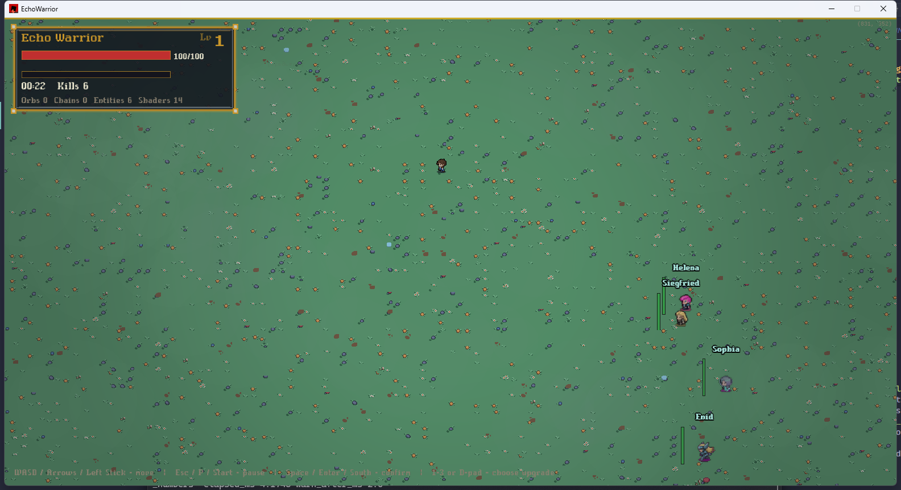

# EchoWarrior Contributor Wiki



This wiki is written for someone who may want to contribute to EchoWarrior and needs a calm first map of the codebase. It documents the main code surface: the crate entry points, app shell, state model, asset and pack gateways, logging, performance hooks, mod manifest layer, and command-line tools.

It deliberately does not document every `src/game`, `src/runtime`, `src/data`, `src/ui`, `src/save`, or `src/scripting` submodule in detail. Those areas already have focused design docs, and they change faster than the main crate boundary.

## What To Read First

- [New Contributor Start](pages/new-contributor-start.md) if this is your first hour in the repo.
- [Contribution Workflow](pages/contribution-workflow.md) before opening a pull request.
- [Change Routes](pages/change-routes.md) when you know what you want to change but not where it belongs.
- [Verification Guide](pages/verification-guide.md) to choose the right checks.
- [Tiny Moddable Feature](pages/guides/tiny-moddable-feature.md) for a slow, guided first implementation path.
- [Architecture Chapter](pages/architecture.md) for the big picture first, then progressively deeper details.
- [Main Code Map](pages/main-code-map.md) for a file-by-file reference to the main Rust files.
- [Assets And Packaging](pages/assets-and-packaging.md) before changing runtime asset discovery or release packs.
- [Asset Pack Reference](pages/asset-pack-reference.md) for the public pack API and read order.
- [CLI Tools](pages/cli-tools.md) before using `asset_pack`, `sprite_cutter`, `mod_check`, or `choreo`.

## Contributor Promise

EchoWarrior is built around moddability, data-driven content, and a clean split between renderer-specific runtime code and pure gameplay/data code. A good contribution should make the game easier to understand, easier to mod, or more reliable to ship.

The fastest way to get oriented is to run the game once, read the contributor start page, then pick a small change with a clear verification command.

## Site Stack

This is a GitHub Pages site powered by [Docsify](https://docsify.js.org/). Pages are ordinary Markdown files loaded by `index.html`, so the wiki can be edited without a build step or new Cargo dependency.

The repository includes a GitHub Actions workflow at `.github/workflows/pages.yml` that publishes the wiki repository root as the Pages artifact. In the private game repository, this repo is mounted as the `Docs/Wiki` submodule.

## Related Project Docs

The deployed wiki artifact contains only this public wiki repository. For deeper project notes in a private game checkout, read:

- `Docs/TECHNICAL_NOTES.md`
- `Docs/MODDING.md`
- `Docs/RELEASE.md`
- `Docs/CHOREO_FORMAT.md`
- `Docs/GAME_DESIGN_DOCUMENT.md`

## Local Preview

Because this site uses Docsify from a CDN, any static server works. On this Windows checkout, prefer the Python launcher:

```powershell
py -m http.server 8000
```

Then open `http://localhost:8000`.
