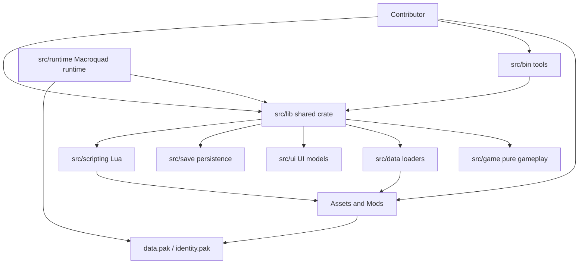

# Architecture Chapter

This chapter explains EchoWarrior from the outside in. Start with the big picture, then move down through module boundaries, runtime flow, data loading, release packaging, choreography, and extension patterns.

The goal is not to memorize every file. The goal is to know where a change belongs and what contracts it must preserve.

## Chapter Path

1. [Fundamentals](pages/architecture/fundamentals.md): the shortest possible architecture map.
2. [Module Boundaries](pages/architecture/module-boundaries.md): which folder owns which kind of work.
3. [Runtime Loop](pages/architecture/runtime-loop.md): how the Macroquad prototype advances a frame.
4. [Data And Modding Flow](pages/architecture/data-and-modding-flow.md): how TOML, YAML, and Lua become game behavior.
5. [Assets And Release Packs](pages/architecture/assets-and-release-packs.md): why loose files and `data.pak` both matter.
6. [Choreography](pages/architecture/choreography.md): the single authored-beat engine.
7. [Extension Patterns](pages/architecture/extension-patterns.md): where to add new behavior safely.
8. [Commands And Events](pages/architecture/commands-and-events.md): how scripts, scenes, upgrades, runtime, and logs communicate.
9. [Simulation And ECS](pages/architecture/simulation-and-ecs.md): how pure run logic and the ECS bridge coexist with runtime actors.
10. [Rendering And UI](pages/architecture/rendering-and-ui.md): how world rendering, effects, post-processing, and UI layers stack.
11. [Persistence And State](pages/architecture/persistence-and-state.md): how saves, settings, progression, and mod metadata are separated.
12. [Verification Architecture](pages/architecture/verification-architecture.md): how checks map to code and content boundaries.
13. [Graceful Degradation](pages/architecture/graceful-degradation.md): how missing or broken content should fail without taking down the game.
14. [Performance And Observability](pages/architecture/performance-and-observability.md): how contributors find slow or noisy paths.
15. [Feature Slice Walkthrough](pages/architecture/feature-slice-walkthrough.md): how a new capability crosses data, runtime, tools, docs, and release packaging.
16. [Design Principles](pages/architecture/design-principles.md): how to choose between valid approaches.
17. [Architecture Glossary](pages/architecture/glossary.md): shared terms used across the wiki and codebase.
18. [Migration Status](pages/architecture/migration-status.md): what is already pure, what is bridged, and what is still runtime-owned.
19. [Anti-Patterns](pages/architecture/anti-patterns.md): common moves that fight the architecture.

## One-Screen Map

## North Star

EchoWarrior is built to keep content easy to modify while keeping core rules testable:

- content lives in `Assets/` and `Mods/` when practical
- pure rules live in `src/game`
- data schemas and fallback loading live in `src/data`
- Macroquad rendering/input/audio live in `src/runtime`
- release asset discovery lives in `src/asset_pack.rs`
- shipping confidence comes from `mod_check`, `asset_pack`, tests, and `cargo check`

## Quick Decisions

| If you are changing... | Read next |
| --- | --- |
| any code for the first time | [Fundamentals](pages/architecture/fundamentals.md) |
| where a module belongs | [Module Boundaries](pages/architecture/module-boundaries.md) |
| frame update/drawing behavior | [Runtime Loop](pages/architecture/runtime-loop.md) |
| TOML/YAML/Lua content | [Data And Modding Flow](pages/architecture/data-and-modding-flow.md) |
| release asset inclusion | [Assets And Release Packs](pages/architecture/assets-and-release-packs.md) |
| story beats, movement beats, scenes | [Choreography](pages/architecture/choreography.md) |
| adding a new capability | [Extension Patterns](pages/architecture/extension-patterns.md) |
| adding Lua/choreography/upgrades behavior | [Commands And Events](pages/architecture/commands-and-events.md) |
| touching actors, ECS, or pure run tests | [Simulation And ECS](pages/architecture/simulation-and-ecs.md) |
| changing draw order, effects, or HUD | [Rendering And UI](pages/architecture/rendering-and-ui.md) |
| changing saves, settings, or account progress | [Persistence And State](pages/architecture/persistence-and-state.md) |
| deciding which checks to run | [Verification Architecture](pages/architecture/verification-architecture.md) |
| adding fallbacks or loader behavior | [Graceful Degradation](pages/architecture/graceful-degradation.md) |
| chasing frame time or logs | [Performance And Observability](pages/architecture/performance-and-observability.md) |
| planning a complete capability | [Feature Slice Walkthrough](pages/architecture/feature-slice-walkthrough.md) |
| deciding between two designs | [Design Principles](pages/architecture/design-principles.md) |
| decoding architecture vocabulary | [Architecture Glossary](pages/architecture/glossary.md) |
| understanding current migration seams | [Migration Status](pages/architecture/migration-status.md) |
| checking whether an approach is risky | [Anti-Patterns](pages/architecture/anti-patterns.md) |
