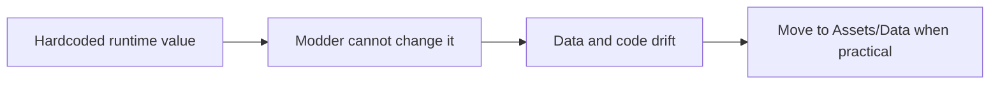
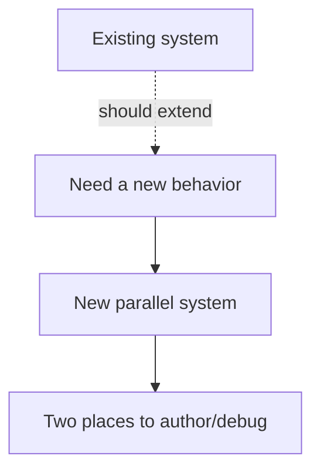
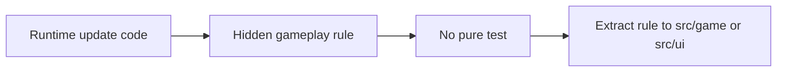
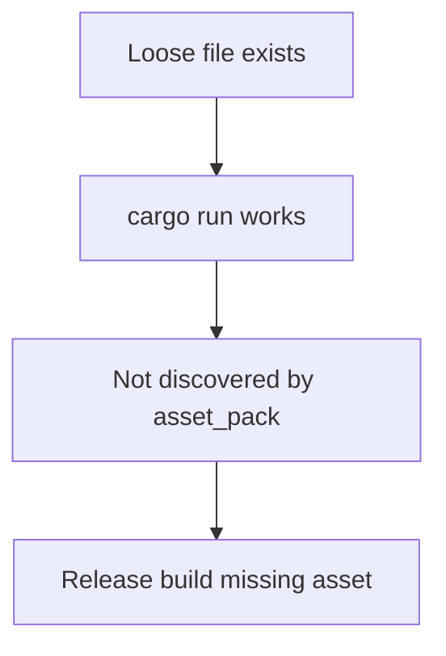
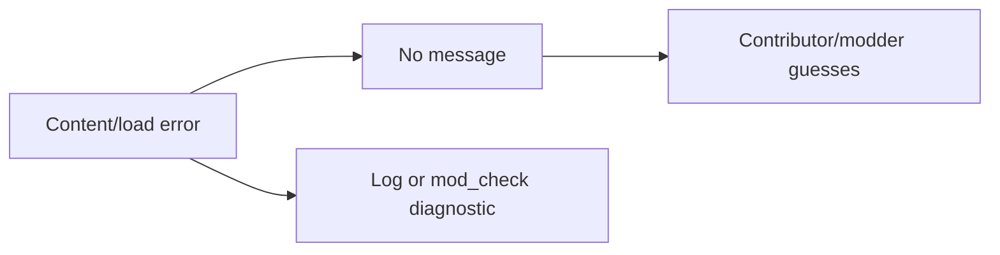

# 19. Anti-Patterns

This page lists architectural moves that usually make EchoWarrior harder to maintain, mod, or ship.

## Hardcoding Content In Runtime

Examples:

- enemy stats in actor constructors
- upgrade numbers in UI code
- fixed dialogue text in runtime
- shader/audio paths not owned by a manifest or discovery rule

## Parallel Systems

Avoid parallel systems for:

- choreography/scene beats
- entity lifecycle ownership
- command vocabularies
- mod layering
- save metadata

## Runtime-Only Rules

Rules embedded directly in draw/update code are hard to test.

If the rule does not need Macroquad, consider extracting it.

## Asset Works Loose, Fails Packed

Every runtime-loaded asset needs a discovery path.

## Silent Failure

Silent failure is worse than noisy fallback.

If the game falls back, say why through stderr/tracing or tool output.

## Big-Bang Refactors

Broad rewrites are especially risky while the prototype is moving.

Prefer:

- one bridge
- one pure extraction
- one tool validation pass
- one data schema surface
- one focused runtime adapter

Then verify and commit the slice.
