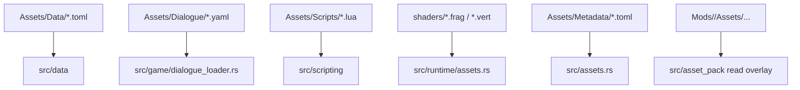
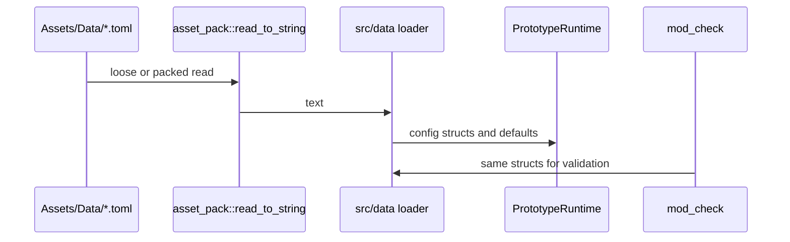
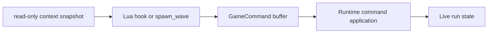
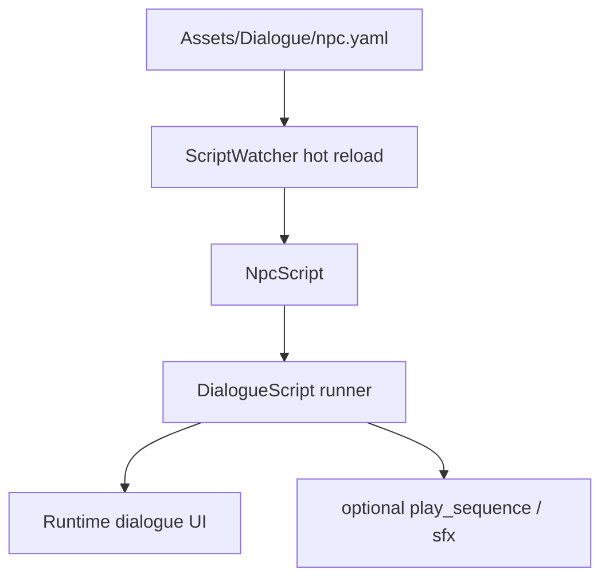
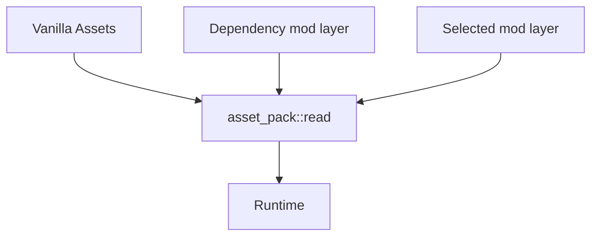
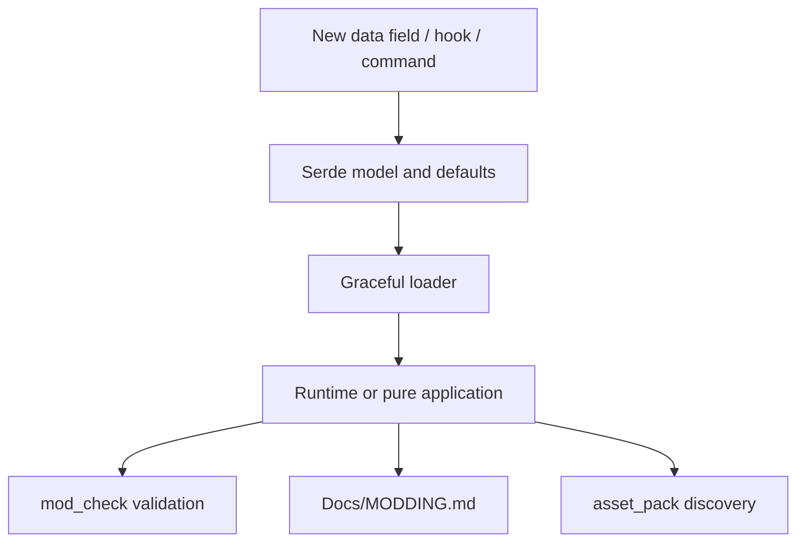

# 4. Data And Modding Flow

EchoWarrior is designed so a large amount of behavior can change without recompiling Rust.

## Content Sources

## Loader Contract

Data loaders should:

- parse serde structs from TOML/YAML
- provide defaults for missing optional fields
- degrade gracefully on missing or malformed files
- keep content values out of runtime code when practical
- expose enough structure for `mod_check` to validate references

## TOML Flow

This shared loader path is important: tools should validate the same shapes the runtime consumes.

## Lua Flow

Lua scripts do not directly mutate arbitrary runtime state. They return commands.

This keeps Rust in charge of invariants while still letting mods add behavior.

## Dialogue Flow

One NPC should have one YAML file. Dialogue may trigger choreography with `play_sequence`.

## Mod Layering

Selectable mods are declared by `Mods/<mod_id>/mod.toml`.

Dependency layers are collected first; selected layers override earlier layers.

## Modding Surface Checklist

When adding a new thing a modder can use:

If any box is missing, the surface is probably not ready.
