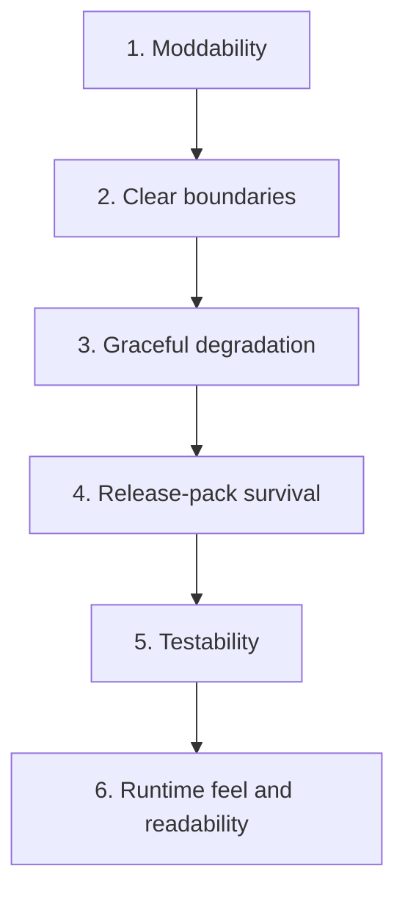
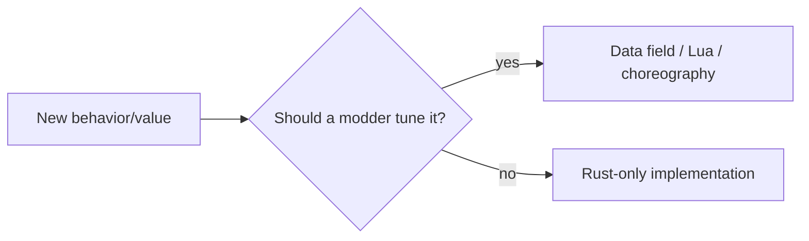
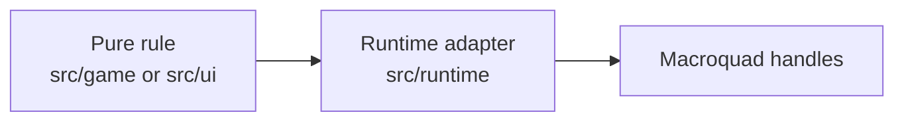
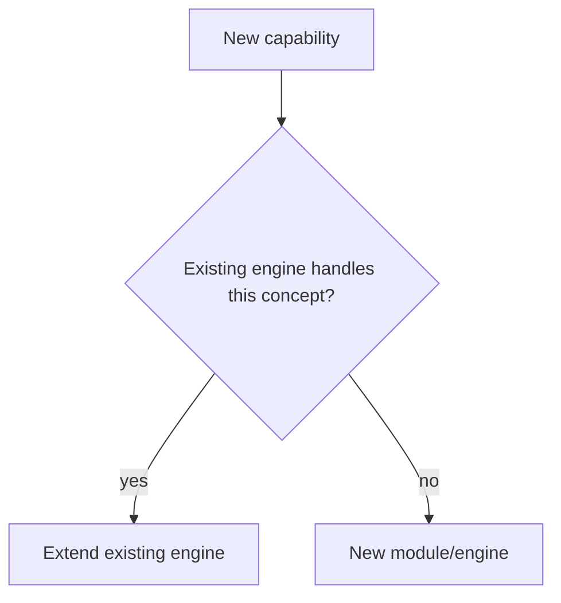
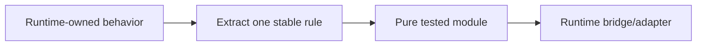

# 16. Design Principles

This page explains how to choose between multiple technically valid designs in EchoWarrior.

## Priority Order

These are not absolute laws, but they are the default tie-breakers.

## Principle: Modding Is A Product Feature

If a value or authored behavior could reasonably be changed by a content author, it should usually live in `Assets/` or a mod layer.

Rust-only behavior is fine for engine invariants, rendering mechanics, and implementation details. It is suspect for balance values, content timing, labels, dialogue, and asset paths.

## Principle: Pure First, Runtime At The Edge

When possible, place deterministic rules in pure modules and let runtime adapt them to Macroquad.

This keeps rules testable and reduces the weight inside `PrototypeRuntime`.

## Principle: Strict Tools, Forgiving Game

The game should keep running when mod content is broken. Shipping tools should be stricter.

| Context | Behavior |
| --- | --- |
| runtime loader | warn and use fallback where practical |
| hot reload | keep previous good state |
| release pack verify | fail on missing/stale/corrupt payload |
| mod_check | report actionable errors |
| schema conversion | avoid corrupting output |

## Principle: One Engine Per Concept

Do not add a second choreography system, second mod layer model, second entity ownership model, or second command vocabulary.

New architecture is warranted only when the concept is genuinely new.

## Principle: Small Bridges Beat Big Rewrites

The runtime is large because it is the playable prototype. Prefer narrow bridges and extraction slices over broad rewrites.

This is how the ECS lifecycle bridge and pure run kernel should continue to grow.
