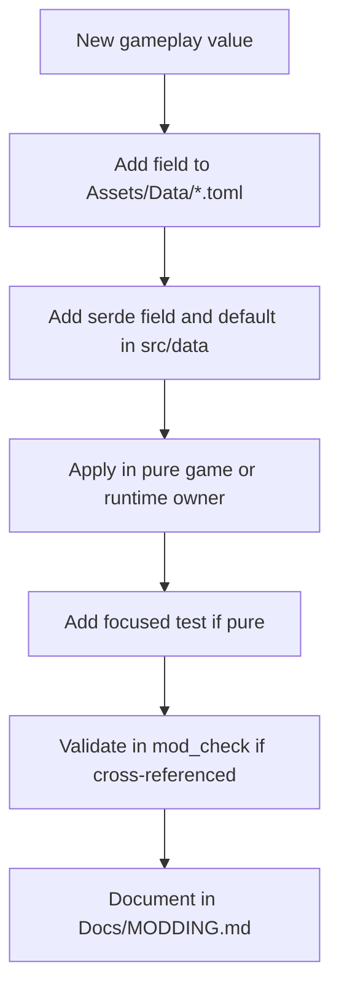
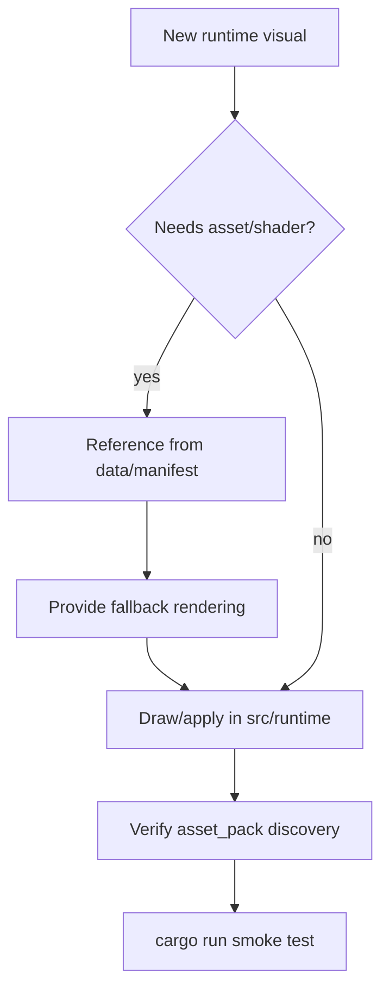
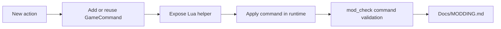
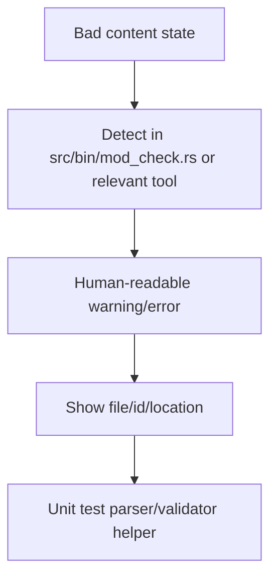
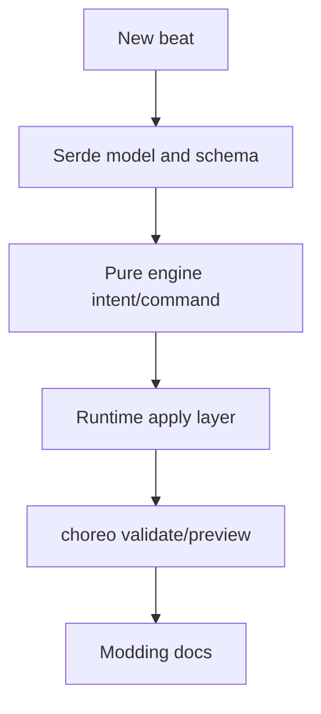
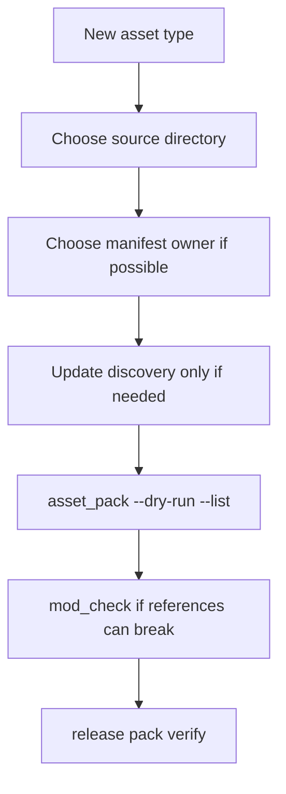
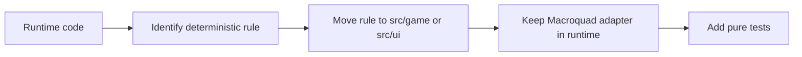

# 7. Extension Patterns

This page turns the architecture into practical patterns. Use it when adding a capability.

## Pattern: Add A Data-Driven Gameplay Value

Keep numeric balance values out of runtime actor constructors when practical.

## Pattern: Add A Runtime Visual

A missing shader or texture should not crash the game.

## Pattern: Add A Lua-Visible Action

Prefer shared `GameCommand` verbs over direct Lua mutation.

## Pattern: Add A Tool Diagnostic

Good diagnostics tell a content author what to fix, not just that parsing failed.

## Pattern: Add A Choreography Beat

If it is authored scene behavior, route it through choreography.

## Pattern: Add A New Asset Type

The preferred outcome is no `asset_pack.rs` edit because an existing scanned directory or manifest already owns the file.

## Pattern: Extract Pure Logic From Runtime

Do this when runtime code is becoming hard to test, but avoid broad rewrites. Extract the smallest stable rule.

## Review Checklist

Before calling an architectural change done:

- Does it preserve the runtime vs pure-module boundary?
- Is the modding story clear?
- Are missing files or malformed data handled gracefully?
- Does release packaging include required assets?
- Is there a focused verification command?
- Did the contributor docs or modding docs need an update?
