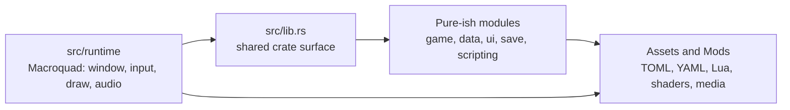
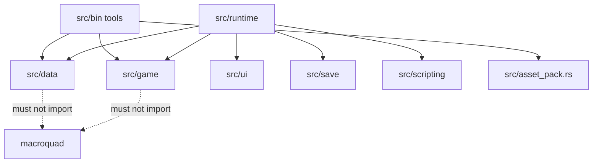
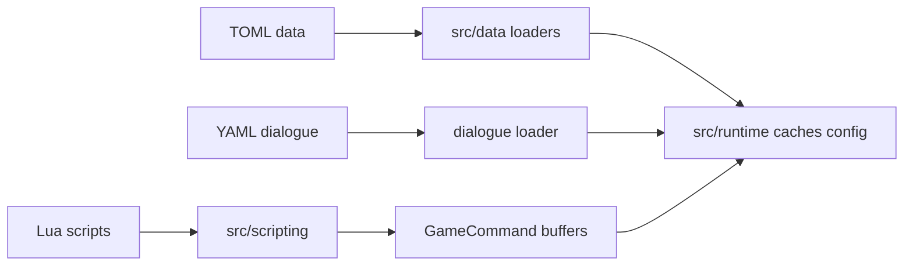

# 1. Fundamentals

EchoWarrior is a Rust desktop game with two personalities:

- a playable Macroquad prototype
- a renderer-agnostic library of game rules, data models, save models, scripts, and tools

The architecture exists to make the game moddable without trapping important rules inside rendering code.

## The Basic Split

## What Each Side Should Feel Like

Runtime code answers:

- What did the player press?
- What textures/shaders/sounds are loaded?
- What should be drawn this frame?
- What Macroquad state is needed?

Shared library code answers:

- What is a valid enemy or item definition?
- How does XP leveling work?
- What command does Lua request?
- What does a save snapshot contain?
- What should a tool validate?

## Dependency Direction

The most important rule: pure modules should not depend on Macroquad.

If a pure module wants positions or vectors, use its own simple data model or shared game types. If code needs `Texture2D`, `Color`, cameras, draw calls, input polling, or Macroquad audio, it belongs in `src/runtime`.

## Content Is The Source Of Truth

The game should prefer data over code for content:

That means a contributor should first ask: "Can this be changed from `Assets/` instead of Rust?"

## First Architectural Questions

Before changing code, answer:

1. Is this content, behavior, rendering, tooling, or packaging?
2. Should a modder be able to change it?
3. Can it be tested without opening a window?
4. Does it need to ship in `data.pak`?
5. Does `Docs/MODDING.md` need to explain it?

Those five questions usually point to the correct folder.
