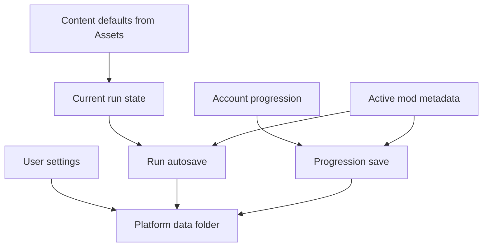
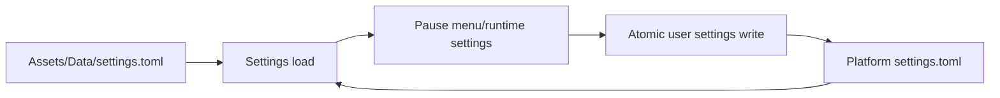
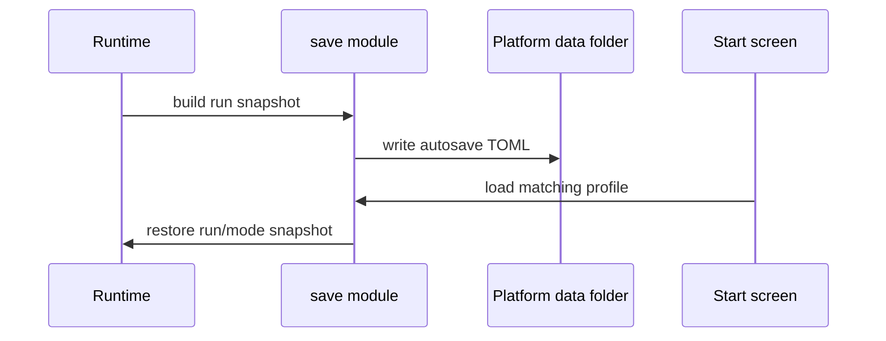
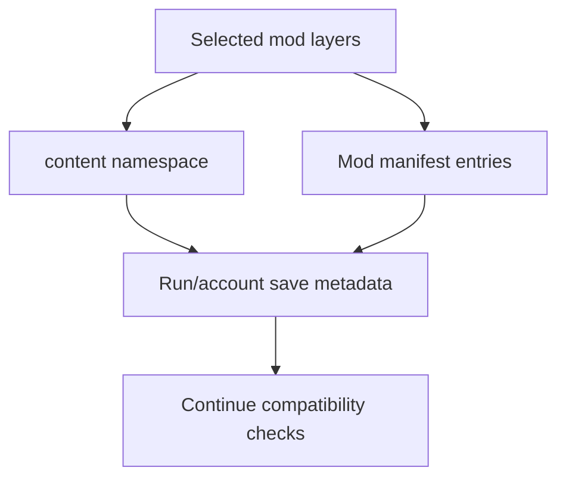
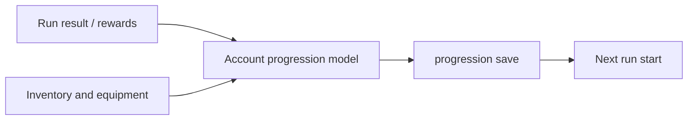

# 11. Persistence And State

EchoWarrior has several kinds of state. Keeping them separate prevents save files, settings, run state, and mod metadata from blurring together.

## State Categories

## Content Defaults vs User State

`Assets/Data/settings.toml` is a moddable default. User-changed settings persist outside `Assets/` in the platform data folder and win on later launches.

The architecture rule: do not write user state back into `Assets/`.

## Run Autosaves

Run autosaves preserve the current run profile and selected content context.

Saved runs may resume into gameplay, pending level-up, victory, or game-over style states depending on the snapshot.

## Mod Metadata In Saves

Saves record active mod metadata so vanilla and modded profiles do not accidentally collide.

When changing mod identity or save-sensitive ids, think about existing saves.

## Account Progression

Account progression is separate from a single run. It includes things like account level, skill points, inventory, and equipped items.

Equipped item effects currently apply at run start/restart, not mid-run.

## Persistence Change Checklist

- Is this run state, account state, user setting, or content default?
- Does it belong in `Assets/` or the platform data folder?
- Does it need backward-compatible defaults?
- Does it need mod namespace or manifest metadata?
- Does `mod_check` need to protect ids referenced by saves?
- Can missing or malformed saves fall back safely?
