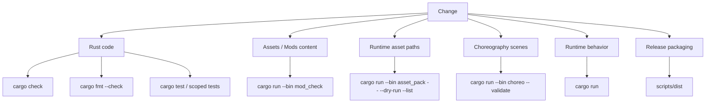
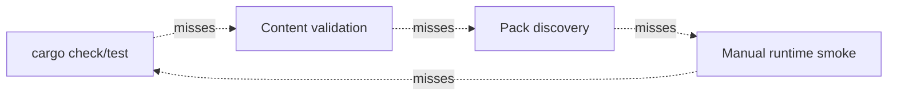
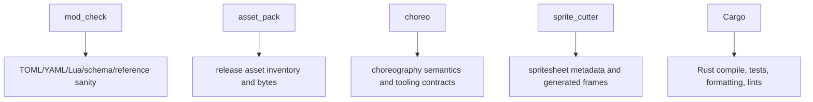

# 12. Verification Architecture

Verification in EchoWarrior is layered like the codebase. The right check depends on what boundary changed.

## Verification Map

## Boundary-To-Check Table

| Boundary changed | Minimum useful check | Stronger check |
| --- | --- | --- |
| Rust compile surface | `cargo check` | `cargo test` |
| Rust formatting | `cargo fmt --check` | `cargo fmt --check && cargo clippy --all-targets -- -D warnings` |
| pure game/data logic | targeted `cargo test --lib` | full `cargo test` |
| runtime behavior | `cargo check` | `cargo run` smoke test |
| TOML/YAML/Lua content | `cargo run --bin mod_check` | run game with content loaded |
| asset discovery | `asset_pack --dry-run --list` | `asset_pack --verify` |
| choreography | `choreo validate` | `choreo preview` plus runtime smoke |
| release scripts | pack verify | `scripts/dist.ps1` or `scripts/dist.sh` |

## Why There Is No Single Check

Each check sees a different failure class. A compile pass does not prove a mod data reference is valid. A mod check does not prove the VFX is readable. A runtime smoke test does not prove release assets ship.

## Tool Roles

## Contributor Rule

When reporting a change, include:

- command run
- pass/fail result
- if failed, whether the failure is related
- any environment caveat

Do not say a check passed unless you ran it.
