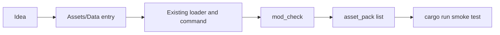
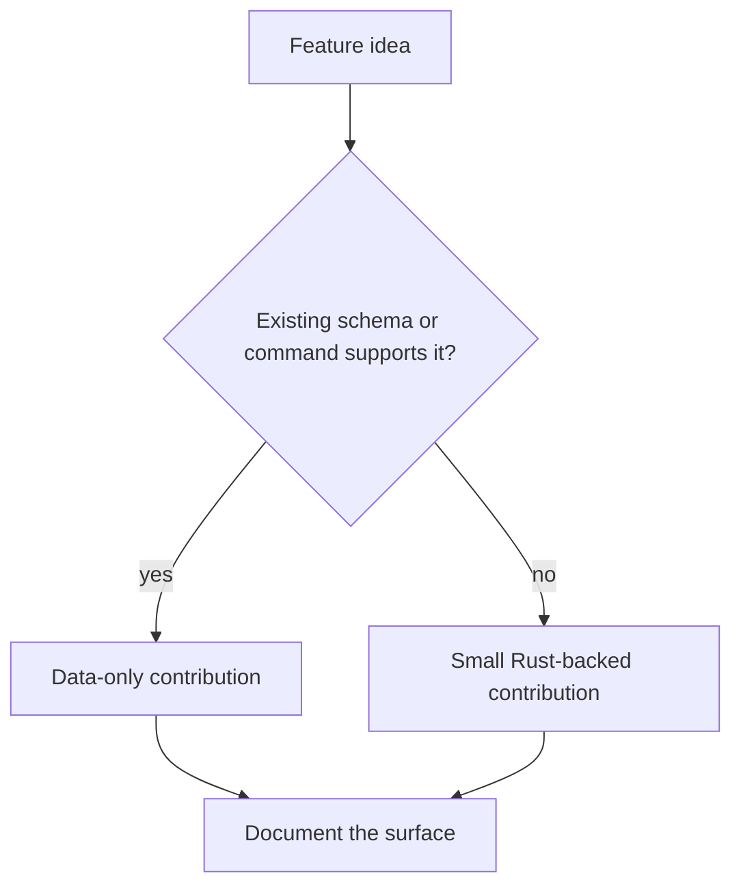
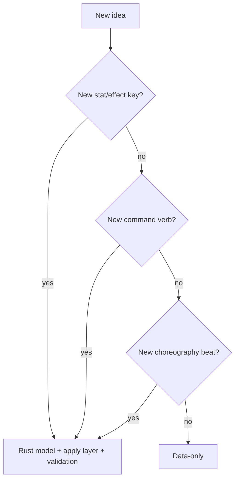

# Tiny Moddable Feature

This chapter eases you into implementing a tiny moddable feature. The first goal is not to write clever Rust. The first goal is to learn the path a small idea takes through EchoWarrior.

We start with the safest possible feature: a new level-up card that uses existing data fields and existing commands.

## The Tiny Feature Shape

This is the best first contribution shape because it teaches the architecture without changing the architecture.

## The Question To Ask First

Can the feature be expressed with existing data?

For a first feature, prefer "yes".

## Good First Tiny Features

| Feature idea | Likely path |
| --- | --- |
| new level-up card using existing stats | `Assets/Data/upgrades.toml` |
| new item using existing stat effects | `Assets/Data/items.toml` |
| new companion banter line | `Assets/Data/companions.toml` |
| small spawn tweak | `Assets/Scripts/spawn.d/*.lua` |
| new scene beat using existing choreography verbs | `Assets/Data/scenes/*.toml` |
| clearer mod_check error wording | `src/bin/mod_check.rs` |

## When Rust Becomes Necessary

Rust is needed when the idea asks for a new rule, not just new content.

If Rust is needed, the slice grows:

1. add or update the data model
2. load with defaults
3. apply in pure code or runtime
4. validate with `mod_check`
5. document in `Docs/MODDING.md`
6. verify asset-pack discovery if assets changed

## First Exercise

Read these in order:

1. [Example: Upgrade Card](pages/guides/example-upgrade-card.md) for a data-only level-up card.
2. [Example: Item Equipment](pages/guides/example-item-equipment.md) for a persistent gear entry.
3. [Example: Spawn Layer](pages/guides/example-spawn-layer.md) for a tiny additive Lua layer.
4. [Example: Mini Dialogue](pages/guides/example-mini-dialogue.md) for a lightweight narrative cue.
5. [Example: Scene Beat](pages/guides/example-scene-beat.md) for a manual choreography scene.
6. [Example: Mod Check Diagnostic](pages/guides/example-mod-check-diagnostic.md) for improving contributor tooling.
7. [Tiny Rust-Backed Stat](pages/guides/tiny-rust-backed-stat.md) for the first moment when existing data is not enough.

Keep the first attempt tiny. A small clean slice teaches more than a large half-finished one.
