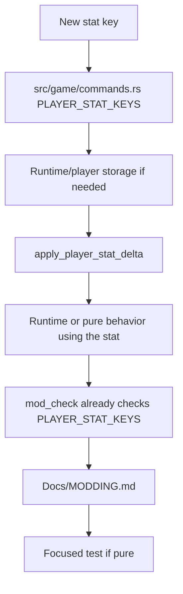
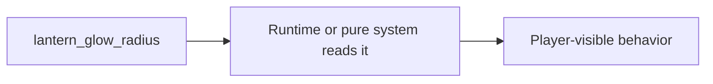

# Tiny Rust-Backed Stat

This guide shows the first step beyond data-only work: adding a tiny player stat key that an upgrade can modify.

Use this only when existing stat keys are not enough.

## The Shape



## Example Idea

Suppose you want an upgrade to increase a new value:

```toml
[[upgrade.commands]]
cmd = "modify_stat"
stat = "lantern_glow_radius"
delta = 48.0
```

Today, this would fail validation because `lantern_glow_radius` is not in `PLAYER_STAT_KEYS`.

## Step 1: Add The Stat Key

Start in:

```text
src/game/commands.rs
```

Add the key to `PLAYER_STAT_KEYS`.

Why here? This list is shared by runtime command application and `mod_check`, so one source controls the public command vocabulary.

## Step 2: Decide Where The Value Lives

If the value affects live player runtime behavior, it likely belongs on `PlayerRuntime` in:

```text
src/runtime/actors.rs
```

Add:

- a field
- a default
- any save/restore plumbing if the value must persist in run saves

If the rule can be pure, consider whether part of it belongs under `src/game` instead.

## Step 3: Apply The Stat Delta

Runtime stat deltas are applied in:

```text
src/runtime/mod.rs
```

Find:

```rust
fn apply_player_stat_delta(&mut self, stat: &str, delta: f32)
```

Add a match arm for the new key:

```rust
"lantern_glow_radius" => {
    self.player.lantern_glow_radius =
        (self.player.lantern_glow_radius + delta).max(0.0);
}
```

Clamp values where negative values would be meaningless or dangerous.

## Step 4: Use The Value

This is the real feature work. A stat key by itself does nothing.



Examples:

- pickup logic reads it
- lighting/VFX reads it
- companion behavior reads it
- UI displays it

Choose the smallest behavior that proves the stat matters.

## Step 5: Validate And Document

Because `mod_check` uses `PLAYER_STAT_KEYS`, adding the key there lets command validation recognize it. But you still need to document what it does.

Update:

```text
Docs/MODDING.md
```

Explain:

- stat key
- valid range
- what runtime behavior it changes
- whether it works in upgrades, items, or both

## Step 6: Verify

Run:

```powershell
cargo check
cargo fmt --check
cargo run --bin mod_check
```

If the stat changes visible runtime behavior:

```powershell
cargo run
```

If the stat adds assets:

```powershell
cargo run --bin asset_pack -- --dry-run --list
```

## Keep It Tiny

A good first Rust-backed stat slice changes one public key, one application path, one behavior, one validation surface, and one doc section.

Avoid bundling several new stats or a full subsystem into the same first patch.
