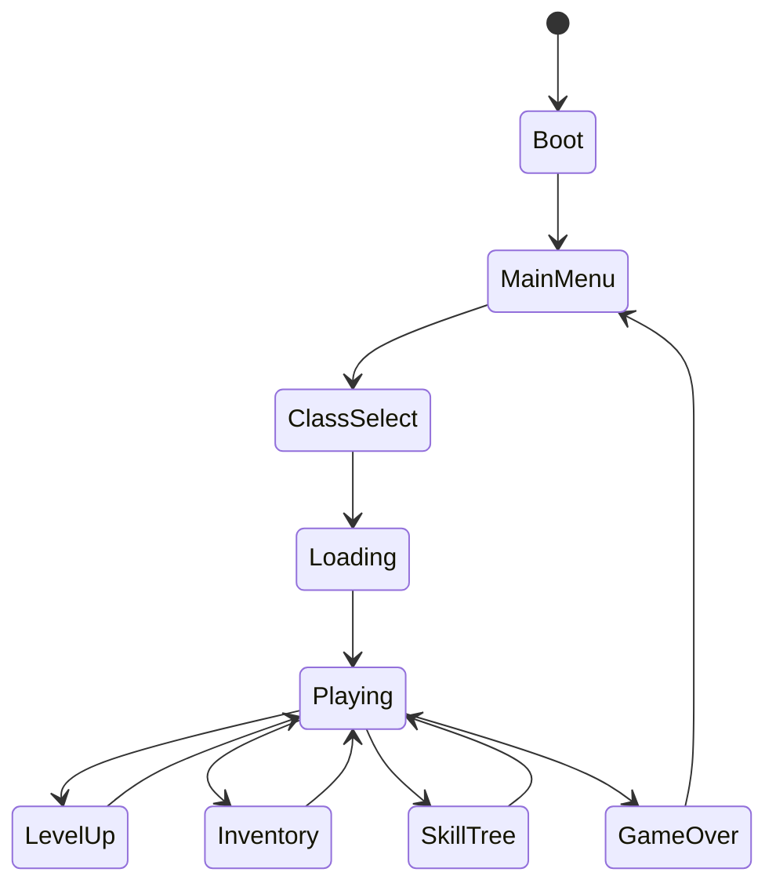
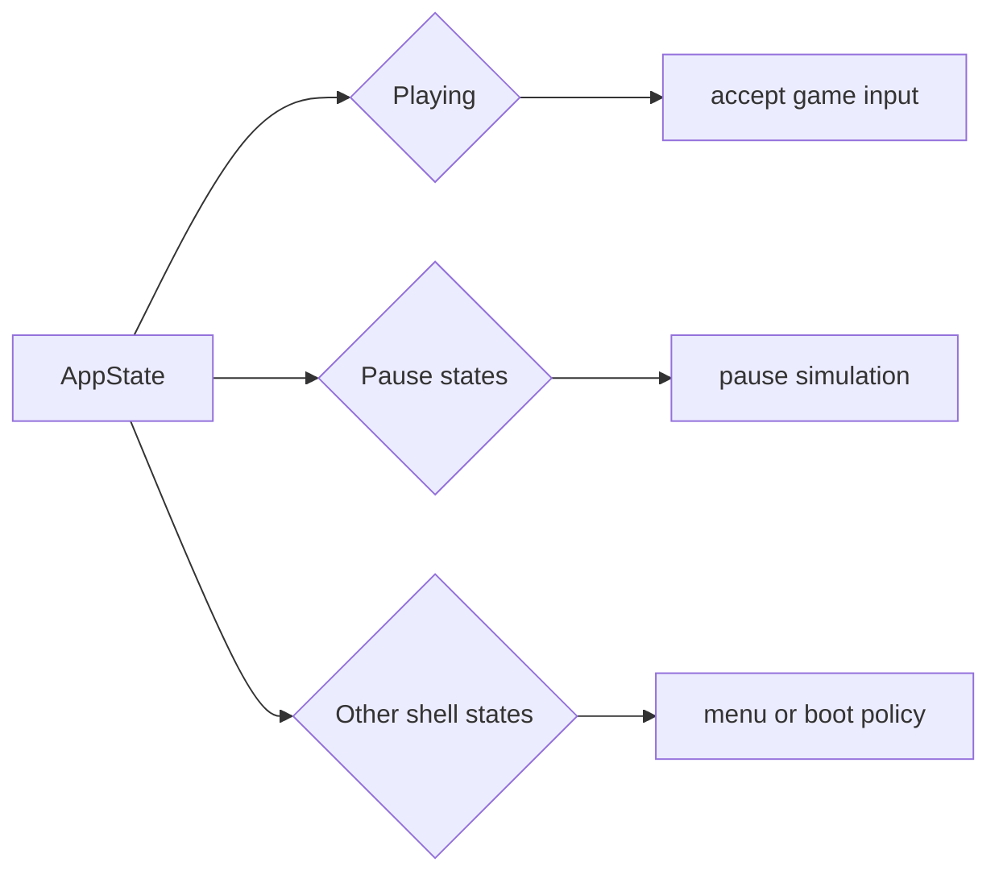
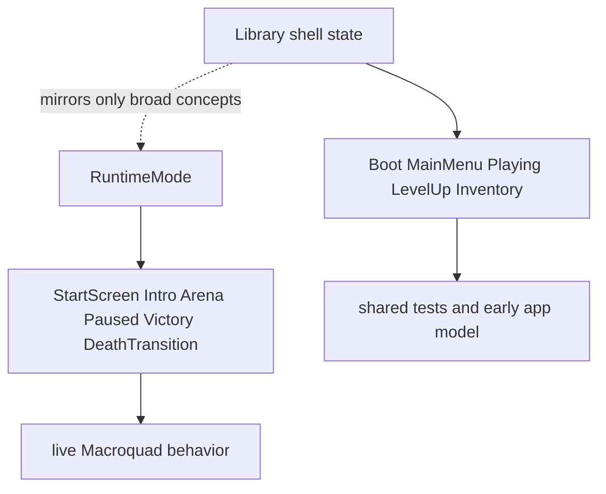

## `src/app.rs`

`EchoWarriorApp` is the small library-side app shell. It is not the full Macroquad runtime; it is a plain Rust model that captures the first-level application state.

```mermaid
flowchart TB
    app[EchoWarriorApp]
    state[AppState]
    class[Selected class]
    manifest[AssetManifest]
    clock[RunClock]
    bounds[WorldBounds]

    app --> state
    app --> class
    app --> manifest
    app --> clock
    app --> bounds
```

```rust
pub struct EchoWarriorApp {
    pub state: AppState,
    pub selected_class: ClassId,
    pub assets: AssetManifest,
    pub run_clock: RunClock,
    pub world_bounds: WorldBounds,
}
```

`EchoWarriorApp::new()` initializes:

- `state` as `AppState::Boot`
- `selected_class` as `ClassId::Warrior`
- default sprite/font manifest
- default run clock
- default arena bounds

The shell exposes small mutators:

- `transition_to(next_state)`
- `select_class(class_id)`
- `boot_summary()`

`boot_summary()` is a compact status string useful for smoke tests or early boot diagnostics.

## `src/states.rs`

`AppState` is a library-side state enum:

```rust
pub enum AppState {
    Boot,
    MainMenu,
    ClassSelect,
    Loading,
    Playing,
    LevelUp,
    GameOver,
    SkillTree,
    Inventory,
}
```

It has two policy helpers:

- `pauses_simulation()` returns true for `LevelUp`, `GameOver`, `SkillTree`, and `Inventory`.
- `accepts_game_input()` returns true only for `Playing`.





## Relationship To Runtime Modes

The live Macroquad prototype has a richer runtime mode model inside `src/runtime/`. Treat `AppState` as a lightweight shared shell model, not as the authoritative live runtime state machine.



If you change the live runtime state model, update the runtime docs and only mirror that change here when the shared library state also changes.

The current runtime mode flow is documented in [Runtime Shell](../runtime-shell/). Use that page when touching `src/runtime/mod.rs`; use this page when touching the shared crate shell.
