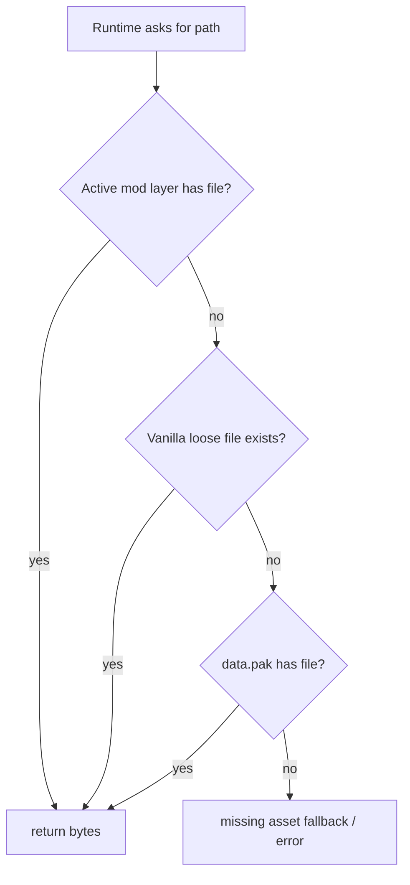
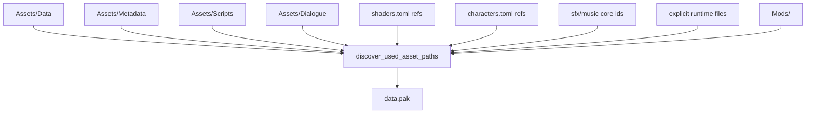
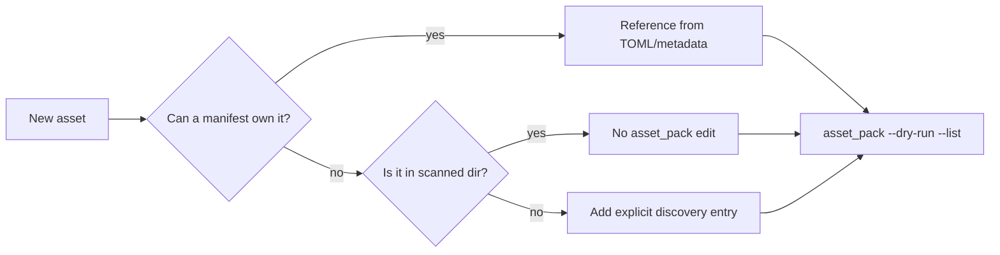
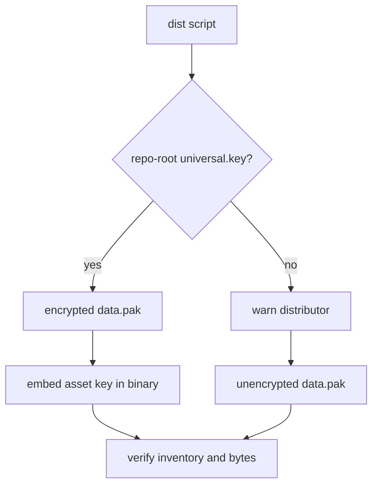
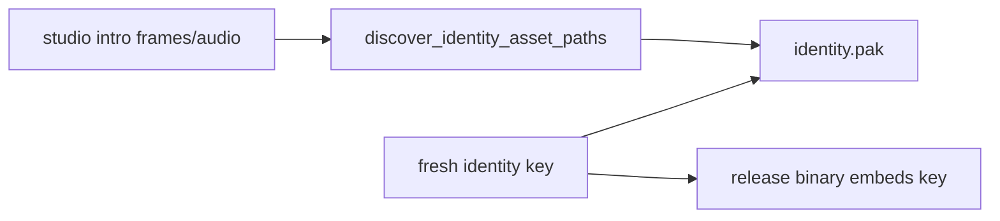

Loose assets make development and modding easy. Packed assets make release builds reliable.

Both paths matter.

## Read Path



Identity media uses a separate path through `identity.pak` and is not part of the ordinary mod override chain.

## Release Discovery

`discover_used_asset_paths()` decides what ships in `data.pak`.



## Why Contributors Should Care

A new asset can work in `cargo run` but disappear in a packaged release if discovery misses it.

That usually happens when:

- code directly loads a path not listed in `HARDCODED_RUNTIME_FILES`
- a new core audio id is played but not included in `CORE_SFX_IDS`
- a shader or texture is not referenced from a manifest
- a new asset lives outside scanned directories

## Correct Asset Addition Pattern



## Verification Commands

List discovered paths:

```powershell
cargo run --bin asset_pack -- --dry-run --list
```

Build and verify `data.pak`:

```powershell
cargo run --bin asset_pack -- --out data.pak --inventory-out asset_inventory.md --verify
```

Build an encrypted `data.pak` explicitly:

```powershell
cargo run --bin asset_pack -- --key universal.key --out data.pak --inventory-out asset_inventory.md --verify
```

For full distribution, prefer the dist scripts because they also decide whether the release binary should embed `ECHO_WARRIOR_ASSET_KEY`.



No key is allowed. `universal.key` is only required for encrypted `data.pak`;
omitting it produces a verified plain pack and a warning during distribution.
Use that knowingly, not by accident.

Validate mod/content references:

```powershell
cargo run --bin mod_check
```

## Identity Pack

`identity.pak` is for canonical studio media. It is always encrypted by release scripts with a fresh key embedded in that build.



Mods may suppress the studio intro through manifest settings, but they do not replace identity media.
