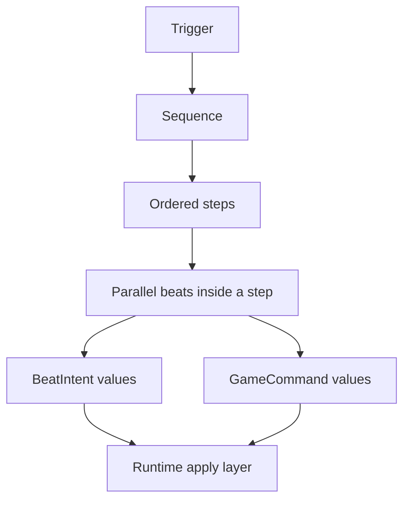
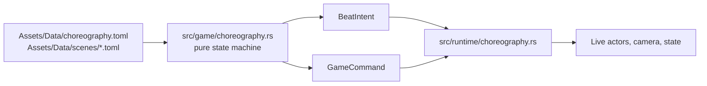
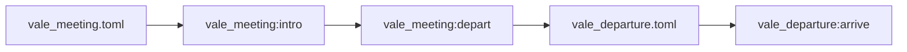
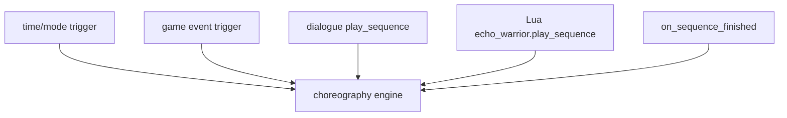

Choreography is the single architecture path for authored beats: story staging, movement, gestures, camera nudges, dialogue-triggered moments, and small expressive actions.

Do not create a parallel scene or beat system.

<figure class="wide-figure">
  
  <figcaption>A scene beat in context: gameplay keeps its world state, while choreography and dialogue temporarily own presentation and input focus.</figcaption>
</figure>

## Concept Model



In plain language:

- a trigger starts a sequence
- a sequence runs steps in order
- each step can contain beats that happen together
- pure code produces intents
- runtime code applies those intents to live actors, camera, dialogue, or commands

## Pure Engine And Runtime Apply Layer



The split matters. The engine can be validated and previewed without Macroquad. The runtime decides how those intents affect textures, positions, camera, and live state.

## Scene Projects

Scene files live under:

```text
Assets/Data/scenes/*.toml
```

Each scene can declare sequences. Scene-qualified ids allow larger story arcs to chain across files.



## Invocation Sources

Sequences can start from multiple places:



This lets content authors connect story, combat, and tiny motion beats without new Rust verbs.

## Tooling

`src/bin/choreo.rs` is the contract CLI:

```mermaid
flowchart LR
    toml[TOML scenes]
    validate[choreo validate]
    convert[choreo convert]
    schema[choreo schema]
    preview[choreo preview]
    graph[choreo graph]
    gui[future authoring tools]

    toml --> validate
    toml --> convert
    toml --> preview
    toml --> graph
    schema --> gui
    convert --> gui
    preview --> gui
    graph --> gui
```

Useful commands:

```powershell
cargo run --bin choreo -- validate Assets/Data/scenes
cargo run --bin choreo -- schema --out choreography.schema.json
cargo run --bin choreo -- preview Assets/Data/scenes/example_scene.toml intro
cargo run --bin choreo -- graph Assets/Data/scenes --json
```

## Change Rule

If you need a new authored beat:

1. add it to the choreography schema/model
2. make the pure engine emit an intent or `GameCommand`
3. make the runtime apply layer handle it
4. validate it in `choreo` and `mod_check`
5. document it for modders

Do not wire a one-off cue directly into runtime unless it is truly runtime-only and not authored content.
