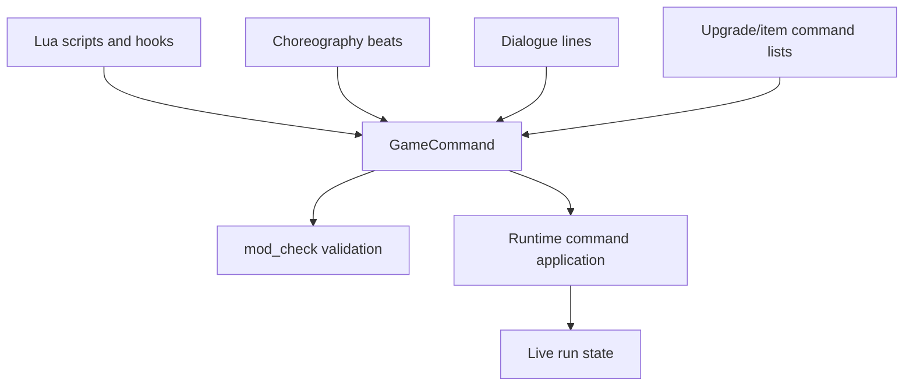
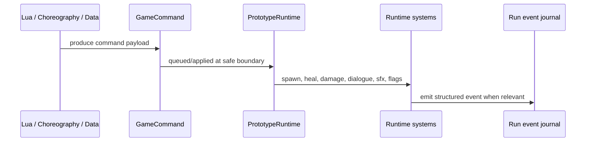
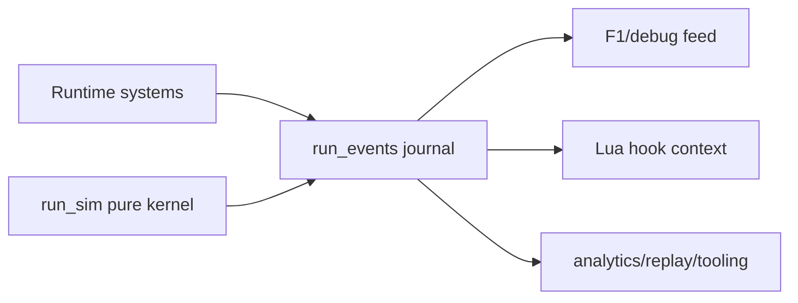
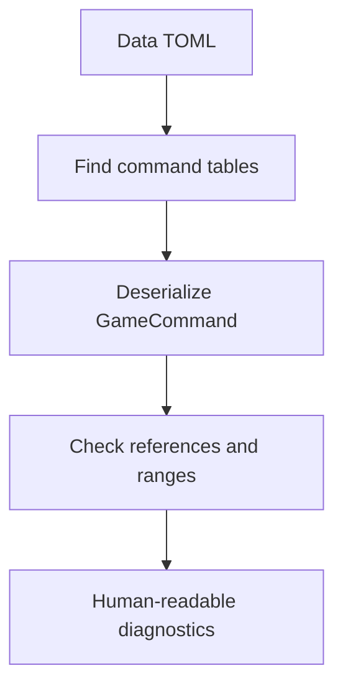

EchoWarrior uses shared command and event shapes to keep data-authored behavior from reaching directly into live runtime internals.

The short version:

- commands ask the runtime to do something
- events describe what happened
- the runtime owns invariants when applying either one

## Command Sources

The shared command model lets authoring surfaces reuse a small vocabulary instead of inventing one-off runtime calls.

## Why Commands Exist

Commands protect these boundaries:

| Boundary | Why it matters |
| --- | --- |
| Lua to Rust | scripts request behavior, Rust enforces invariants |
| Choreography to runtime | authored scenes stay data-driven |
| Upgrades/items to player state | modded content can reuse stat/effect verbs |
| Tools to content | `mod_check` can validate command payloads before launch |

## Typical Command Flow

## Event Flow

Events are structured facts about a run: enemy killed, player hit, level-up offer, upgrade picked, mode changed, and similar moments.

The same event vocabulary should be useful to tests, debug UI, scripts, and future tooling.

## Command Validation

`mod_check` walks TOML command tables and tries to deserialize them as `GameCommand`.

That means adding a new command should usually include:

- data shape
- runtime application
- validation rules
- modding docs
- tests where practical

## Safe Extension Rule

If a new data/Lua/choreography feature needs to affect the world, first ask:

> Can this be a `GameCommand` or event instead of a direct runtime special case?

Often the answer is yes, and the resulting feature becomes easier to validate, test, and author.
