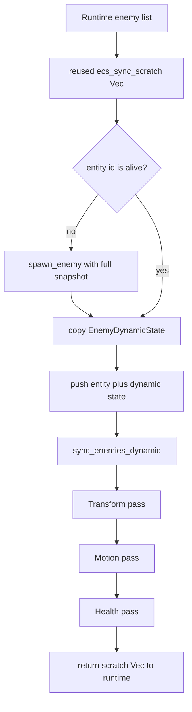
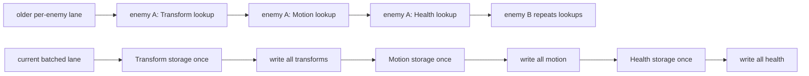
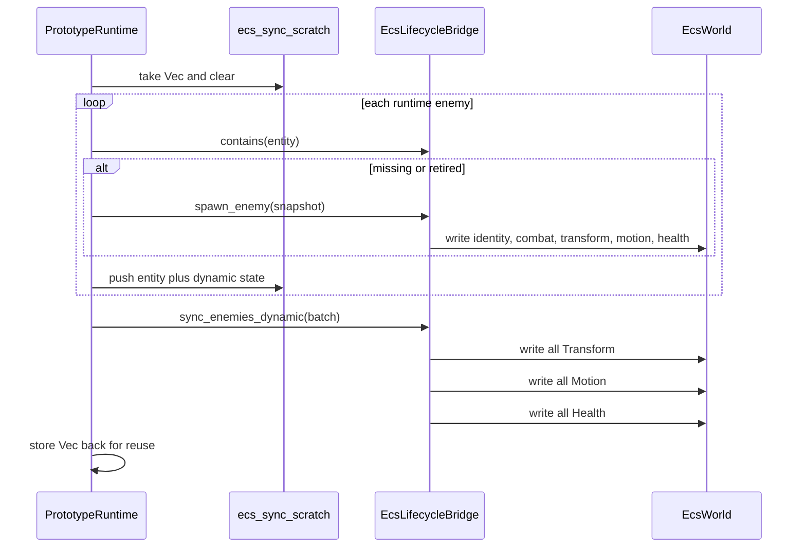
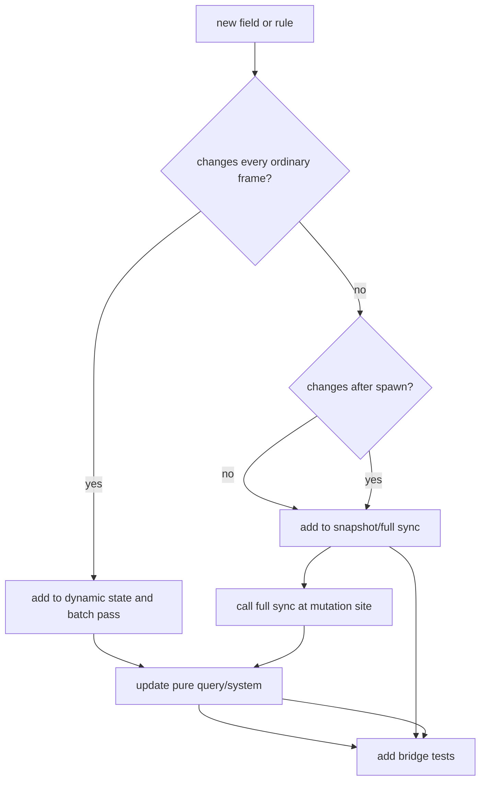

The ECS lifecycle bridge is deliberately transitional. `PrototypeRuntime` still owns the live enemy list used by Macroquad drawing, collision-adjacent runtime state, VFX, and save timing. `EcsLifecycleBridge` mirrors enough of that state into `EcsWorld` for pure systems, tests, and future migration work.

The current bridge has two lanes:

| Lane | Data shape | When to use it |
| --- | --- | --- |
| cold full sync | `EnemyLifecycleSnapshot` | spawn, save restore, or a real identity/base-stat mutation |
| hot dynamic sync | `EnemyDynamicState` | ordinary per-frame position, velocity, HP, and max HP updates |

The distinction matters. The hot lane exists so dense swarms do not clone static strings or resolve component storage once per enemy.

## Current Frame Shape

The runtime first guarantees every enemy has a live ECS entity. Then it pushes `(EntityId, EnemyDynamicState)` pairs into a reused scratch vector and calls `sync_enemies_dynamic()` once.

## Why Batch By Component

`EcsWorld` stores component storages behind `TypeId` keys. A generic insert has to resolve the storage and downcast the erased box before it can write the component.

Both lanes still do linear component writes. The difference is that the current lane resolves `Transform`, `Motion`, and `Health` storage once per frame, then writes each storage in a tight pass.

That keeps the bridge cheap enough to run while the runtime still owns the visible actor list.

## Sequence View

This is a mirror, not an ownership transfer. Runtime actor state is still authoritative for the frame. The ECS state is the clean, queryable copy that pure systems can consume.

## What Belongs In Each Shape

`EnemyLifecycleSnapshot` is for stable identity and baseline combat state:

- enemy kind string
- starting position and velocity
- HP and max HP at creation/restore time
- speed, damage, and XP value

`EnemyDynamicState` is for per-frame fields:

- position
- velocity
- current HP
- max HP

If a future buff system changes speed, damage, XP value, or identity after the ECS entity already exists, the mutation site must call `sync_enemy_full()` or an intentionally designed cold-lane update. Do not smuggle those fields into the hot lane just because it is nearby.

## Contributor Checklist

When touching enemy lifecycle sync:

1. Decide whether the field is cold identity/base data or hot frame data.
2. Keep hot data `Copy` and allocation-free.
3. Reuse `ecs_sync_scratch`; do not allocate a fresh batch every frame.
4. Preserve the "spawn strays first, batch sync second" order.
5. Add or update tests in `src/game/ecs_lifecycle.rs`.
6. Run a focused Rust check before landing runtime behavior changes.

## Adding A Mirrored Component

The most common safe extension is a new pure query that reads existing mirrored components. The riskiest extension is making ECS state authoritative for drawing or gameplay while runtime actors still own those systems.

## Common Mistakes

| Mistake | Why it hurts |
| --- | --- |
| calling `sync_enemy_full()` from the per-frame path | clones static data and rewrites components that did not change |
| adding `String` or heap-owned data to `EnemyDynamicState` | turns the hot lane back into an allocation path |
| resolving component storage inside the enemy loop | loses the reason the batch lane exists |
| mutating base stats after spawn without a cold sync | leaves ECS queries stale |
| adding a second entity mirror | creates two transitional seams instead of one |

The bridge is allowed to be boring. Its job is to make the migration safe, observable, and cheap enough that contributors can keep extracting pure systems without destabilizing the live runtime.
