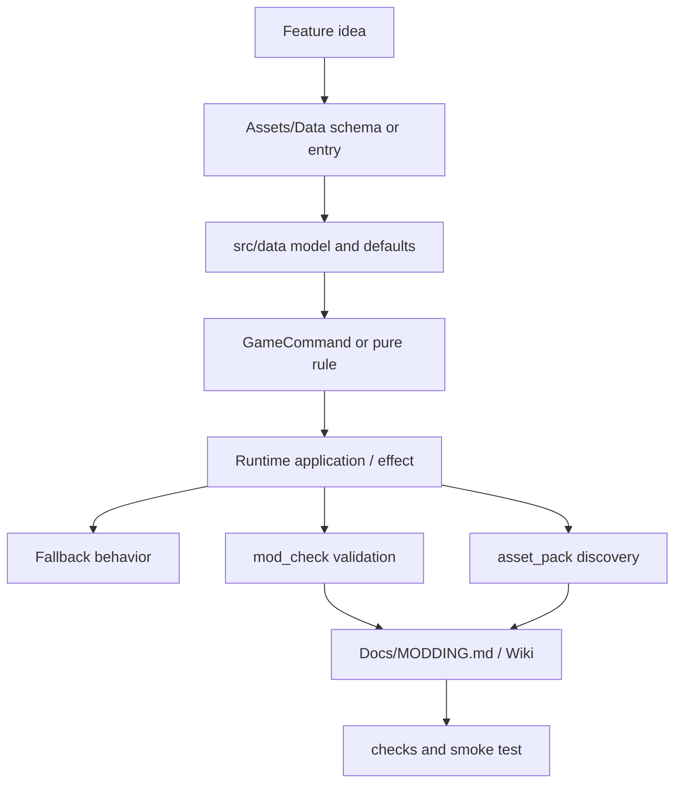
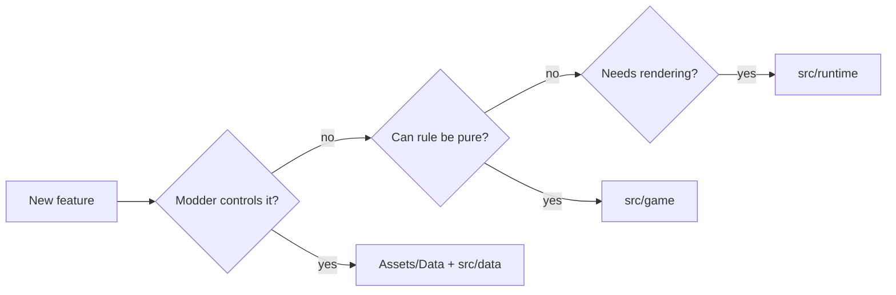
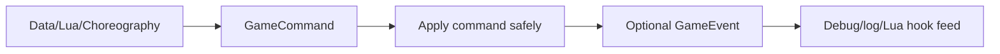
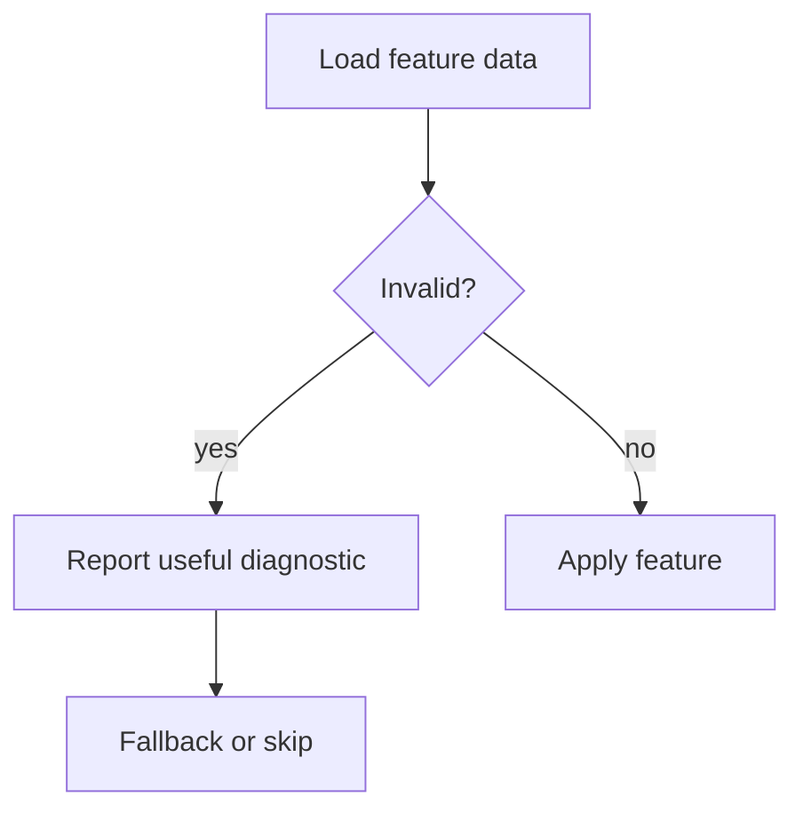
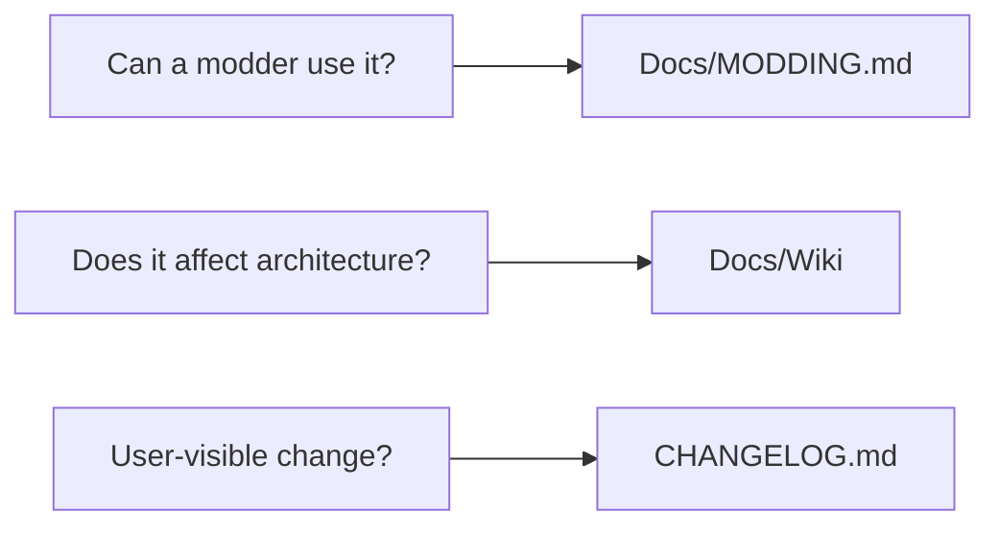

This page shows how a complete capability moves through EchoWarrior's architecture.

Example: add a new data-driven upgrade that triggers a small runtime effect and can be used by mods.

## Whole Slice

## Step 1: Decide Ownership

Most good features touch more than one layer. The important part is that each layer owns the right piece.

## Step 2: Choose A Communication Shape

If the feature is triggered by data, Lua, choreography, or upgrades, prefer a shared command or event.

## Step 3: Make It Robust

If a modder mistypes an id, the game should tell them what broke and keep going where practical.

## Step 4: Verify The Right Boundaries

| Feature touched | Check |
| --- | --- |
| Rust model or runtime | `cargo check` |
| pure logic | targeted `cargo test` |
| TOML/YAML/Lua/mod references | `cargo run --bin mod_check` |
| new asset/shader/audio path | `cargo run --bin asset_pack -- --dry-run --list` |
| visible runtime behavior | `cargo run` |
| choreography | `cargo run --bin choreo -- validate ...` |

## Step 5: Document The Surface

## Final Slice Checklist

- The feature has a clear owner.
- Content values are data-driven where practical.
- Pure logic is testable where practical.
- Runtime code owns only runtime-specific application.
- Errors degrade gracefully.
- Tools validate the new surface.
- Release packs include required assets.
- Docs explain the contributor/modder-facing contract.
