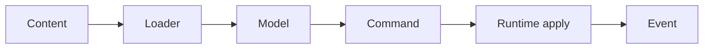
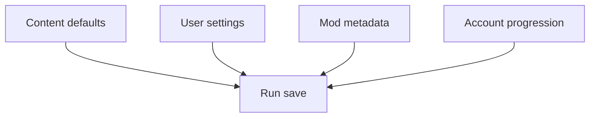

Shared vocabulary keeps architecture discussions short and less mysterious.

## Core Terms

| Term | Meaning |
| --- | --- |
| `PrototypeRuntime` | The live Macroquad runtime owner for the playable prototype. |
| pure module | Code that can run without Macroquad rendering/window/audio state. |
| runtime boundary | The point where pure rules become rendered/audio/input behavior. |
| data-driven | Content or tuning comes from `Assets/`/`Mods/`, not hardcoded Rust. |
| graceful degradation | Broken/missing content reports a problem and falls back where practical. |
| mod layer | A selectable `Mods/<mod_id>` content overlay with a manifest. |
| `data.pak` | Packed moddable runtime content for release builds. |
| `identity.pak` | Separate protected canonical studio media pack. |
| `GameCommand` | Shared request shape used by Lua, choreography, data, and runtime application. |
| run event journal | Structured record of run events used by debug, Lua hooks, tests, and future tooling. |
| ECS lifecycle bridge | Adapter that mirrors runtime enemy lifecycle into `EcsWorld` without making ECS the runtime owner. |
| hot lane | Per-frame path that must stay allocation-light and avoid repeated expensive setup. |
| cold sync | Full or infrequent synchronization used for spawn, restore, identity, or base-stat changes. |
| `Renderer2d` | Backend-neutral drawing trait in `src/render.rs`; runtime code should use it when a draw site is ready to migrate away from raw Macroquad calls. |
| `MacroquadRenderer` | Adapter in `src/runtime/renderer_mq.rs` that implements `Renderer2d` using the current Macroquad runtime. |
| `vk2d` | Standalone renderer project at [soulwax/vk2d](https://github.com/soulwax/vk2d), consumed by EchoWarrior as the `crates/vk2d` git submodule. |
| `wgpu_probe` | Isolated binary that drives EchoWarrior demo assets through `vk2d` without replacing the shipped Macroquad runtime. |
| scene project | A choreography TOML file under `Assets/Data/scenes`. |

## Flow Terms

| Term | Meaning |
| --- | --- |
| loader | Reads loose/packed text and produces typed data. |
| model | Rust struct/enums that represent a content schema or game rule. |
| command buffer | List of `GameCommand` values returned by a script or data-authored action. |
| apply layer | Runtime code that safely mutates live state from commands/intents. |
| intent | Choreography output describing what should happen without owning rendering. |

## Contributor Shorthand

| Phrase | Usually means |
| --- | --- |
| "move it to data" | Add or use a TOML/YAML/Lua/choreography surface instead of hardcoding. |
| "keep it pure" | Put deterministic logic in `src/game`, `src/data`, or `src/ui` without Macroquad. |
| "runtime adapter" | Thin code that turns pure output into Macroquad drawing/audio/state changes. |
| "pack discoverable" | `asset_pack --dry-run --list` includes the runtime asset. |
| "mod-checkable" | `mod_check` can catch bad ids/ranges/schema before launch. |
| "single engine" | Extend the established system instead of adding a parallel mechanism. |

## State Terms

| Term | Meaning |
| --- | --- |
| content default | Version-controlled value in `Assets/`. |
| user setting | Player-edited setting persisted outside `Assets/`. |
| run save | Snapshot of the current run/mode/profile. |
| account progression | Long-term progression, inventory, and unlock state. |
| content namespace | Save metadata identifying active mod content context. |
