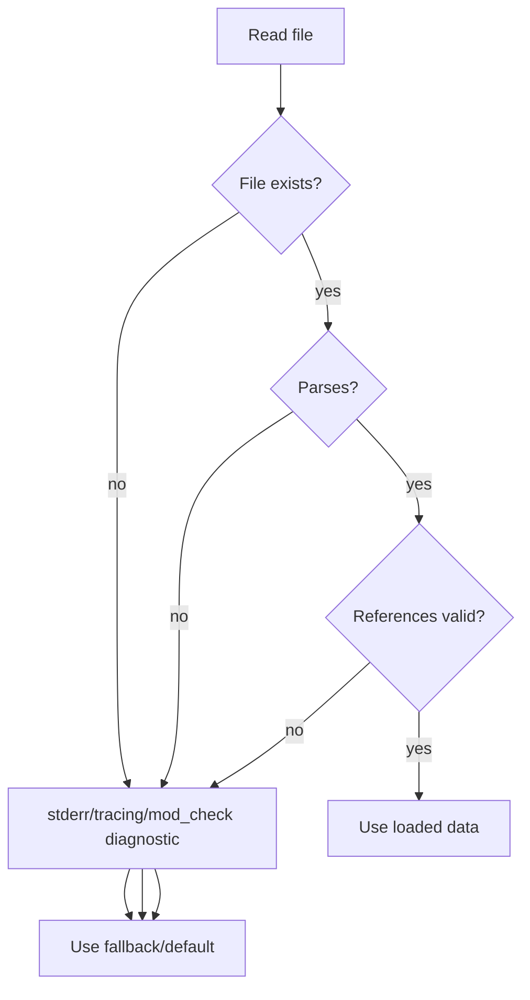
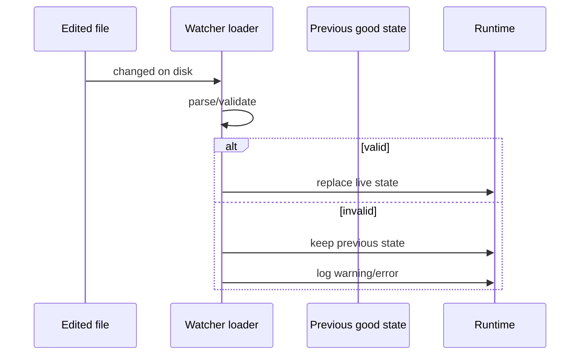
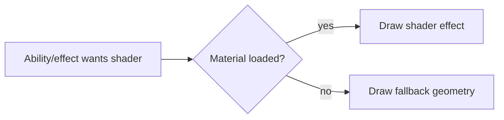

Graceful degradation is an architecture rule, not just a nice-to-have. EchoWarrior is moddable, so missing or malformed content should usually produce a warning/error and a fallback instead of a crash.

## Loader Philosophy

The fallback may be a built-in default, previous hot-reloaded state, a visible runtime fallback, or a skipped command. Choose the safest option for the subsystem.

## Common Fallback Styles

| Area | Preferred fallback |
| --- | --- |
| TOML config | built-in defaults or previous live config |
| dialogue YAML | fallback script or no dialogue |
| Lua scripts | keep previous compiled script when available |
| shader material | visible fallback shape/effect |
| audio cue | skip playback and remember failure |
| missing texture | placeholder or skip non-critical draw |
| save file | default account/run state where safe |
| mod manifest | report invalid manifest and skip layer |

## Hot Reload Safety

This matters because authors often save half-written files while iterating.

## Runtime Fallback Visuals

For gameplay-readable effects, invisible failure is dangerous. If a shader fails, draw a simpler shape that still communicates the gameplay role.

## When Not To Continue

Some failures should stop a tool or command:

- release pack verification mismatch
- unsafe unpack path
- malformed CLI arguments
- schema conversion that would corrupt output
- tests that prove a code invariant is broken

The game should degrade gracefully; shipping tools should be stricter.

## Contributor Checklist

When adding a loader or runtime asset path:

- What happens if the file is missing?
- What happens if parsing fails?
- What happens if ids reference missing content?
- Will a modder get a useful diagnostic?
- Does runtime keep the previous good state when hot-reloading?
- Is the fallback visible enough for gameplay?
