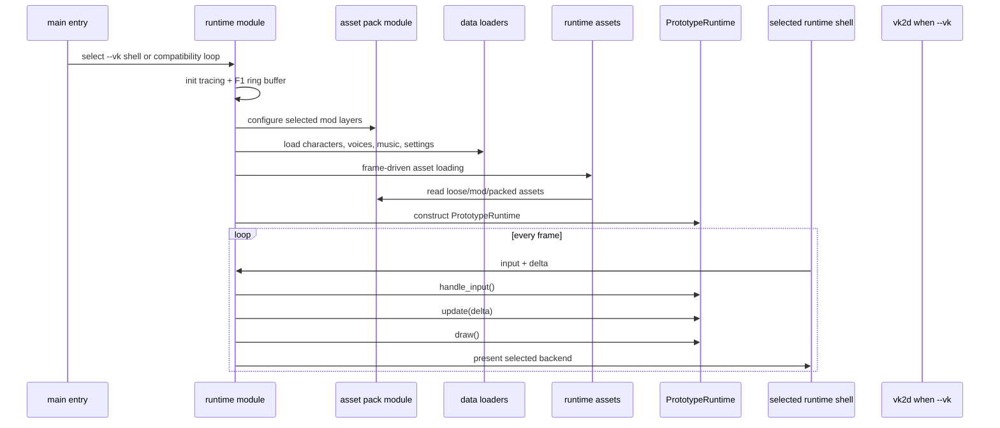
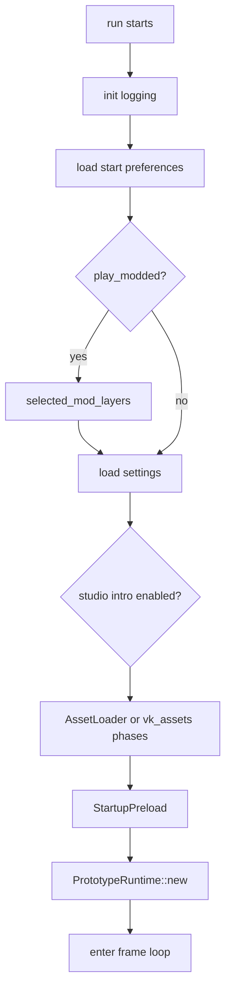
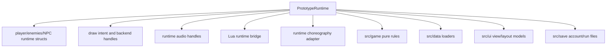
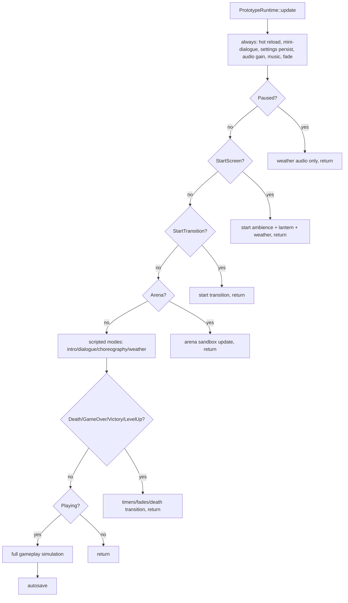
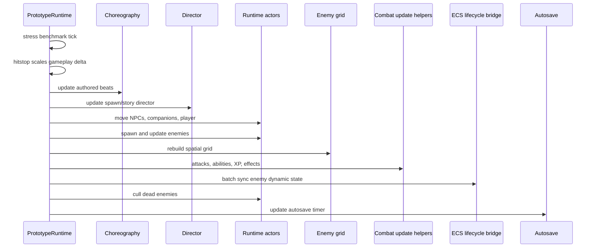
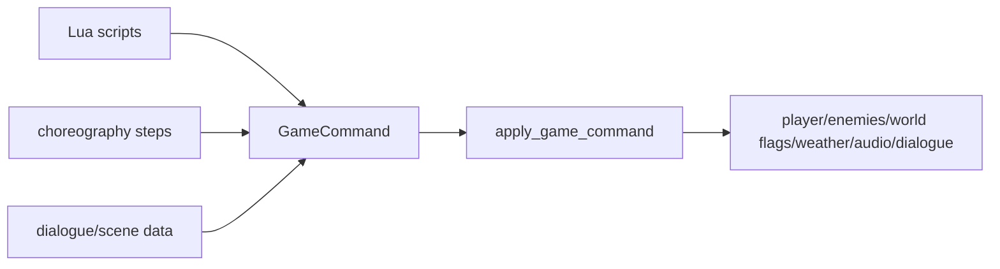
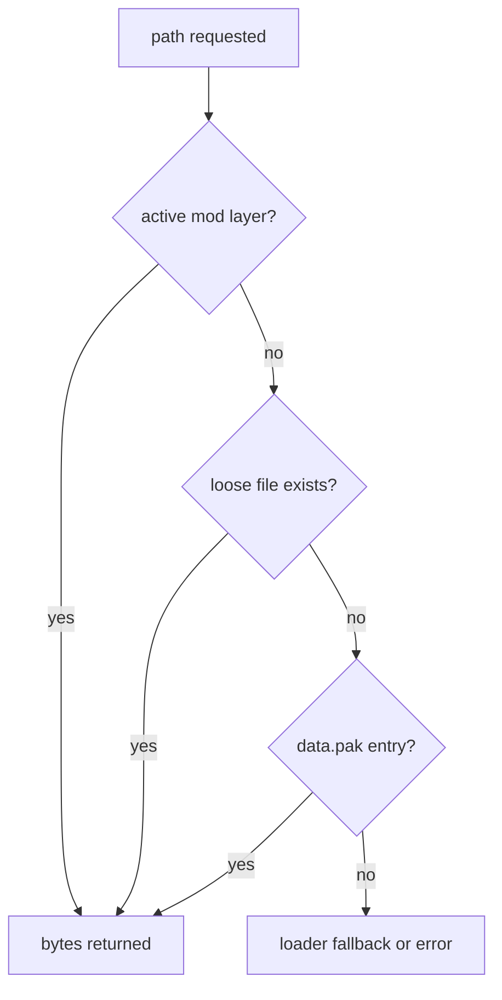
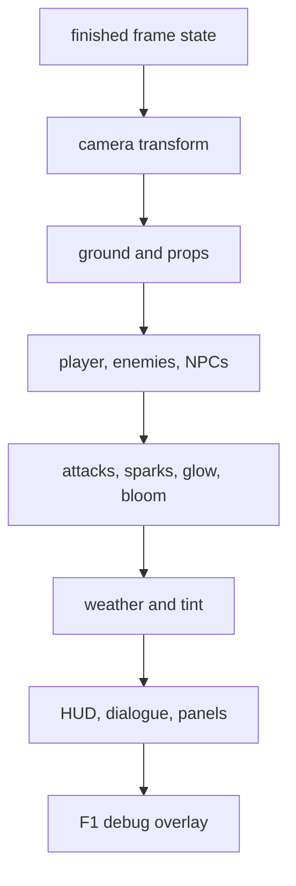

This page is the slower, deeper walkthrough of how EchoWarrior actually runs from the inside.

Read this after [Runtime Loop](runtime-loop/) if you want to touch gameplay, input, scenes, audio, effects, or anything that happens once the window is open.

For the deeper data/event side of the same flow, continue with [Runtime Data Command Pipeline](runtime-data-command-pipeline/).

## Boot To Frame

The executable starts small:

`src/main.rs` selects the winit/vk2d shell for `--vk` and retains the
Macroquad loop as a compatibility path. If startup fails, the selected shell
reports the error. The shared application logic lives in `src/runtime`.

## Startup Phases

Startup is deliberately staged. The active renderer loader registers the
resources it can support, performs one load phase, presents again, then
continues. The Macroquad loader and `vk_assets` loader share the asset lookup
contract but create backend-specific handles.

At this point the runtime has already chosen the active mod layers and called `asset_pack::set_active_mod_layers()`. That matters because later data loaders use the same asset read gateway whether the bytes come from a mod, a loose development file, or `data.pak`.

## Runtime Ownership

`PrototypeRuntime` is still the live owner of the playable prototype. It owns player state, enemies, NPCs, effects, cameras, weather, dialogue, settings, saves, the choreography adapter, and the immediate draw paths.

That does not mean all rules should stay there.

Use this rule of thumb:

| Work | Likely owner |
| --- | --- |
| texture handles, render targets, shader uniforms | `src/runtime` |
| input interpretation and mode gates | `src/runtime` |
| deterministic combat math | `src/game` |
| TOML/YAML schema and fallback loading | `src/data` |
| Lua command buffering | `src/scripting` plus runtime application |
| UI layout models and theme data | `src/ui` |
| save/account persistence | `src/save` |

## The Update Gate

The frame update is mode-gated. Some systems tick in every mode, some tick only on the start screen or arena, and most gameplay simulation only advances in `RuntimeMode::Playing`.

This is why contributors should be careful with "just update it every frame" changes. A system that advances during pause, level-up, death transition, or intro can break save state, animation timing, or player expectations.

## Playing Simulation Order

In `Playing`, the runtime applies a recognizable order:

The exact function list is long because the prototype is still live and feature-rich. The architectural point is simpler: input and timers happen before gameplay, gameplay mutates live actor state, ECS mirrors selected state, and drawing reads the finished frame state.

The enemy ECS mirror is not a per-enemy full rewrite. During ordinary frames, the runtime collects a reusable batch of `(EntityId, EnemyDynamicState)` pairs and lets `EcsLifecycleBridge` update `Transform`, `Motion`, and `Health` in component passes. See [ECS Lifecycle Hot Lane](ecs-lifecycle-hot-lane/) for the deeper contract.

## Commands Are The Runtime Boundary

Lua, choreography, dialogue, and some data-driven systems do not directly mutate every runtime field. They emit `GameCommand` values. The runtime applies those in `PrototypeRuntime::apply_game_command()`.

Current command effects include spawning enemies, changing player stats, granting XP, healing/damaging the player, queueing dialogue, playing SFX, setting story flags, starting choreography sequences, and changing weather presets.

When adding a new scriptable effect, prefer extending `GameCommand` and applying it in one place instead of giving each authoring path its own side effect.

## Asset Reads During Runtime

Most runtime content flows through `asset_pack::read()` or `asset_pack::read_to_string()`.

This is what lets a contributor run from loose files during development while release builds run from a pack. It is also what lets mods override ordinary content.

Canonical identity media is different. It uses `asset_pack::read_identity()`, which exists specifically to bypass the normal mod/loose replacement chain in release builds.

## Drawing Reads Finished State

Drawing happens after update. The runtime draws world-space layers first, then effects, then overlays and UI.

If a visual change needs simulation data, compute the data during update and let draw read it. Avoid draw-time gameplay mutations; they are hard to test and can behave differently when frame pacing changes.

## Practical Contributor Route

When you need to understand an unfamiliar feature from the inside:

1. Find the data owner in `Assets/Data`, `Assets/Dialogue`, `Assets/Scripts`, or `Assets/Metadata`.
2. Find the loader in `src/data` or the direct runtime load site.
3. Find the runtime owner in `PrototypeRuntime`.
4. Check whether a pure helper already exists in `src/game`.
5. Check whether the feature emits or applies `GameCommand`.
6. Check whether assets need release discovery in `src/asset_pack.rs`.
7. Run a targeted verification command.

The healthy direction is not "move everything out of runtime immediately." The healthy direction is to make each new slice cleaner than the last: data-driven where practical, pure where useful, runtime-bound only where rendering/input/audio genuinely require it.
