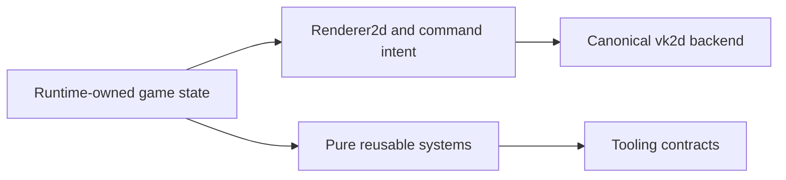
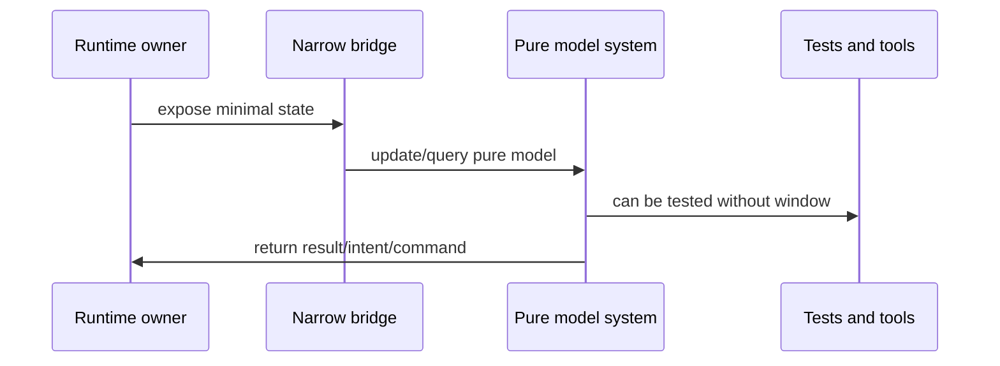

EchoWarrior is intentionally evolving from a playable prototype toward cleaner pure systems. This page describes the current seams so contributors know what is stable and what is transitional.

## Migration Map

The goal is not to erase runtime. The goal is to keep runtime focused on rendering/input/audio/application while pure code owns rules and validation-friendly models.

## Current Buckets

| Area | Status | Notes |
| --- | --- | --- |
| enemy/player/NPC live actors | runtime-owned | Simulation and presentation state are still coordinated by runtime actors. |
| enemy ECS lifecycle | bridged | Spawn/despawn/restore mirror through `EcsLifecycleBridge`; ordinary frames use batched dynamic sync for `Transform`, `Motion`, and `Health`. |
| run level / XP curve | mostly pure | Runtime delegates more arithmetic to shared run-level/run-sim code. |
| level-up offers | pure | Offer director is deterministic and testable. |
| dialogue model/loading | split | YAML loading is pure-ish; runtime owns presentation. |
| Lua hooks | split | Lua returns commands; runtime applies them. |
| choreography | split by design | Pure engine emits intents; runtime apply layer moves actors/camera/state. |
| rendering/VFX | split with canonical vk2d path | `Renderer2d` is the game-facing vocabulary; `VkRenderer` records and replays it through `crates/vk2d`. Macroquad remains a compatibility backend while remaining routes move. |
| audio | runtime-owned | Audio remains runtime-side, with data-driven manifests and Soundgarden tooling evolving separately. |
| saves/progression | shared | Save models are library-side; runtime triggers writes/restores. |
| mod validation | tooling | `mod_check` is the shipping gate for content references. |

## Transitional Pattern

If you are migrating a behavior, prefer this pattern over moving entire runtime files.

## Stable Direction

Stable architectural direction:

- more validation in tools
- more rules in `src/game`
- more content in `Assets/`
- more authoring through choreography/commands
- runtime focused on application, draw intent, audio, input, and backend integration
- `soulwax/vk2d` as the canonical GPU renderer and reusable renderer library
- Macroquad retained only as a compatibility backend until its remaining routes are retired

Not stable yet:

- final ECS ownership model beyond the current lifecycle bridge hot/cold lanes
- final UI architecture
- final removal of the Macroquad compatibility backend
- final scene/prop authoring model
- final inventory/skill-tree UI shape
- future GUI authoring workflows

## Contributor Advice

When touching transitional code:

1. preserve behavior first
2. identify the smallest pure rule to extract
3. keep adapter code close to current runtime owner
4. add tests around the pure piece
5. avoid creating new parallel ownership models

Renderer migration follows the same rule: move one draw site or one backend capability at a time, then verify the canonical `--vk` shell and the compatibility path when both are affected. New GPU capabilities belong in `vk2d`, not in an inbuilt replacement renderer inside EchoWarrior.
