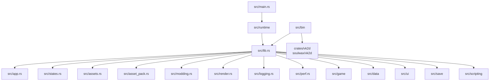
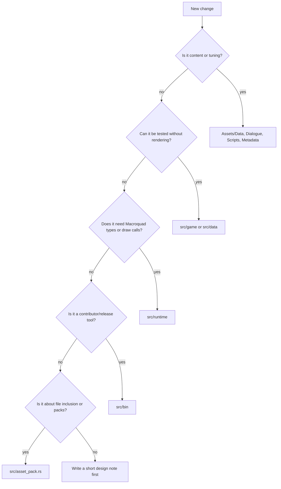
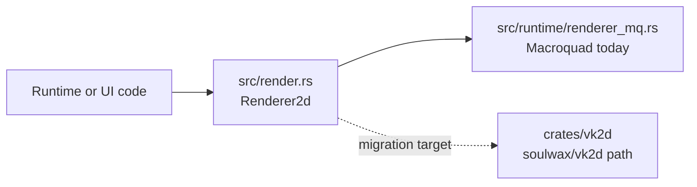

This page goes one layer deeper than the fundamentals and shows how the crate is divided.

## Top-Level Shape

## Boundary Table

| Area | Owns | Should avoid |
| --- | --- | --- |
| `src/main.rs` | Macroquad entry and error display path | game logic |
| `src/runtime` | draw/input/audio/window/live actor presentation | reusable pure rules |
| `src/game` | pure gameplay models and systems | Macroquad, file I/O where avoidable |
| `src/data` | serde models, TOML loading, fallbacks | rendering, live runtime state |
| `src/ui` | UI models, theme/layout helpers, some draw helpers | gameplay ownership |
| `src/render.rs` | backend-neutral 2D renderer vocabulary | Macroquad, wgpu, winit, game-specific asset paths |
| `src/runtime/renderer_mq.rs` | adapter from `Renderer2d` verbs to Macroquad drawing | pure gameplay rules, renderer feature design |
| `crates/vk2d` | local checkout of `soulwax/vk2d`, the standalone renderer crate | EchoWarrior gameplay assumptions or hardcoded `Assets/` paths |
| `src/save` | account/run save models and paths | rendering decisions |
| `src/scripting` | Lua API and command buffers | direct rendering side effects |
| `src/asset_pack.rs` | loose/packed reads and discovery | gameplay rules |
| `src/modding.rs` | mod manifest discovery/layer ordering | content behavior |
| `src/bin` | command-line tools over shared APIs | duplicated game logic |

## "Where Should This Go?"

## Public Library Surface

`src/lib.rs` exposes modules for tools and tests. Adding a top-level `pub mod` is an architectural choice: it means the module is part of the shared crate surface.

Good candidates:

- pure logic needed by tests or tools
- data models used by multiple bins
- save/modding/packaging helpers

Poor candidates:

- one-off runtime helpers
- Macroquad-only drawing state
- temporary experiment code

## Renderer Boundary Rule

Renderer work now has its own boundary. `src/render.rs` describes what a frame wants to draw; backend adapters decide how to draw it.

Do not pass backend types upward. If a helper takes `macroquad::Texture2D`, `wgpu::Device`, or `winit` window state, it belongs in a backend adapter or probe, not in gameplay, data, or UI model code.

## Runtime Is Still A Bridge

The live prototype still owns a lot of per-frame state in `PrototypeRuntime`. Some of that state is mirrored into pure systems through bridges, such as the ECS lifecycle bridge.

That means a contributor should not assume every gameplay concept has fully migrated to `src/game`. When in doubt:

1. find the live runtime owner
2. extract only the pure rule if useful
3. keep rendering/input/audio at the runtime boundary
