This page goes below the asset-pack overview and explains the mechanics that protect release packs from accidental drift and casual tampering.

The important mental model: pack integrity is mostly a build-time guarantee, while pack encryption is a lightweight runtime obfuscation layer.

## Build-Time Integrity Pipeline

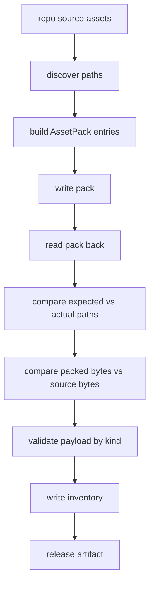

`asset_pack --verify` is the key step. It proves that the just-written pack still contains exactly the discovered paths, with byte-identical payloads, and with parseable payloads for known asset kinds.

## Discovery Split

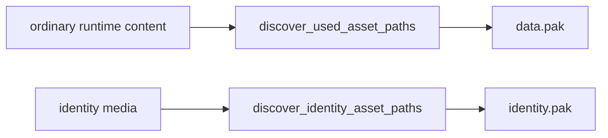

The split is deliberate. Ordinary runtime content is part of the moddable data surface. Identity media is canonical studio media and has a separate read path.

## Ordinary Discovery Graph

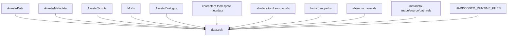

If a runtime asset can be manifest-owned, prefer that over adding a hardcoded path. Hardcoded discovery is for files that have no better data owner.

## Identity Discovery Graph

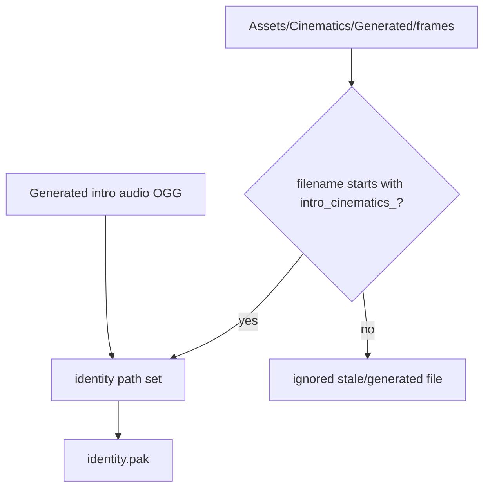

The prefix filter is a stale-file guard. Generated folders can accumulate old media; identity discovery only takes the expected current frame family plus the generated intro audio.

## Pack File Shape

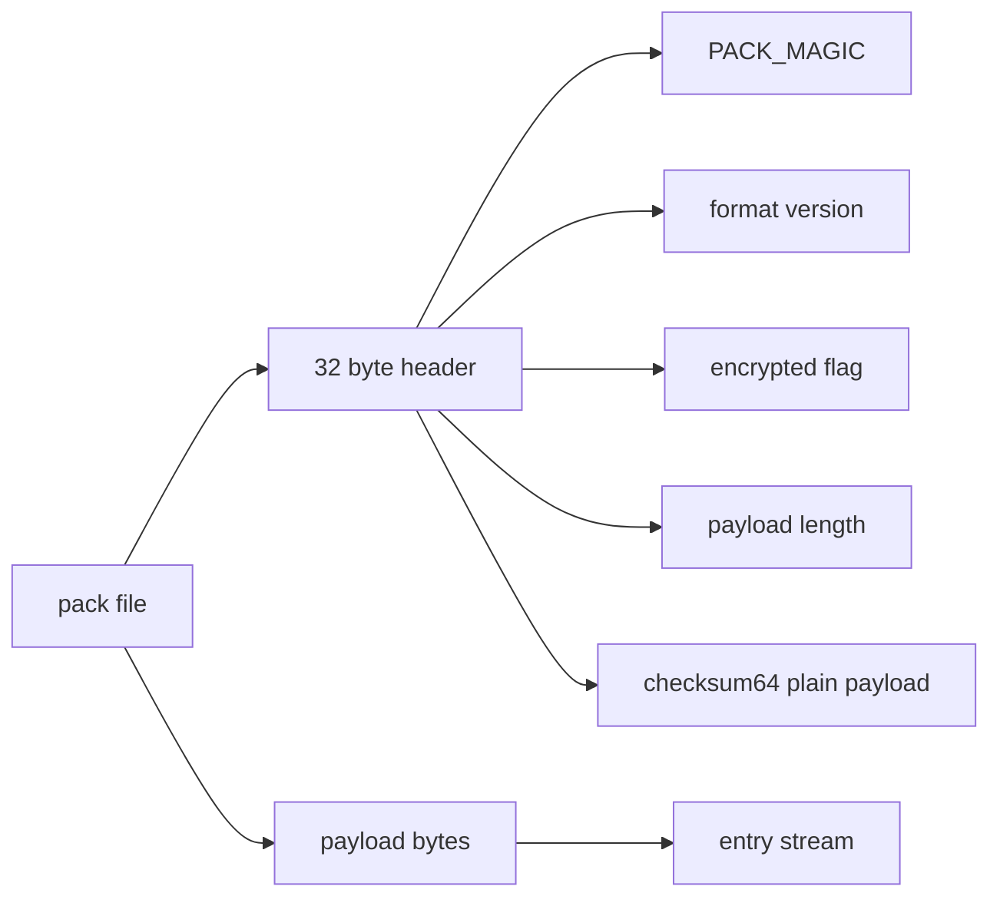

The decoded payload starts with its own payload magic, then an entry count, then entries. Each entry stores:

| Field | Purpose |
| --- | --- |
| kind byte | data, dialogue, script, texture, audio, font, shader, metadata, other |
| path bytes | normalized forward-slash path |
| byte length | payload length for this entry |
| bytes | original source file bytes |

## Write Path State Machine

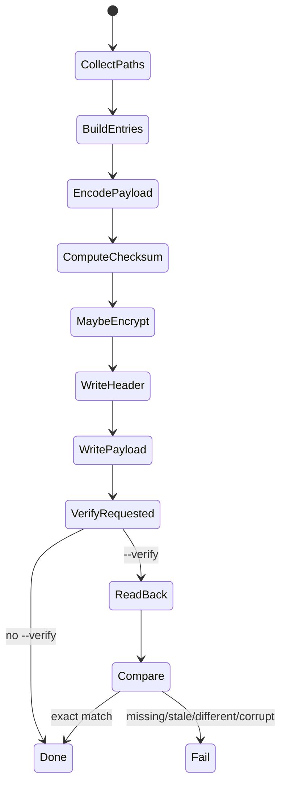

The checksum is calculated over the plain encoded payload. If the pack is encrypted, the checksum also acts as part of the keystream nonce.

## Read Path State Machine

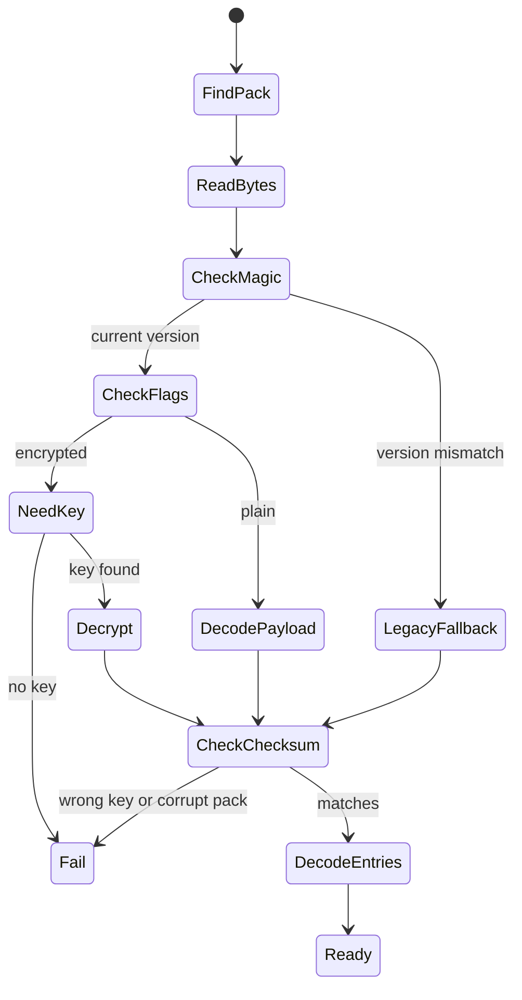

Wrong key and corrupt payload both land at checksum mismatch. The runtime should treat that as "pack unavailable" and continue with loose/fallback behavior where possible.

## Key Resolution

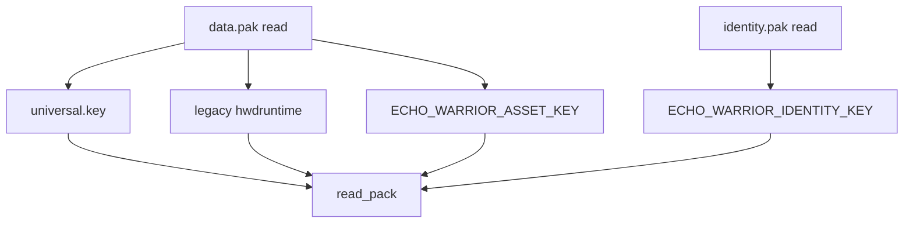

`data.pak` supports key files for development and embedded asset keys for packaged release builds. New release packaging uses `universal.key`; `hwdruntime` remains only as a legacy runtime fallback so older local encrypted packs can still be read.

## Release Encryption Decision

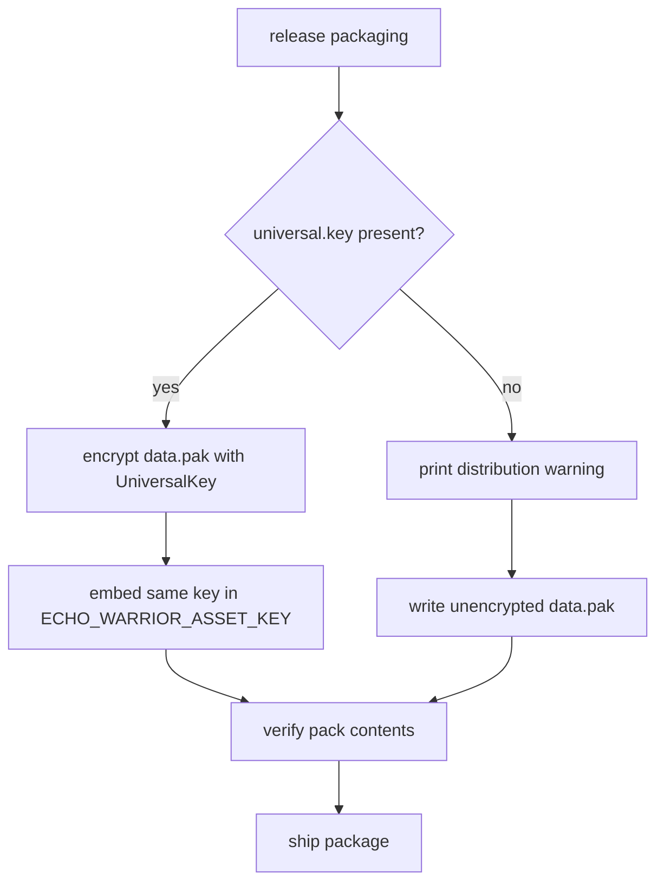

This means encryption is optional for `data.pak`, but integrity is not optional. Both branches still run `asset_pack --verify`.

## What Verification Catches

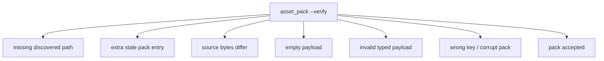

Typed payload checks include:

| Kind | Verification |
| --- | --- |
| data / metadata | valid UTF-8 and TOML |
| dialogue | valid UTF-8 and YAML |
| script / shader | valid UTF-8 |
| texture | image decoder can read bytes |
| audio / font / other | non-empty, plus byte identity |

This is not a full semantic validation pass. Pair it with `mod_check` for cross-references and command/data contracts.

## Runtime Read Layering

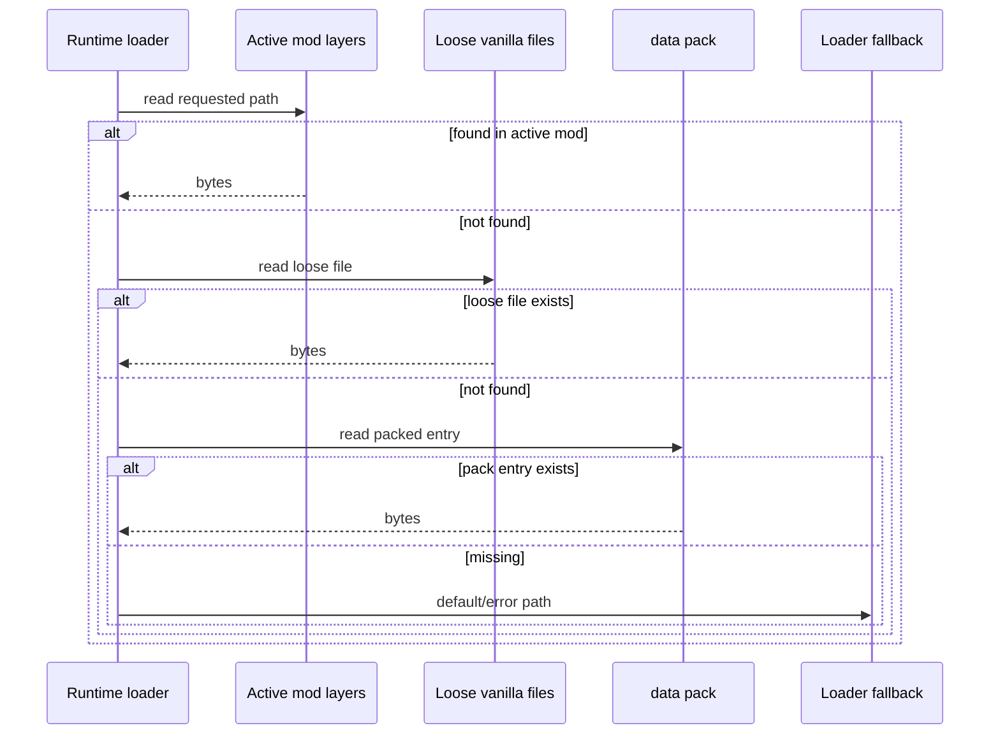

This is why release verification is necessary: development can hide discovery mistakes because loose files are earlier in the read order.

## Identity Read Layering

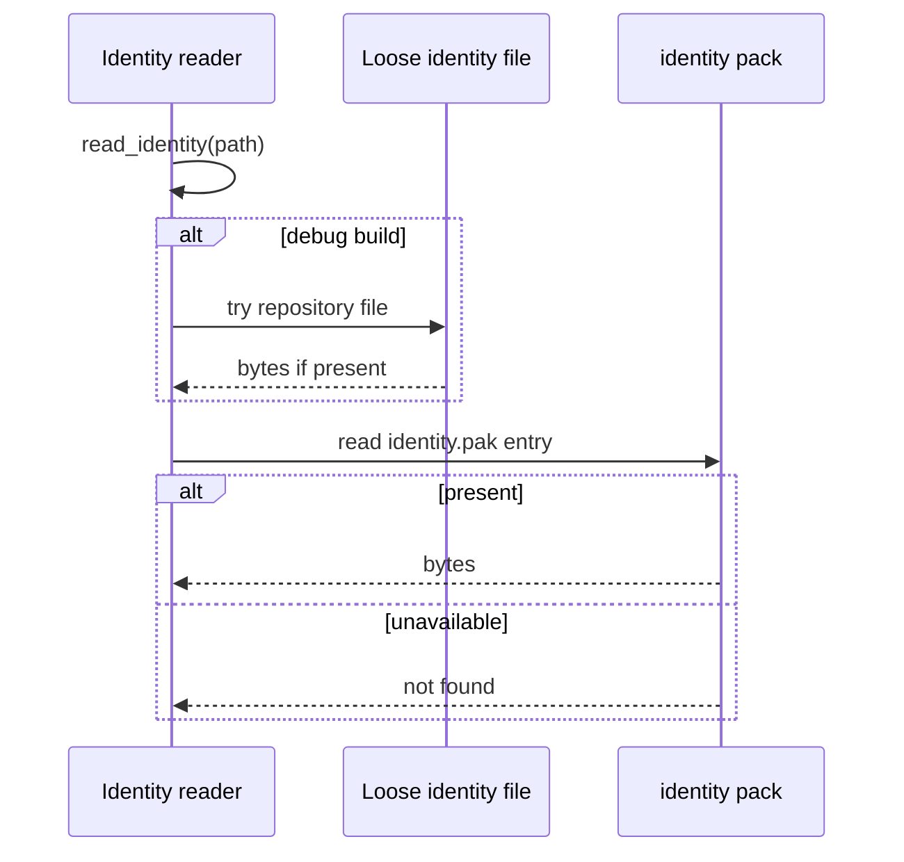

There is no active-mod check here. That absence is the protection boundary.

## Where To Automate More

The current automation already handles the highest-risk release questions, but useful next checks would be:

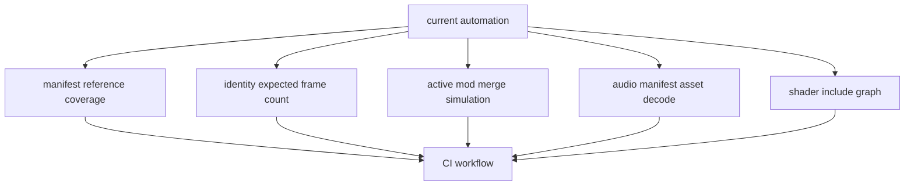

Prefer adding automation at the boundary where mistakes become expensive:

- before launch: `mod_check`
- before release: `asset_pack --verify`
- before publishing docs: `npm run build` and `npm run wiki:audit`
