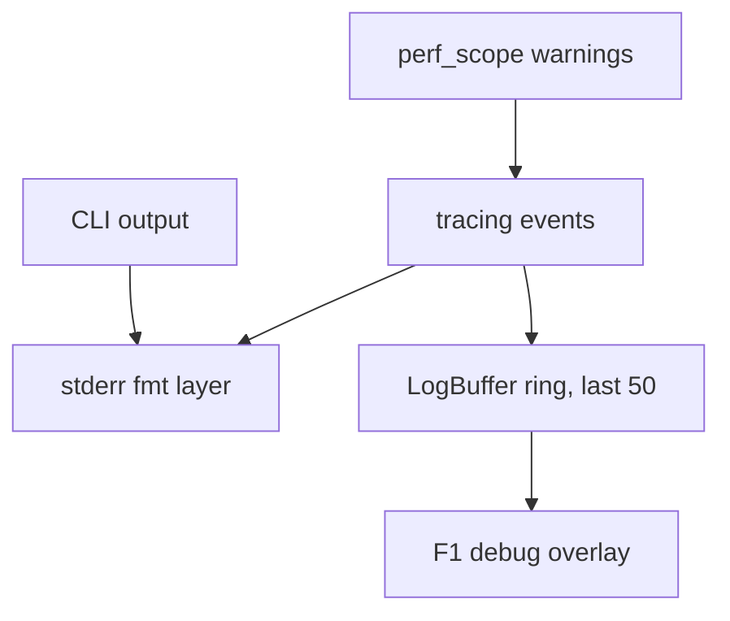
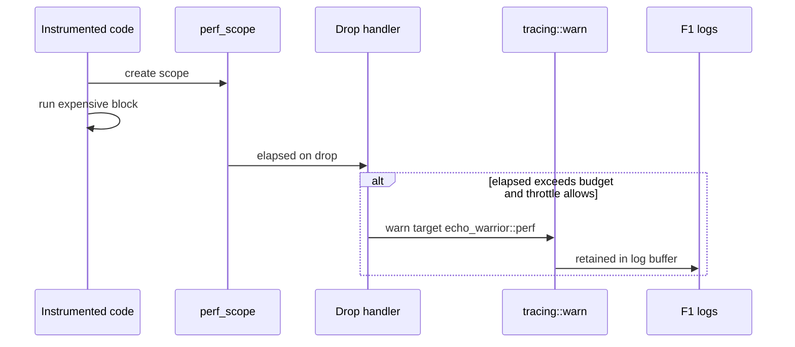
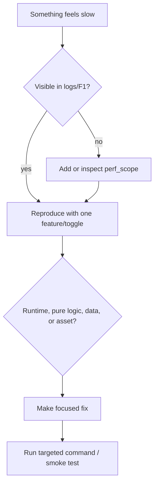

EchoWarrior aims for dense swarms, readable effects, hot-reloadable content, and fast iteration. Performance and observability are part of the architecture because contributors need to see problems early.

## Observability Stack

`logging::init()` sends logs to stderr and to the in-memory ring buffer used by the debug overlay.

## Performance Scope Flow

Scopes are debug-only. Release builds keep the API but do no timing work.

## Hot Paths To Treat Carefully

| Area | Typical risk |
| --- | --- |
| rendering loops | draw-call churn, texture switching, overdraw |
| spatial queries | repeated O(n) scans in dense swarms |
| pathfinding | per-companion allocation or excessive repathing |
| asset loading | blocking decode, repeated failed loads |
| Lua hooks | recompiling or re-executing too often |
| save writes | frequent disk I/O or non-atomic writes |
| weather/post-processing | oversized render targets or expensive shader passes |

## Performance Question Flow

## Contributor Guidance

When optimizing:

- keep behavior stable unless the task asks otherwise
- measure before and after when practical
- avoid broad rewrites as a first move
- prefer batching/caching/reuse over cleverness
- document the motivation if the optimization changes architecture

When adding expensive code:

- consider `perf_scope!`
- think about debug build cost
- keep allocations out of per-entity hot loops
- avoid repeated disk reads or script recompiles per frame
