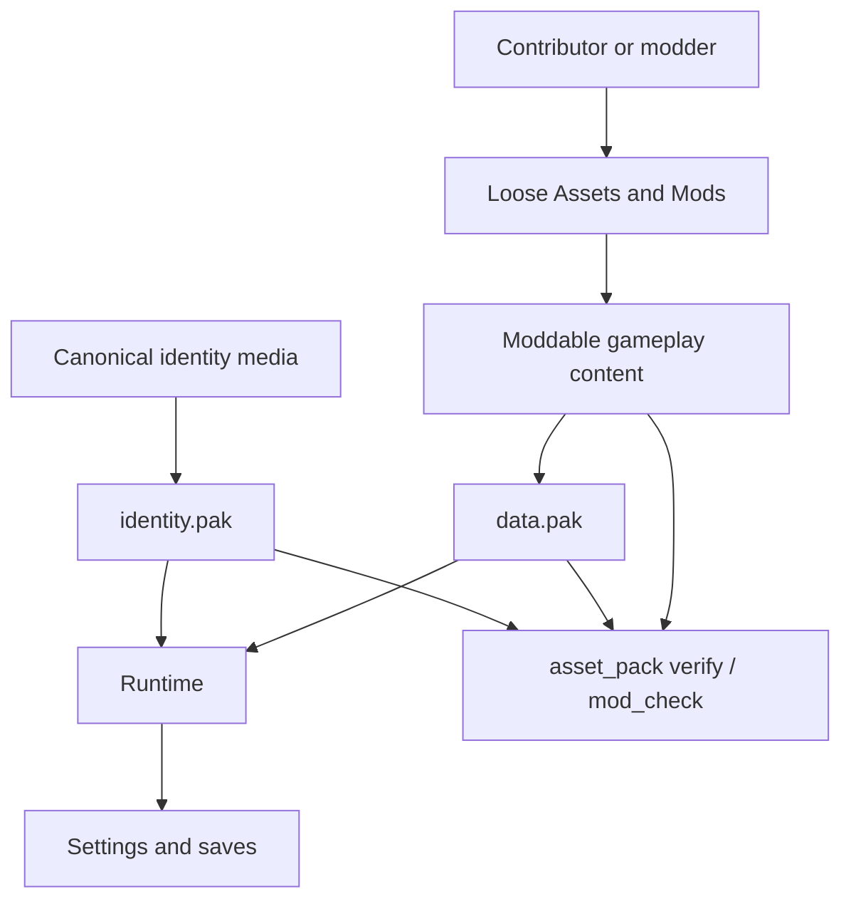
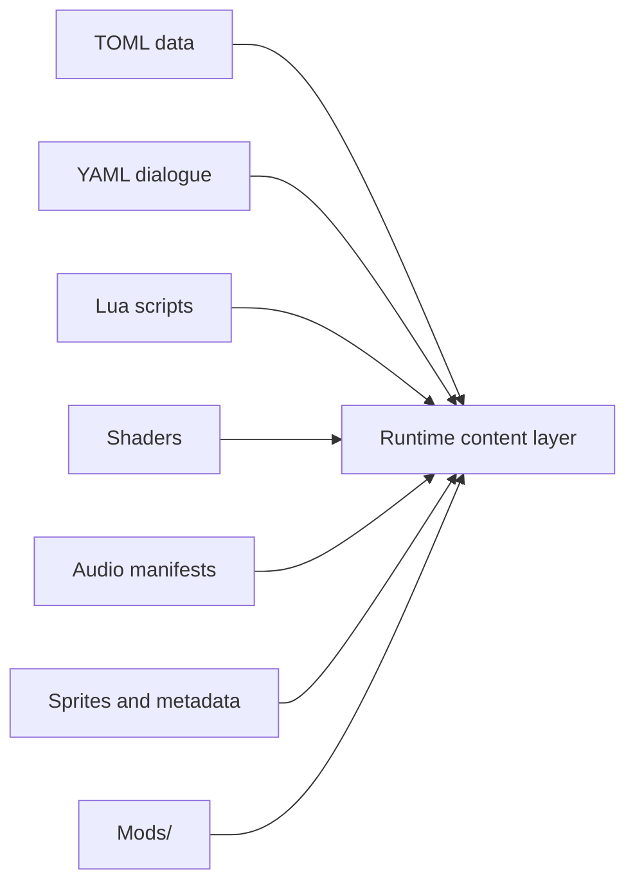
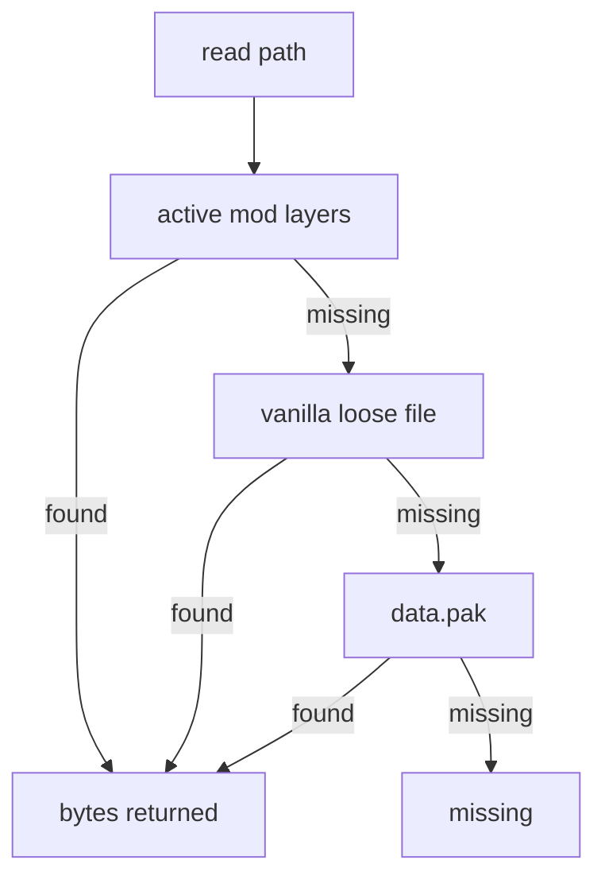
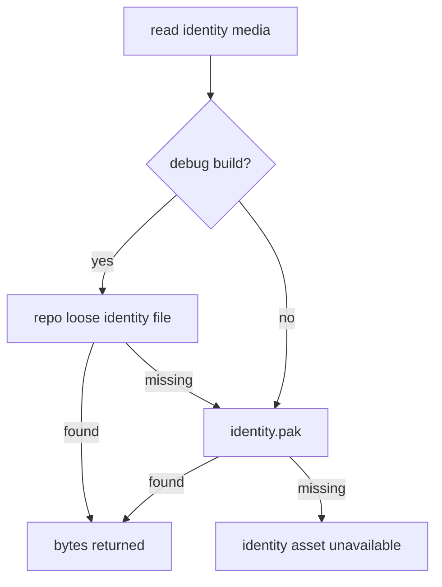
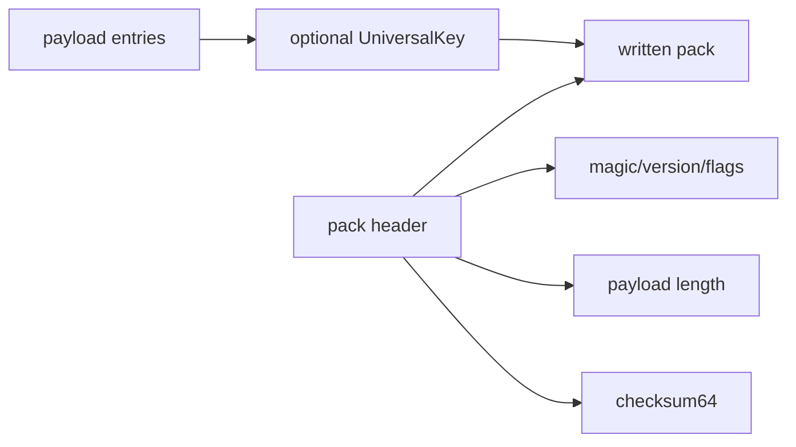
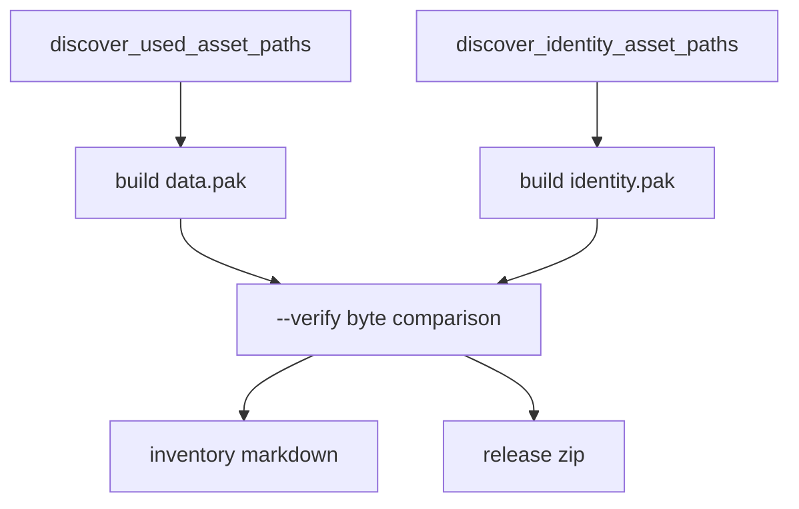
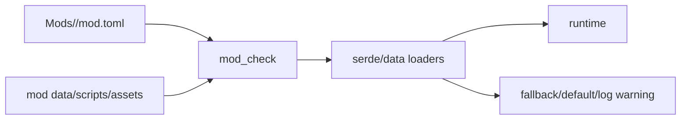
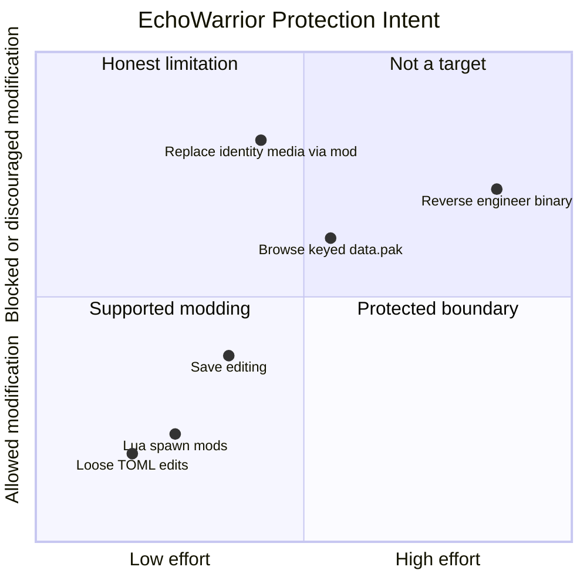

EchoWarrior is moddable by design. The protection model is therefore not "lock down the whole game." It is a set of narrower boundaries:

- keep canonical studio identity media separate from ordinary moddable content
- make release packs verifiable and complete
- make casual asset browsing less convenient when pack encryption is enabled
- validate mod/content contracts before shipping or debugging
- record which mods shaped a save so contributors can reason about state

This page explains what the game actually protects, what it intentionally leaves open, and where the code enforces each boundary.

## One-Screen Boundary Map



The game protects the release boundary and the identity-media boundary. It does not try to make local content, saves, or the desktop client untouchable.

## What Is Protected

| Boundary | Protected from | How |
| --- | --- | --- |
| `identity.pak` | casual replacement of canonical studio intro media | separate pack, separate embedded key, `read_identity()` path |
| release inventory | missing or stale shipped assets | `asset_pack --verify` compares discovered paths against source bytes |
| `data.pak` when keyed | casual browsing/editing of packed content | optional payload encryption via `UniversalKey` |
| runtime content shape | malformed mods and missing references | `mod_check`, serde loaders, fallback defaults |
| save context | confusion about which mod produced state | save metadata records active mod manifest entries |

The strongest current boundary is not encryption. It is separation of responsibility: identity media is not loaded through the ordinary mod override path.

## What Is Intentionally Moddable

Most game content is supposed to be editable.



This includes classes, enemies, weapons, abilities, upgrade offers, dialogue, spawn layers, weather presets, SFX/music manifest entries, metadata descriptors, shaders, and modded assets. A mod can also suppress the canonical studio intro through `disable_studio_intro = true`.

Suppressing the intro is different from replacing identity media. Replacement goes through the ordinary asset system for ordinary content, not through the identity-media path.

## What Is Not Protected

EchoWarrior is not currently an anti-cheat or DRM system.

| Area | Current stance |
| --- | --- |
| local saves | user-editable files, with structure and metadata for clarity |
| local settings | user-editable preferences |
| ordinary loose assets | intentionally override packed content in development |
| mods | intentionally powerful |
| desktop binary | a determined user can inspect the client |
| pack encryption | casual obfuscation and corruption detection, not adversarial secrecy |

This is a desktop game. If a local client can decrypt and play an asset, a determined user can eventually observe enough of the client to reproduce that path. The project should describe encryption honestly: it protects against casual browsing and accidental tampering, not against a determined reverse engineer.

## Ordinary Asset Read Order

Most runtime reads use `asset_pack::read()`:



Important details from `src/asset_pack.rs`:

- active mod layers are checked first
- later selected layers override earlier dependency layers
- a mod asset may be loose under `Mods/<mod_id>/...` or packed under `Mods/<mod_id>/...` inside `data.pak`
- vanilla loose files are checked before `data.pak`
- `data.pak` is the fallback for packaged releases

That order is the reason loose development files are convenient and the reason release discovery matters. A path can work in `cargo run` because a loose file exists, then fail in a packaged build if the path was never discovered into `data.pak`.

## Identity Media Read Order

Identity media uses `asset_pack::read_identity()`:



In debug builds, loose identity files are allowed for iteration. In production builds, the function does not consult active mod layers or ordinary loose release files. It accepts the separately keyed `identity.pak`.

This is the concrete tamper boundary: a mod can opt out of the studio intro, but it cannot provide replacement identity media through the normal override chain.

## Pack Format And Keys

`data.pak` and `identity.pak` use the same pack format:



Technical notes:

- `PACK_MAGIC` identifies an EchoWarrior pack.
- `PACK_FORMAT_VERSION` selects the current format.
- `PACK_FLAG_ENCRYPTED` marks payloads that require a key.
- `PAYLOAD_MAGIC` identifies the decoded entry payload.
- each entry stores kind, normalized path, byte length, and bytes.
- checksum validation detects wrong keys or corrupt payloads.
- encryption is XOR-style keystream obfuscation derived from `UniversalKey` and checksum nonce.

Key sources differ by pack:

| Pack | Key behavior |
| --- | --- |
| `data.pak` | optional key from `hwdruntime`, `universal.key`, or embedded `ECHO_WARRIOR_ASSET_KEY` |
| `identity.pak` | embedded `ECHO_WARRIOR_IDENTITY_KEY`, generated fresh by release packaging |

The identity key is per release-script invocation. It is embedded into the release build and the loose key is not meant to be staged.

## Release Verification

Release packaging should prove that the shipped packs match the runtime set.



`discover_used_asset_paths()` scans or derives ordinary runtime content:

- `Assets/Data/*.toml`
- `Assets/Metadata/*.toml`
- `Assets/Scripts/**/*.lua`
- dialogue YAML/YML files
- runtime-shaped files under `Mods/<mod_id>/`
- character sprite metadata references
- shader manifest references
- font manifest references
- core SFX and music manifest entries
- explicit runtime files that have no better manifest owner

`discover_identity_asset_paths()` is narrower. It collects generated studio intro frames with the expected prefix and the generated intro audio path.

Run these checks when touching pack inclusion:

```powershell
cargo run --bin asset_pack -- --dry-run --list
cargo run --bin asset_pack -- --out data.pak --inventory-out asset_inventory.md --verify
cargo run --bin asset_pack -- --identity --key identity.key --out identity.pak --inventory-out identity_inventory.md --verify
```

## Mod Validation Boundary

Mods are allowed to change content, but they still have contracts.



The goal is graceful degradation. Broken content should produce a useful warning or diagnostic and fall back where reasonable. It should not become an unexplained crash.

For contributors, this means a new moddable field should usually come with:

- serde defaults
- validation in `mod_check` when the field references another asset/id
- release discovery updates if it introduces a new runtime asset path
- tests when the behavior is pure enough to test

## Threat Model In Plain English



Read the chart as intent, not a formal security audit. Supported modding should stay easy. Identity-media replacement through the normal mod path should stay blocked. Reverse engineering the desktop client is outside the current protection target.

## Contributor Checklist

Before changing anything related to protection or asset loading:

1. Decide whether the asset is ordinary moddable content or identity media.
2. For ordinary content, route reads through `asset_pack::read()` or `read_to_string()`.
3. For identity media, use `read_identity()` and keep it out of mod/loose replacement paths in release.
4. Add manifest ownership or discovery coverage for any new release asset.
5. Add `mod_check` validation for new content references.
6. Run the relevant pack dry-run or verification command.
7. Document honestly whether the change is a modding feature, an integrity check, or casual obfuscation.

The healthiest protection work in this project is precise. Protect the specific boundaries that matter, and leave the moddable surface welcoming.
