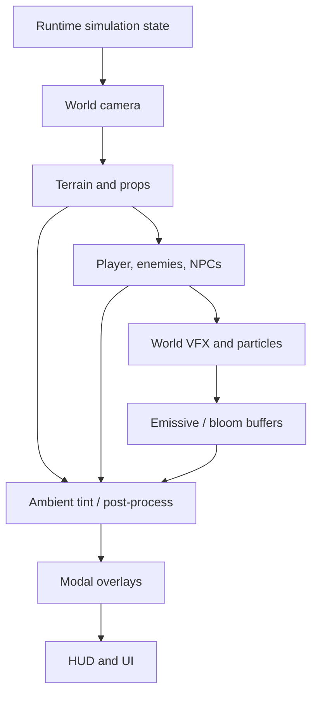
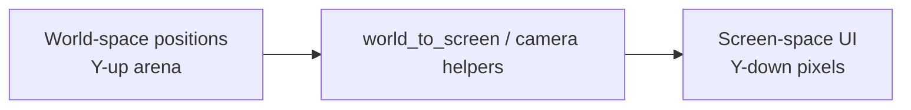
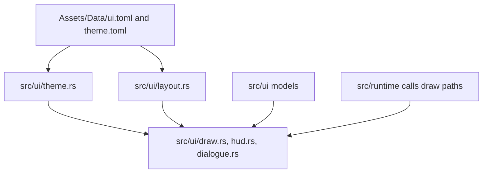
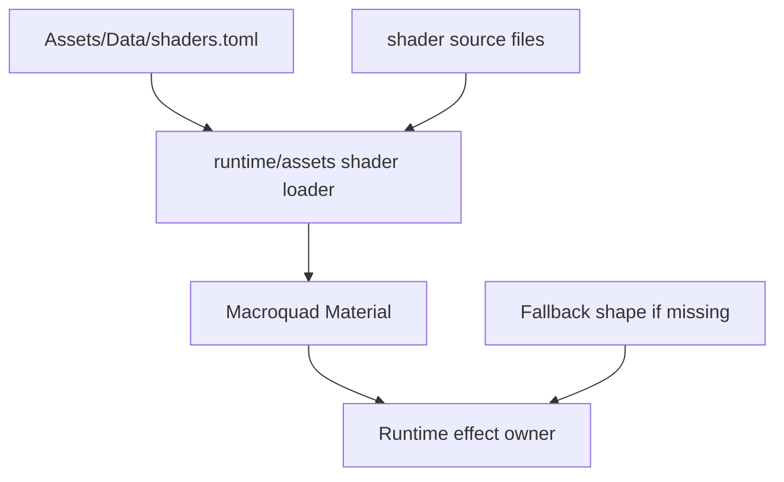
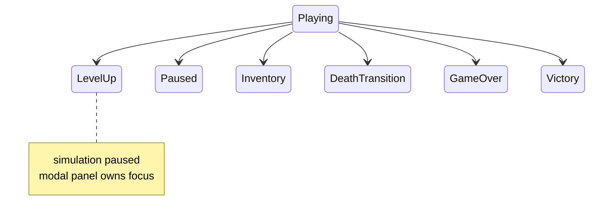

Rendering is the clearest place where EchoWarrior must keep boundaries tidy: world simulation, world rendering, post-processing, and screen-space UI all happen in one frame, but they do different jobs.

## Layer Stack

Exact implementation details change, but the conceptual stack stays useful for contributors.

## World Space vs Screen Space

Do not duplicate projection math for labels, hit tests, or overlays. Use existing runtime helpers.

## UI Ownership

UI should be data-driven where practical. Text, colors, budgets, and common layout values should not drift into random runtime constants.

## Shader And VFX Flow

Missing shader materials should degrade gracefully. A visible fallback is better than a crash or invisible gameplay signal.

## Modal Modes

Some runtime modes pause or suppress world labels/effects to keep UI readable.

When adding world-space labels, damage numbers, or banter, check how they behave under modal overlays.

## Rendering Change Checklist

- Is the draw call world-space or screen-space?
- Does it need pixel snapping?
- Does it respect current runtime mode?
- Does it have data-driven colors/tuning where practical?
- Does a missing asset/shader have a fallback?
- Does any new runtime asset ship in `data.pak`?
- Did you smoke-test with `cargo run` if behavior changed?
