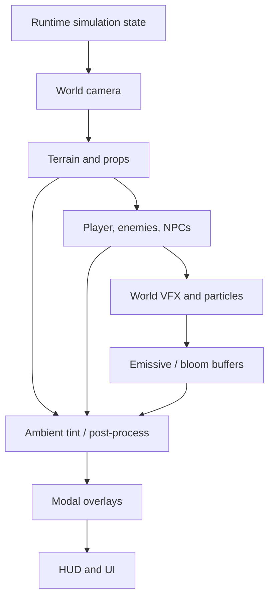
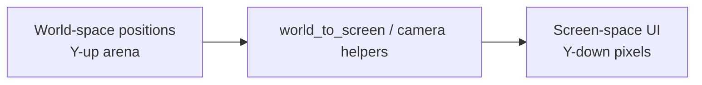
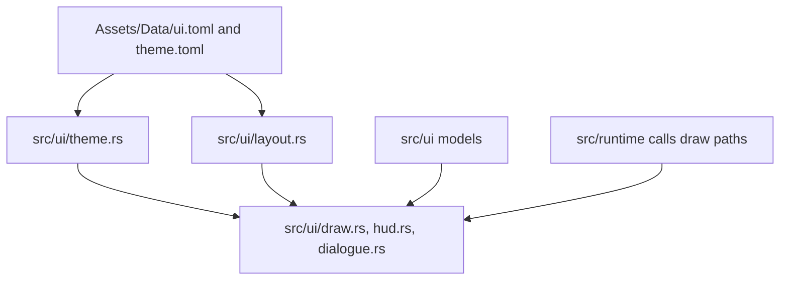
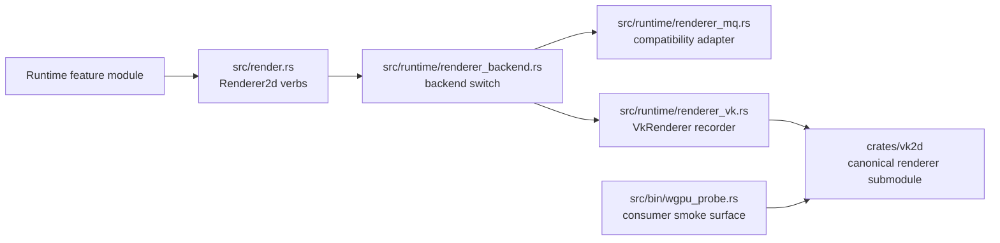
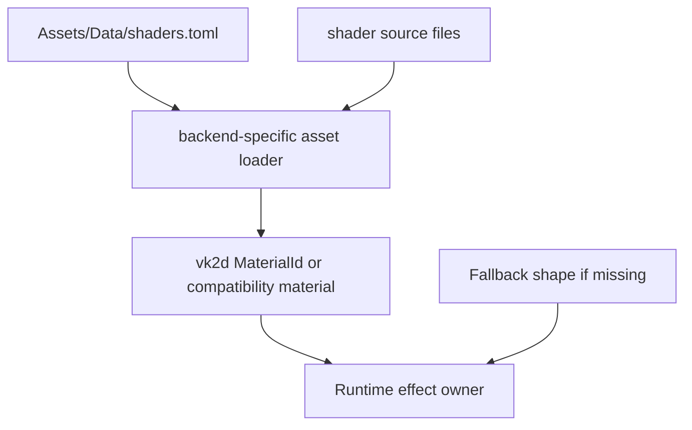
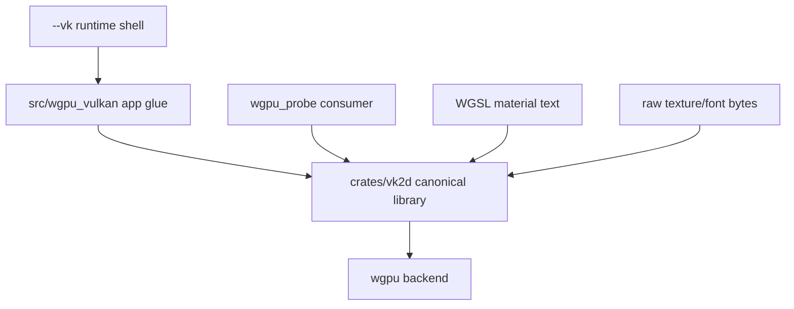
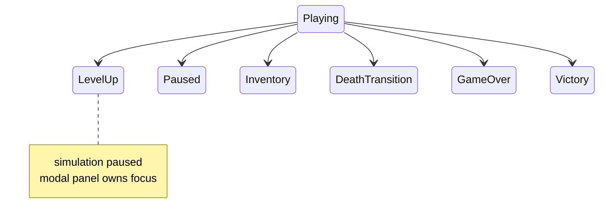

Rendering is the clearest place where EchoWarrior must keep boundaries tidy: world simulation, world rendering, post-processing, and screen-space UI all happen in one frame, but they do different jobs.

<figure class="wide-figure">
  
  <figcaption>The shader arena makes the rendering/UI split visible: world-space effects, HUD, icon rows, and tuning panels all share a frame but belong to different layers.</figcaption>
</figure>

## Layer Stack



Exact implementation details change, but the conceptual stack stays useful for contributors.

## World Space vs Screen Space



Do not duplicate projection math for labels, hit tests, or overlays. Use existing runtime helpers.

## UI Ownership



UI should be data-driven where practical. Text, colors, budgets, and common layout values should not drift into random runtime constants.

## Renderer Boundary

The game-facing draw contract is neutral, but its architectural destination is no longer undecided: [`soulwax/vk2d`](https://github.com/soulwax/vk2d) is the canonical 2D renderer. The Macroquad adapter remains because old paths still need a compatibility implementation while the route is completed.



For contributors, the practical rule is simple: new renderer slices should move draw intent toward `Renderer2d` verbs such as rectangles, sprites, text, lines, circles, targets, and materials. Gameplay and UI model code should not learn about `wgpu`, `winit`, or Macroquad resource types. When the verb is insufficient, extend `vk2d` first and then adapt the contract.

For the current target/view/bloom routing, read [vk2d Runtime Usage](vk2d-runtime-usage/). For the renderer crate internals, read [vk2d Renderer Internals](vk2d-renderer-internals/).

## Shader And VFX Flow



`vk2d` is the canonical material path and loads WGSL through its own API. Macroquad GLSL materials remain for compatibility, so shader work now has two important contracts:

- gameplay and UI choose *what* effect should be drawn
- the backend chooses *how* that material is loaded and presented

Missing shader materials should degrade gracefully. A visible fallback is better than a crash or invisible gameplay signal.

## Vulkan-Oriented Probe Path

`src/bin/wgpu_probe.rs` is a focused consumer smoke surface for Vulkan-facing renderer work. The canonical runtime surface is the winit/vk2d shell selected with `--vk`; the probe remains useful because it isolates library and material issues from game-state complexity.



Use the probe for renderer library checks:

```powershell
cargo test -p vk2d
cargo run -p vk2d --example hello_sprite -- --frames 3
cargo run --bin wgpu_probe -- --frames 3
```

Use the game for integration checks:

```powershell
cargo run
```

## Modal Modes

Some runtime modes pause or suppress world labels/effects to keep UI readable.



When adding world-space labels, damage numbers, or banter, check how they behave under modal overlays.

## Rendering Change Checklist

- Is the draw call world-space or screen-space?
- Does it need pixel snapping?
- Does it respect current runtime mode?
- Can the draw intent go through `Renderer2d` instead of raw Macroquad calls?
- Does it have data-driven colors/tuning where practical?
- Does a missing asset/shader have a fallback?
- Does any new runtime asset ship in `data.pak`?
- Did you smoke-test with `cargo run` if behavior changed?
