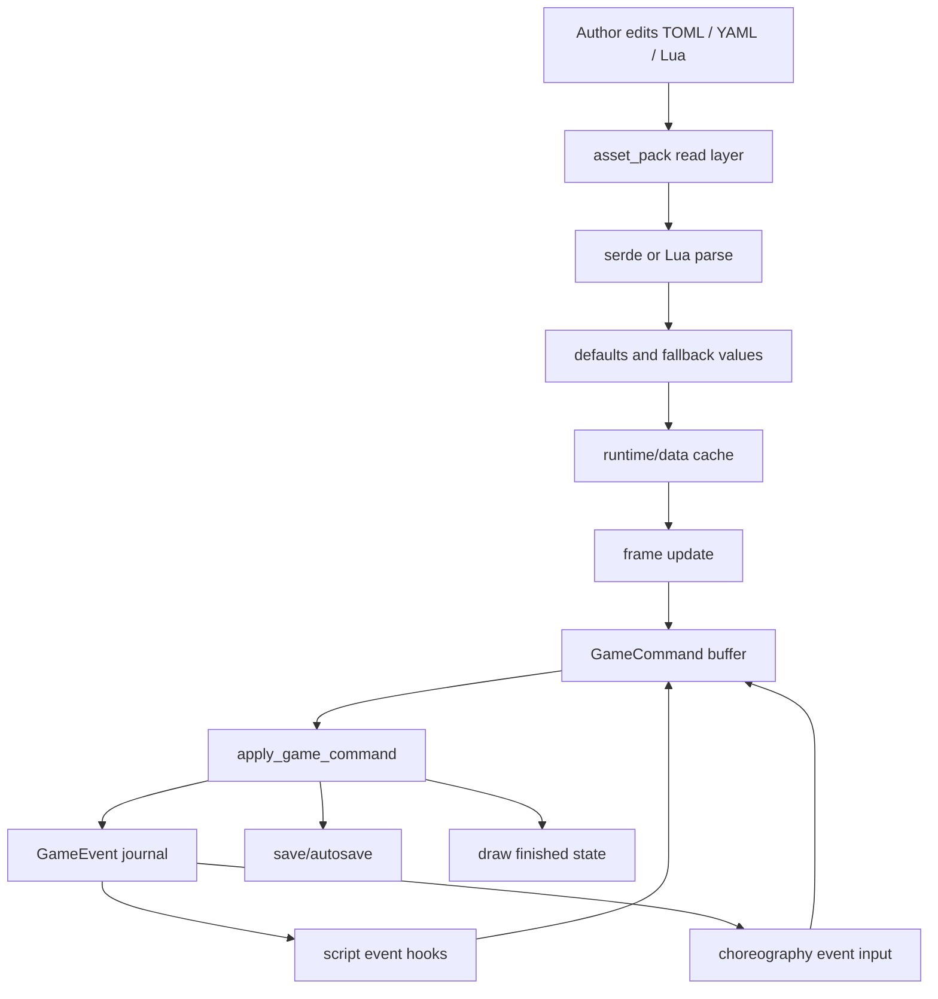
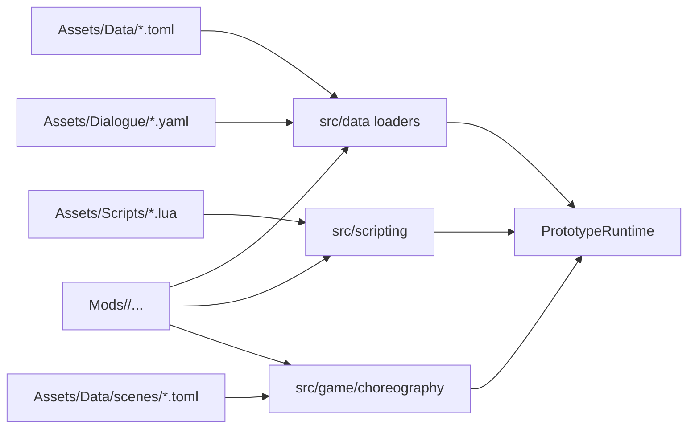
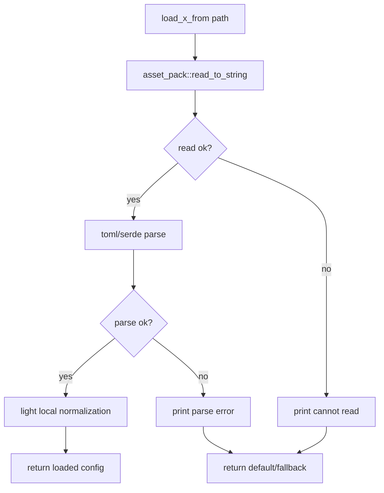
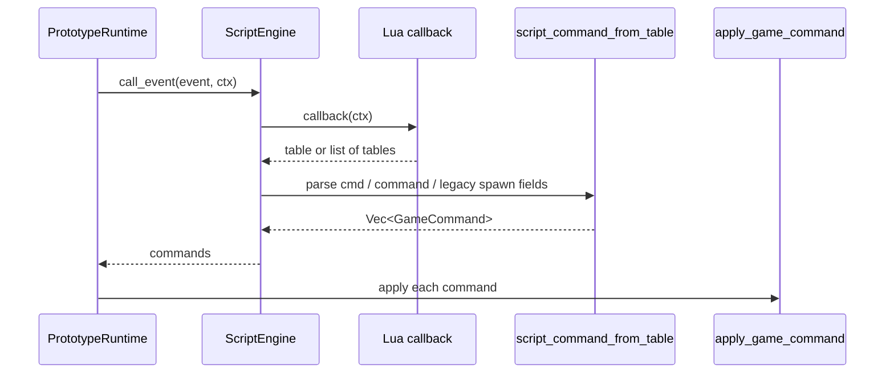
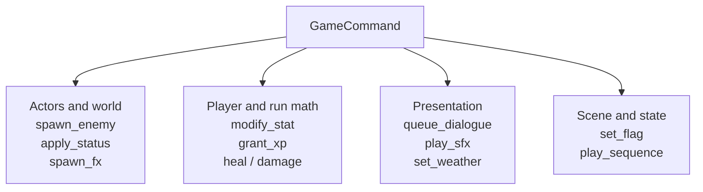
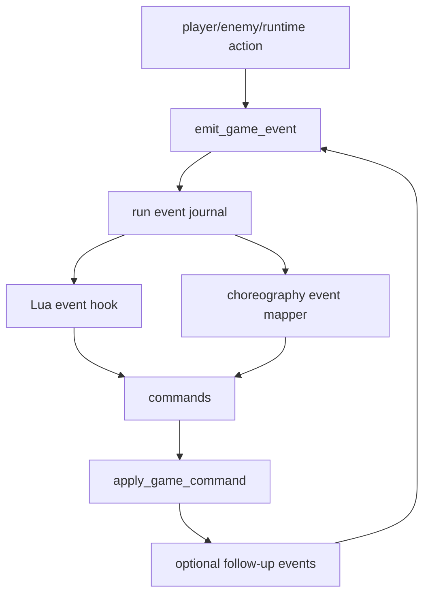
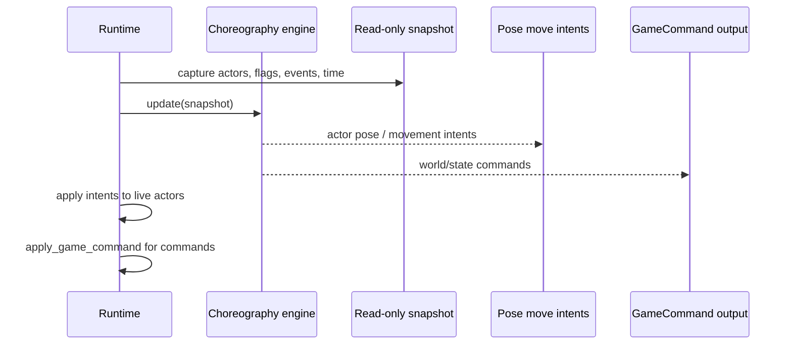
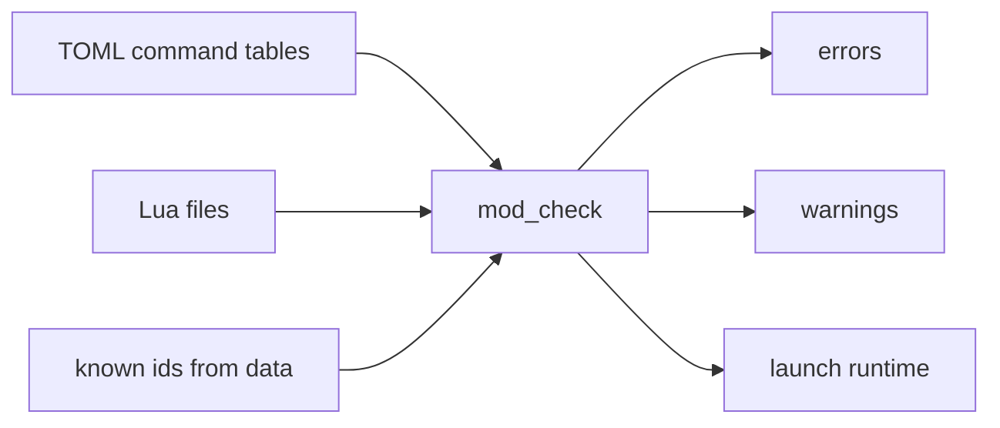
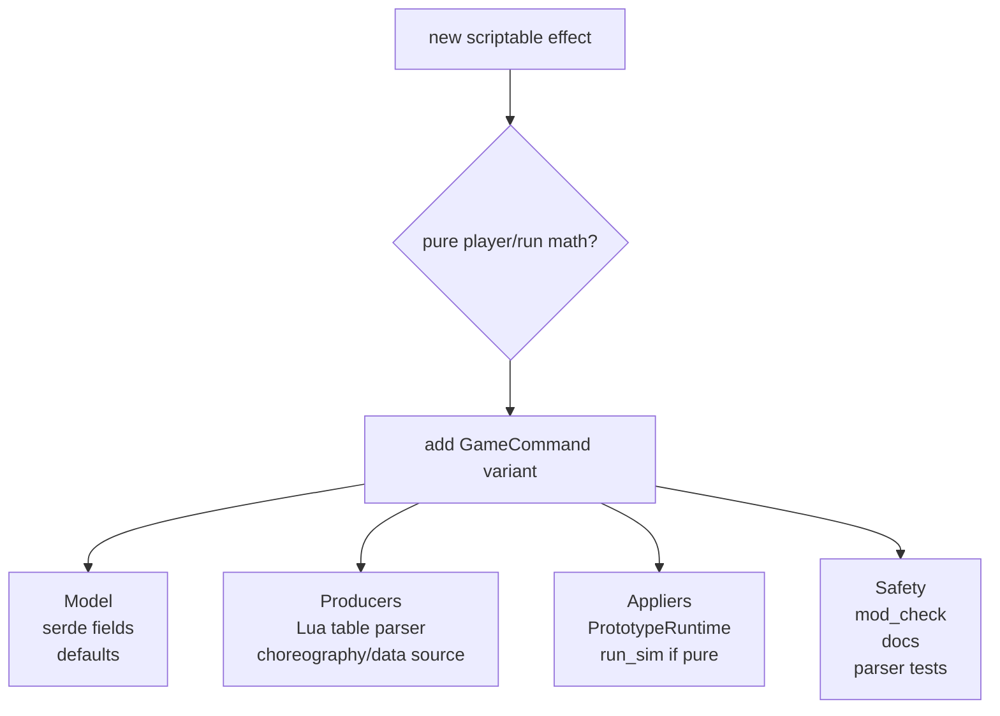
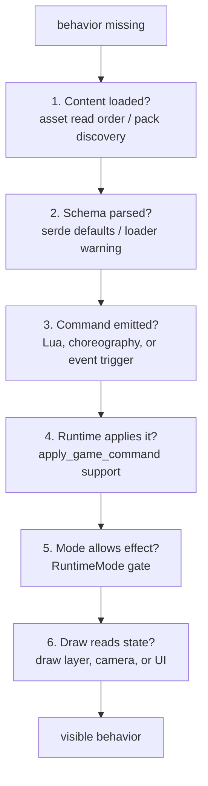

This page follows one important idea through the system: authored data becomes typed Rust state, typed state creates commands/events, and the runtime applies only the effects it owns.

The pipeline matters because it is where moddability stays powerful without letting every content path mutate the game in a different way.

## Whole Pipeline

There are loops here on purpose. A player hit can emit a `GameEvent`, Lua can react to that event, Lua can return a `GameCommand`, and the runtime can apply that command in the same shared place.

## Source Families

The runtime should not care whether ordinary content came from vanilla loose files, active mods, or `data.pak`. That decision is hidden behind `asset_pack::read()` and `asset_pack::read_to_string()`.

## Data Loader Shape

Most `src/data/mod_data.rs` loaders follow the same failure-tolerant shape:

This is the graceful-degradation contract. Runtime content can be broken while a contributor is iterating, but the game should usually continue with a known fallback rather than crashing in an unrelated system.

## Lua Command Path

Lua is powerful, but the script engine still translates Lua tables into typed command variants before runtime application.

`spawn_wave(ctx)` is narrower: it only executes spawn commands today. Generic event hooks can return the broader shared command vocabulary.

## Command Vocabulary

`src/game/commands.rs` is renderer-agnostic. The type is intentionally broader than what every context can execute.

## Context Support Matrix

| Command | Runtime applies today | Pure run simulation applies today | Notes |
| --- | --- | --- | --- |
| `spawn_enemy` | yes | needs runtime | runtime owns live enemy actors |
| `modify_stat` | yes | yes | limited to `PLAYER_STAT_KEYS` |
| `grant_xp` | yes | yes | may emit level-up events |
| `heal` / `damage` | player target | player target | non-player targets need more runtime support |
| `apply_status` | typed command exists | needs runtime | currently validated more than applied |
| `set_flag` | yes | needs runtime | stored in choreography flag state |
| `queue_dialogue` | yes | needs runtime | full or mini dialogue |
| `play_sfx` | yes | needs runtime | audio handle lives in runtime |
| `set_weather` | yes | needs runtime | loads weather preset and updates weather/audio |
| `spawn_fx` | command exists in choreography output | needs runtime | world visual effect request |
| `play_sequence` | yes | needs runtime | routes to choreography request queue |

This table explains a recurring contributor decision: if a command affects pure player math, it may belong in `run_sim`. If it touches actors, audio, weather, dialogue, or visuals, runtime remains the owner.

## Event Feedback Loop

Examples:

- enemy death emits `EnemyDied`, then Lua may grant XP or start a sequence
- player damage emits `PlayerDamaged`, then Lua may heal, play SFX, or set a flag
- level-up availability emits an event, then the runtime opens the level-up mode
- queueing dialogue emits `DialogueQueued`, then UI presentation reads the resulting state

## Choreography Command Path

The choreography engine does not mutate the world directly. That is why authored scenes, Lua, and runtime systems can converge through one command application boundary.

## Validation Before Runtime

`mod_check` validates command payloads and cross-references before launch. It checks things like unknown enemy ids, unknown SFX ids, unknown weather presets, invalid player stat keys, non-finite numbers, and malformed Lua.

Runtime loaders still need fallbacks because development and modding are dynamic, but `mod_check` is the contributor gate that catches preventable content mistakes early.

## Adding A New Command

Do not add a command only to Lua, only to choreography, or only to upgrades if it is meant to be a shared gameplay verb. Add it to the shared command model, then teach each source how to produce it and each applicable runtime/pure context how to apply it.

## Debugging The Pipeline

This graph is usually faster than searching randomly. Follow the bytes, then the typed data, then the command, then the mode gate, then the draw path.
