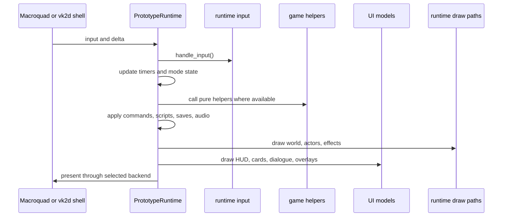
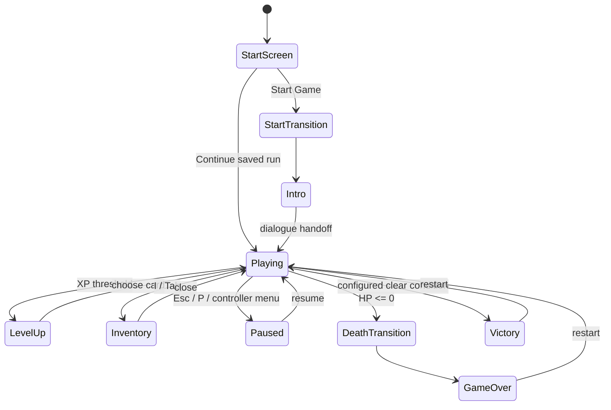
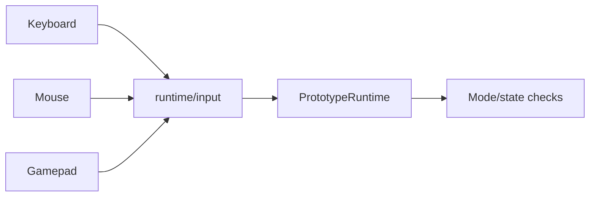
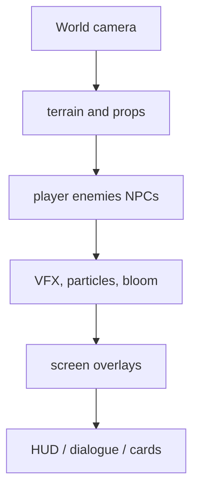

The runtime owns one game-frame sequence, while the selected shell supplies
window events and the renderer presents the result. The canonical shell is
`winit + vk2d`; the Macroquad loop remains available as a compatibility path.

## Frame Shape

At the highest level, each frame is:

## Runtime Modes

The runtime has a richer mode model than the library-side `AppState`.

Exact mode names evolve, but the architectural rule stays the same: simulation should only advance in modes that permit it.

## Inputs Become Intent

Input code should answer what the player requested, not own gameplay rules.

Examples:

- movement vector can be read in runtime
- level-up selection can update runtime mode state
- pure upgrade application should route through shared rule/data paths where practical

## Update Responsibilities

Runtime update owns:

- live actor positions used by drawing
- transient effects and particles
- audio playback decisions
- hot-reload polling
- Lua event dispatch timing
- save/autosave timing
- applying `GameCommand` effects to live state

Pure modules should own:

- deterministic calculations
- data models
- validation-friendly logic
- compact simulations used in tests

## Draw Responsibilities

Keep world-space and screen-space drawing clear. If a label or hit-test needs manual projection, use the existing helpers instead of duplicating coordinate math.

## Common Runtime Change Risks

| Risk | Why it matters |
| --- | --- |
| updating simulation during pause/level-up | breaks player expectations and save state |
| duplicating pure rules in runtime | makes tests and modding drift |
| hardcoding stats in actors | bypasses `Assets/Data` and modding |
| loading a direct asset without pack discovery | works loose, fails in release |
| adding a separate scene/beat mechanism | conflicts with choreography |
