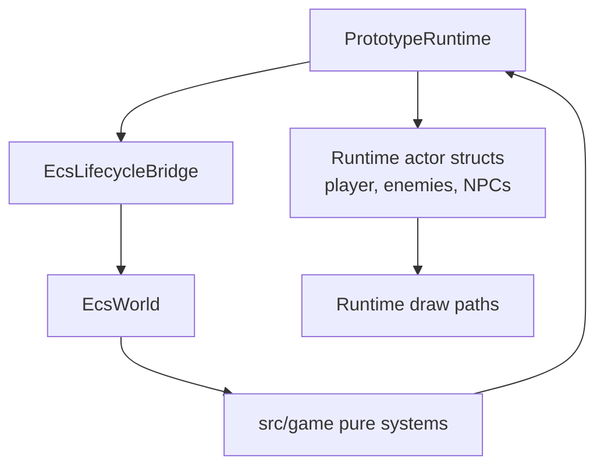
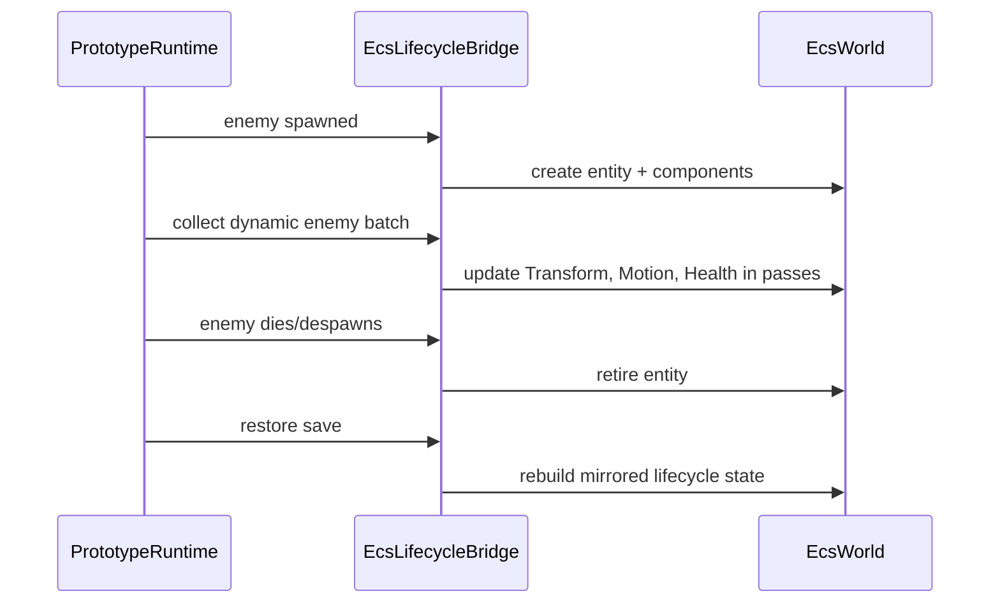
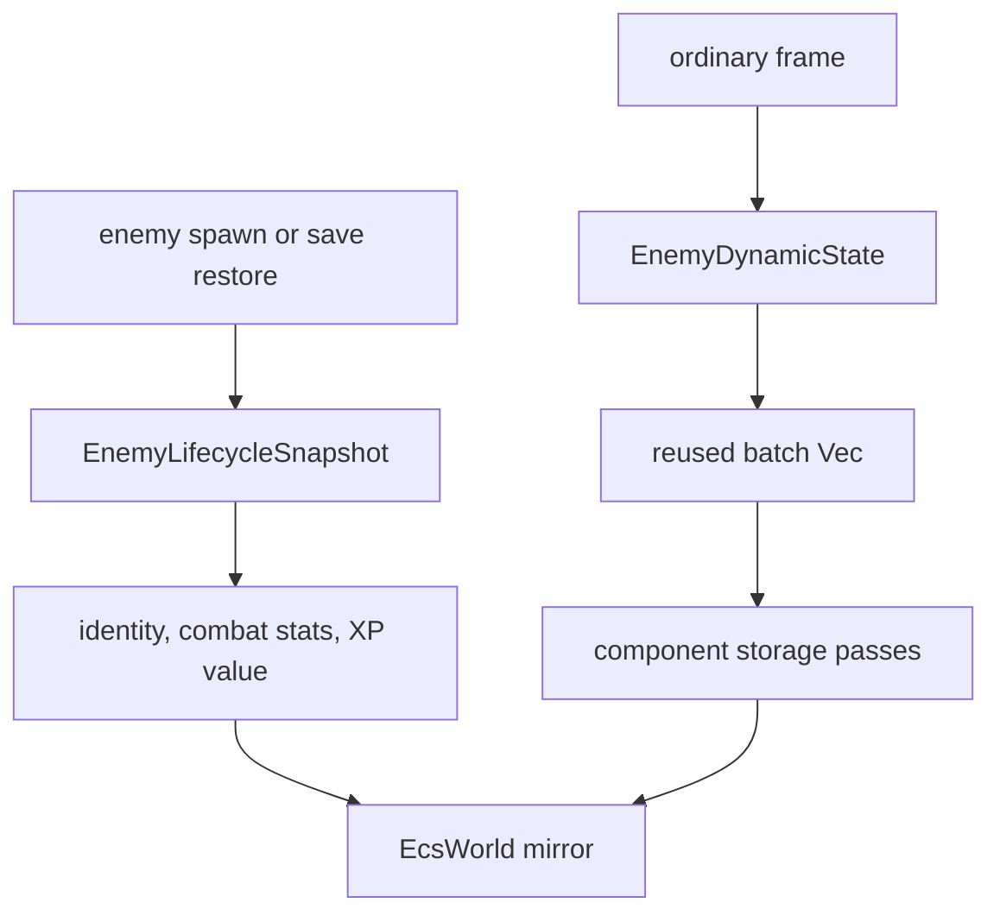
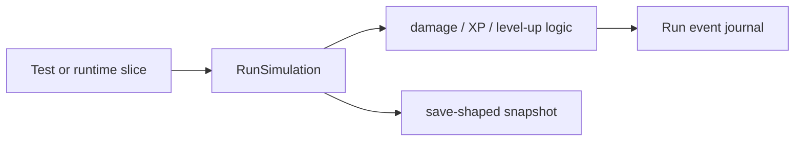
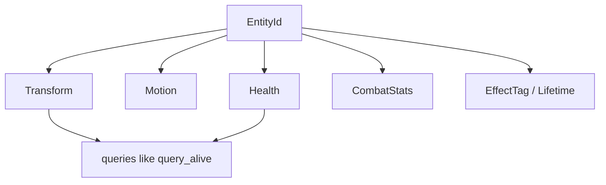

EchoWarrior is migrating toward pure, testable systems without forcing a risky rewrite of the playable runtime.

That creates a bridge architecture:

- `PrototypeRuntime` still owns the live Macroquad actor lists used for drawing and input.
- Pure modules in `src/game` own reusable rules and testable state machines.
- The ECS lifecycle bridge mirrors key runtime entities into `EcsWorld`, with a cold full snapshot lane and a batched hot lane for ordinary enemy frame sync.

## Current Ownership

The runtime remains the playable source of truth for Macroquad-facing state. The ECS mirror exists so shared systems can grow without a big-bang migration.

## ECS Lifecycle Bridge

This bridge should stay narrow. Avoid creating a second entity ownership model beside it.

For the deeper performance-sensitive contract, read [ECS Lifecycle Hot Lane](ecs-lifecycle-hot-lane/).

## Hot And Cold Enemy Sync

The hot lane mirrors only fields that change during ordinary play: position, velocity, current HP, and max HP. Identity and baseline combat data are written when the entity is created or explicitly cold-synced.

That keeps runtime actors authoritative while still letting pure ECS queries grow safely.

## Pure Run Kernel

`src/game/run_sim.rs` is a pure run simulation boundary. It can test core run behavior without a window.

Use this style when extracting logic from runtime:

1. identify the deterministic rule
2. move the rule into `src/game`
3. keep runtime as adapter/application layer
4. add pure tests

## ECS World Shape

At a high level, `EcsWorld` is a sparse-set component store:

`query_alive()` is the important current query boundary: systems can ask for finite, positive-health spawned actors without knowing runtime internals.

## Contributor Guidance

| If you are doing this... | Prefer |
| --- | --- |
| adding a pure rule | `src/game` with tests |
| changing visible actor state | runtime owner plus bridge sync if needed |
| adding ECS components | update bridge and pure queries together |
| changing save restore for enemies | ensure ECS mirror rebuilds correctly |
| adding a second entity list | do not; extend the existing bridge/model |

## Good Extraction Candidates

Good candidates for pure extraction:

- targeting rules
- cooldown/rate-limit math
- spawn schedule helpers
- offer selection
- XP/progression arithmetic
- hitstop/state machine logic
- pathfinding/nav rules

Poor candidates:

- draw order
- texture handles
- shader uniforms
- audio playback handles
- camera render-target details
