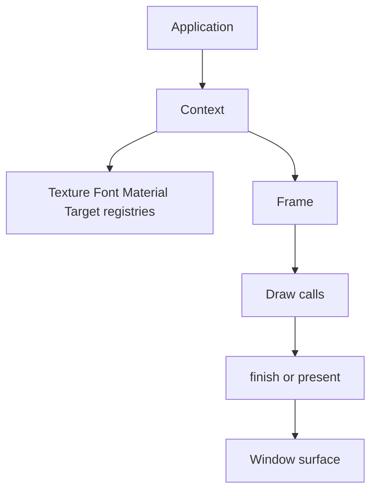
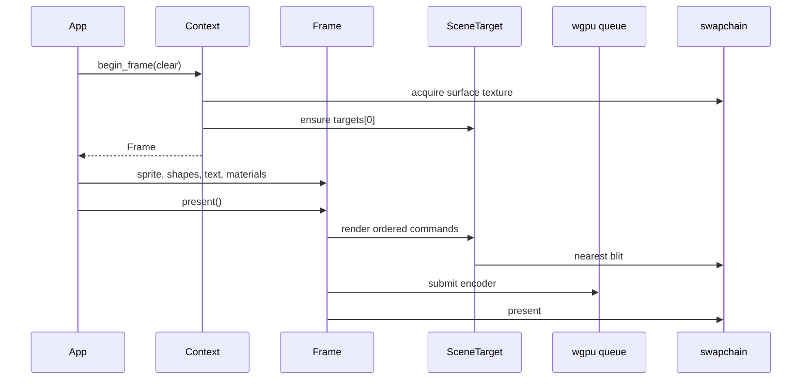
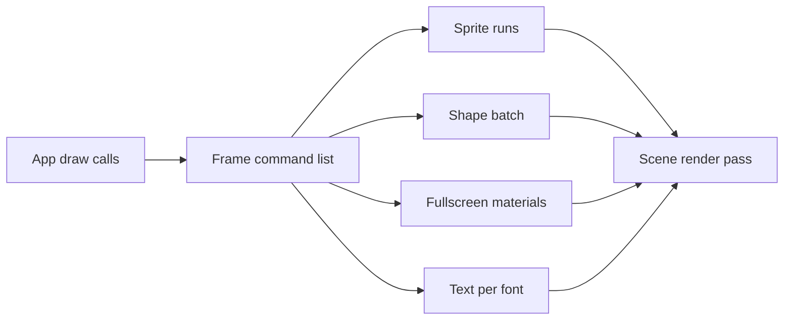
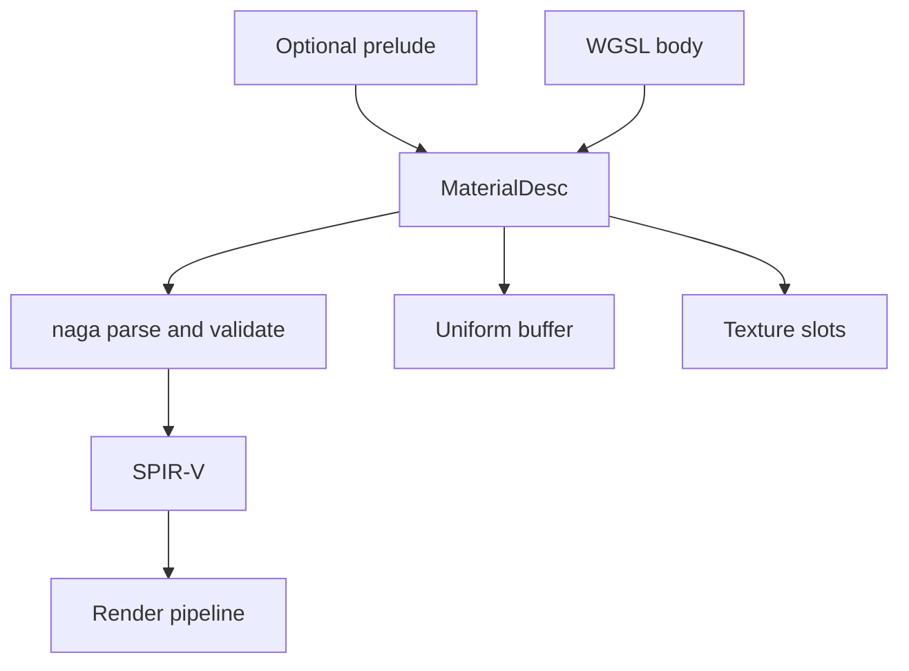
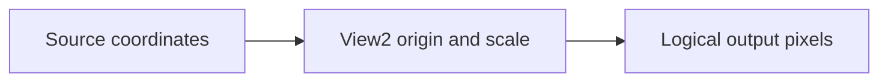

`vk2d` is the reusable renderer crate behind EchoWarrior's Vulkan-facing experiments. This page is for contributors who need to change the renderer itself, not just move a game draw site behind `Renderer2d`.

The short version: `vk2d` owns GPU setup, resource registries, frame recording, material compilation, batching, render targets, text, and optional overlays. EchoWarrior supplies decoded bytes, WGSL text, logical sizes, and draw calls.

## Module Map

| File | Owns |
| --- | --- |
| `crates/vk2d/src/lib.rs` | public exports, crate contract, feature-gated `egui` / `winit-input` surfaces |
| `context.rs` | `Context`, GPU device/queue/surface, registries, resize, resource loading |
| `frame.rs` | immediate-mode `Frame`, draw command ordering, swapchain and offscreen frame finish |
| `material.rs` | WGSL-to-SPIR-V compile, `MaterialDesc`, uniforms, texture slots, bind groups |
| `target.rs` | offscreen scene targets, nearest upscale blit, target texture sampling |
| `sprite.rs` | RGBA texture upload and sprite batching |
| `shapes.rs` | batched rectangles, lines, circles, triangles |
| `text.rs` | TTF atlas baking, text measurement, text drawing |
| `view.rs` | CPU-side 2D view transform, including Y-up source windows |
| `egui_overlay.rs` | optional egui paint pass over the swapchain |
| `input.rs` | optional winit keyboard/mouse state collector |

## Public Shape



The application creates one `Context` for a `winit` window. It then uploads resources and begins frames. Draw calls are immediate-mode from the app's point of view, but `vk2d` batches internally before submitting GPU work.

## Frame Flow



`Context::begin_frame` is the normal window path. It renders into the logical scene target, then blits that target to the surface with nearest filtering. `Context::begin_target_frame` is the offscreen path. It renders straight into a chosen target and finishes without touching the swapchain.

## Draw Ordering And Batching

`Frame` keeps a command list so overlapping draws layer predictably.



Important details:

- consecutive sprites using the same `TextureId` extend the same sprite run
- a different texture, material, text command, or shape boundary opens a new ordered command
- shapes share one accumulated batch and draw at the first shape command position
- text queues per `FontId` and draws once for that font
- bad handles are no-ops, preserving the no-panic frame contract

## Materials And WGSL

`MaterialDesc` is the renderer's shader contract.



Rules to preserve:

- WGSL must define `vs_main`, `fs_main`, and any declared bind-group layout
- uniform fields are declared in `MaterialDesc::uniforms`
- every uniform gets one 16-byte slot, so apps push by name instead of offsets
- `MaterialDesc::prelude` prepends shared WGSL helper code before compilation
- `MaterialDesc::textures` declares sampled texture slots by name
- unknown uniforms, texture slots, materials, textures, and targets are no-ops

Texture binding layout:

| Slot index | WGSL texture binding | WGSL sampler binding |
| --- | --- | --- |
| `textures[0]` | `@binding(1)` | `@binding(2)` |
| `textures[1]` | `@binding(3)` | `@binding(4)` |
| `textures[n]` | `@binding(1 + 2*n)` | `@binding(2 + 2*n)` |

Unbound texture slots sample a shared 1x1 white fallback. That lets a material compile and draw even before a frame binds a real texture or target.

## Render Targets And Multi-Pass

```mermaid
flowchart TD
    create[Context create_target]
    reserve[Reserve targets[0] as scene]
    target[App target id >= 1]
    pass[begin_target_frame]
    finish[Frame finish]
    bind[bind_material_target]
    composite[material_fullscreen composite]

    create --> reserve --> target --> pass --> finish --> bind --> composite
```

`targets[0]` is reserved for the normal scene. App-created targets start at index 1 so the default scene cannot accidentally sample itself. This matters for bloom, post-processes, and gallery demo scenes.

Use the offscreen path for a multi-pass effect:

```rust
let scene = ctx.create_target(1600, 900);
let mut pass = ctx.begin_target_frame(scene, vk2d::Color::BLACK)?;
pass.fill_rect(vk2d::Rect2::new(0.0, 0.0, 1600.0, 900.0), vk2d::Color::WHITE);
pass.finish();

let mut frame = ctx.begin_frame(vk2d::Color::BLACK)?;
frame.bind_material_target(composite, "scene", scene);
frame.material_fullscreen(composite);
frame.present();
```

Do not bind the target currently being rendered into as a sampled texture. Render first, finish, then bind the finished target in a later pass.

## View2

`View2` is a CPU-side affine transform applied when a draw call is recorded.



It exists so consumers can map a world window onto the renderer's logical output without teaching `vk2d` about EchoWarrior cameras. A negative `scale.y` supports Y-up source spaces. Sprites compensate for that vertical flip so texture atlases stay upright.

Use `View2` for renderer-level coordinate mapping. Do not add game camera concepts to `vk2d`.

## Shader Gallery

`examples/shader_gallery.rs` is the renderer's parity-check surface for WGSL ports.

It:

- walks `Assets/Shaders/wgsl/`
- skips `lib/` as shared prelude source
- prepends `lib/arcane.wgsl` when available
- parses each shader's `struct Uniforms` fields so uniform buffers are correctly sized
- infers texture slots such as `scene`, `tex`, and `u_noise_tex`
- keeps failed shaders visible as selectable error entries instead of crashing
- renders a demo scene target for post-process materials that sample `scene`

Run:

```powershell
cargo run -p vk2d --example shader_gallery
cargo run -p vk2d --example shader_gallery -- --frames 3
cargo run -p vk2d --example shader_gallery -- --shader ambient_tint --frames 3
```

Use `hello_sprite` for a small renderer smoke test. Use `shader_gallery` when changing material bindings, shader ports, post-process support, texture slots, or shared WGSL prelude behavior.

## Extension Rules

When extending `vk2d`:

1. keep the public API game-agnostic
2. prefer neutral value types and opaque handles
3. return `Result` from setup/loading paths
4. keep per-frame draw calls infallible
5. add a renderer example or test that exercises the new contract
6. update EchoWiki when the contributor workflow changes

The renderer can become powerful without becoming game-specific. That line is the whole point of the crate.
