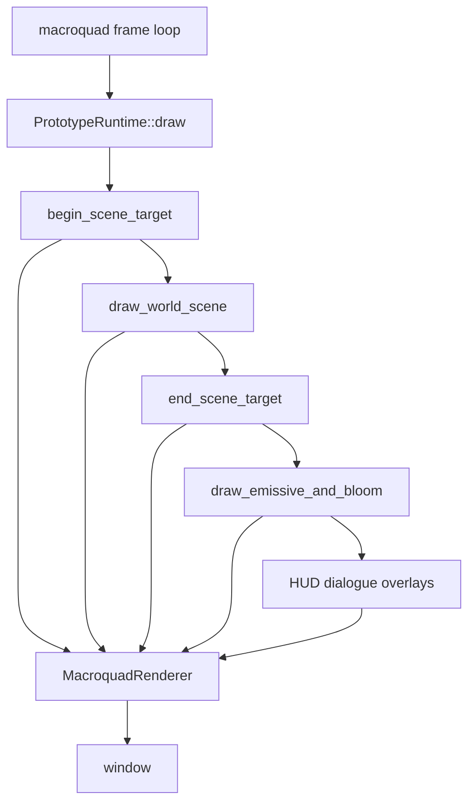
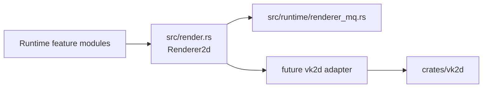
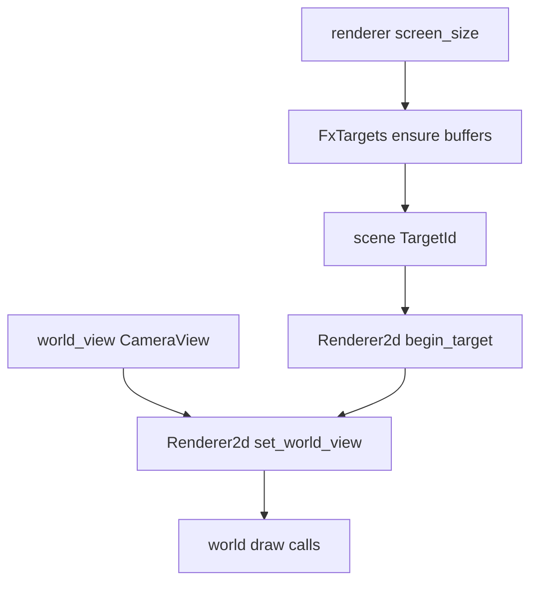
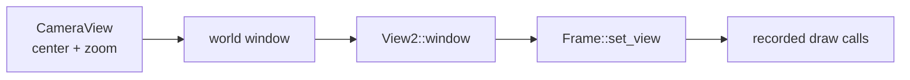
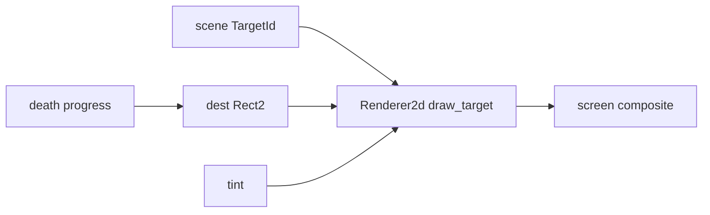
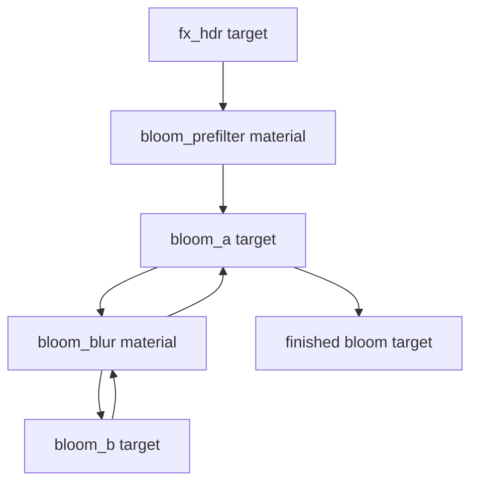
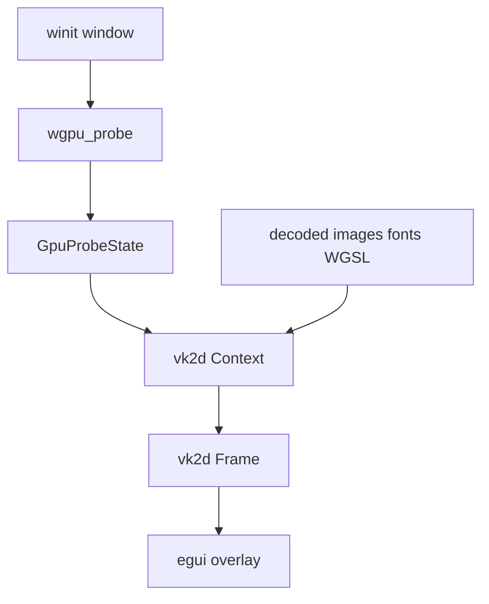
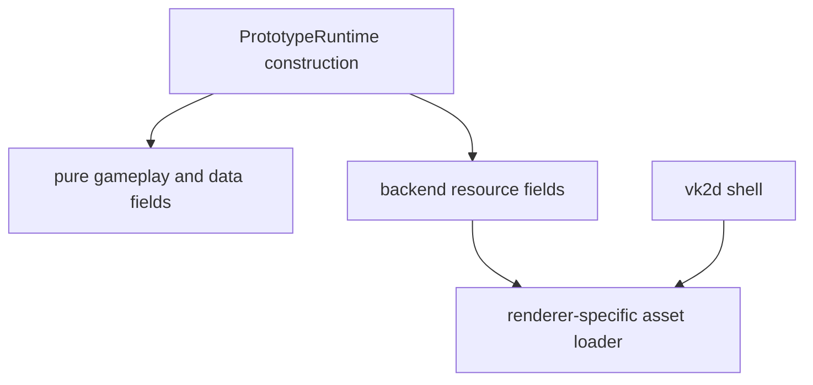

This page shows how the current runtime is being shaped so `vk2d` can become a real renderer backend.

The important truth first: `vk2d` is not the live gameplay renderer yet. The playable runtime still presents through Macroquad. The runtime already draws large parts of the frame through the backend-neutral `Renderer2d` contract, and `vk2d` now has the matching renderer primitives: views, offscreen target frames, target sprites, material texture slots, and baseline text metrics.

## Current Runtime Path



The live call stack is in `src/runtime/mod.rs`:

```rust
self.begin_scene_target();
self.draw_world_scene(assets, render_time);
self.end_scene_target(assets);
self.draw_emissive_and_bloom(assets);
self.draw_hud(assets);
self.draw_dialogue(assets);
```

That shape matters because the future Vulkan runtime does not need to reinvent the game loop. It needs a backend that can satisfy the same renderer verbs the runtime already calls.

## The Boundary In The Middle

`src/render.rs` defines the runtime-facing API. It contains only neutral values and opaque handles:

- `Color`, `Point`, `Rect2`
- `TextureId`, `MaterialId`, `FontId`, `TargetId`
- `SpriteParams`, `TextParams`, `TextMetrics`
- `CameraView`
- `Renderer2d`



Contributors should follow the contract, not the backend. If a draw site can express itself as `draw_sprite`, `fill_rect`, `draw_text`, `set_world_view`, `begin_target`, `draw_target`, or `present_target`, it belongs behind `Renderer2d`.

## Scene Target Usage

`src/runtime/render_scene.rs::begin_scene_target` is the cleanest example of the current shape:

```rust
let screen = self.renderer.screen_size();
self.fx_targets.ensure(&mut self.renderer, screen.x, screen.y, self.settings.gfx.render_scale);

let scene_id = self.fx_targets.scene_id();
let view = self.world_view();
self.renderer.begin_target(scene_id);
self.renderer.set_world_view(view);
```

That reads like a renderer-agnostic version of "draw the world into an offscreen scene texture through a world camera".



For Macroquad, `begin_target` binds a `RenderTarget` camera. For a vk2d backend, the matching concept is `Context::begin_target_frame(target, clear)` plus `Frame::set_view(View2::window(..., y_up = true))`.

`end_scene_target` must close this bracket through `Renderer2d::end_target`, not by calling a backend-native camera reset directly. The current Macroquad adapter stores the active target separately from the camera; if the scene target is not ended through the trait, later `set_world_view` or `set_screen_view` calls can accidentally reattach the stale scene target. That exact failure path hid the bloom-off emissive glow by drawing it into an already-composited scene buffer instead of the screen.


## Camera Mapping

The runtime now computes one neutral world view:

```rust
pub(crate) fn world_view(&self) -> CameraView {
    let center = snap_world_camera_center(center, self.renderer.screen_size());
    CameraView {
        center: Point::new(center.x, center.y),
        zoom,
    }
}
```

`MacroquadRenderer::set_world_view` turns that into `Camera2D::from_display_rect`. `vk2d` does not know about cameras, but it has `View2`:



The likely vk2d adapter rule is:

| Renderer2d concept | vk2d concept |
| --- | --- |
| `CameraView { center, zoom }` | compute a world window from logical size and zoom |
| Y-up world space | `View2::window(..., y_up = true)` |
| `set_screen_view()` | `Frame::reset_view()` |
| sprites and shapes after the view bind | recorded through the active `Frame` |

This is why `View2` was added to `vk2d`: it lets EchoWarrior keep world-camera math in the game while the renderer only applies a generic coordinate transform.

## Death Zoom Composite

The runtime also uses positioned target drawing. During death transition, the already-rendered scene target is drawn back to the screen with a shrinking or shifting destination rectangle:

```rust
self.renderer.draw_target(
    self.fx_targets.scene_id(),
    Rect2::new(death_texture_x(progress, sw), death_texture_y(progress, sh), size.x, size.y),
    SpriteParams { tint: from_mq(death_texture_tint(progress)), ..Default::default() },
);
```



The vk2d-side sibling is `Frame::target_sprite(target, pos, params)`. It can draw a finished target at a position, with destination size supplied through `SpriteParams`.

## Bloom Usage

`src/runtime/render_fx.rs::FxTargets::run_bloom` is the current multi-pass example. It routes target-to-target work through `Renderer2d`:



Internally, each pass uses the same small verb vocabulary:

```rust
r.begin_target(dst);
r.clear(Color::TRANSPARENT);
r.use_material(material);
r.present_target(src, SpriteParams { dest_size: Some(Point::new(w, h)), flip_y: true, ..Default::default() });
r.use_default_material();
r.end_target();
```

For vk2d, that maps to offscreen target frames. The source target can be sampled either as a material texture with `bind_material_target` or as a positioned sprite with `target_sprite`, depending on whether the pass needs shader work.

## vk2d Probe Usage

`src/bin/wgpu_probe.rs` and `src/wgpu_vulkan/` are the place where EchoWarrior already uses `vk2d` directly.



The probe:

- creates `vk2d::Context` with `Backend::Vulkan`
- uploads decoded RGBA sprite bytes with `load_texture_rgba`
- loads WGSL materials with `MaterialDesc`
- bakes a TTF with `load_font`
- begins a `Frame`
- draws sprites, fullscreen materials, and text
- presents with `present_with_egui`

The probe is not the game runtime. It is the richer smoke surface proving that vk2d can draw the ingredients the runtime needs.

## Verb Mapping

| Runtime verb | Current live backend | vk2d equivalent |
| --- | --- | --- |
| `screen_size()` | Macroquad `screen_width/height` | adapter logical output size |
| `clear(color)` | `clear_background` | pass clear at `begin_frame` / `begin_target_frame` |
| `draw_sprite` | `draw_texture_ex` | `Frame::sprite` |
| `fill_rect`, `line`, `circle`, `triangle` | Macroquad primitives | `Frame` shape methods |
| `draw_text`, `measure_text` | Macroquad text APIs | `Frame::text`, `Context::measure_text_ext` |
| `set_uniform` | Macroquad `Material::set_uniform` | `Context::set_material_uniform` or frame wrapper |
| `use_material` + fullscreen target draw | Macroquad material bind | `Frame::material_fullscreen` or material-backed blit |
| `begin_target` / `end_target` | Macroquad `RenderTarget` camera bind | `Context::begin_target_frame` / `Frame::finish` |
| `present_target` | draw target texture fullscreen | `Frame::target_sprite` or scene blit |
| `draw_target` | draw target texture into `Rect2` | `Frame::target_sprite` with `dest_size` |
| `set_world_view` | `Camera2D::from_display_rect` | `Frame::set_view(View2::window(...))` |

The only awkward part is lifecycle: `Renderer2d` is a stateful trait used throughout one Macroquad frame, while `vk2d` models each render pass as a `Frame` value that must be finished. A vk2d runtime adapter will need to own that pass state carefully.

The lifecycle rule is strict: every target begin must have a matching backend-visible target finish before screen-space work resumes. In the live adapter, that is `end_target`. In a vk2d adapter, it will be the point where the target `Frame` is finished and the next pass begins.

## Construction Spike

`tests/vk_construction_spike.rs` documents why the cutover needs a shell-first plan. It probes which Macroquad-typed values can be constructed without a Macroquad window.

The finding to preserve: a vk2d runtime should not build a `PrototypeRuntime` that eagerly creates Macroquad `Material`, `RenderTarget`, or `Font` values off-context. The backend split needs a runtime asset layer whose resource creation belongs to the active renderer.



## Contributor Rules

Use this route when working on renderer migration:

1. Move game draw intent through `Renderer2d` first.
2. Keep `src/render.rs` free of Macroquad and wgpu types.
3. Keep `vk2d` free of EchoWarrior asset paths and game camera concepts.
4. Add or update `vk2d` features only when a real runtime verb needs them.
5. Verify game behavior with `cargo run` when the Macroquad path changed.
6. Verify renderer-library behavior with `cargo test -p vk2d` and the vk2d examples when the submodule changed.
7. Verify the probe with `cargo run --bin wgpu_probe -- --frames 3` when the Vulkan-facing consumer changed.

The target is not "Vulkan everywhere immediately". The target is a runtime that describes rendering once, then lets Macroquad and vk2d answer that contract without dragging gameplay code into either backend.
