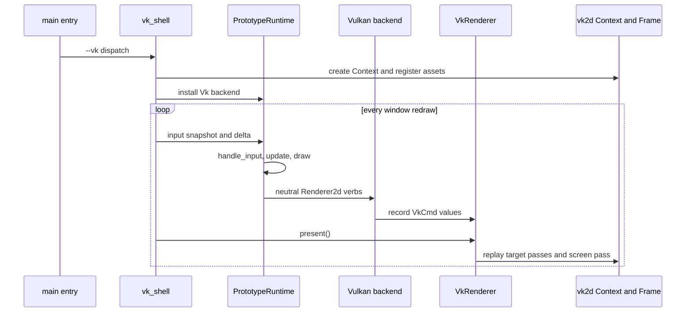
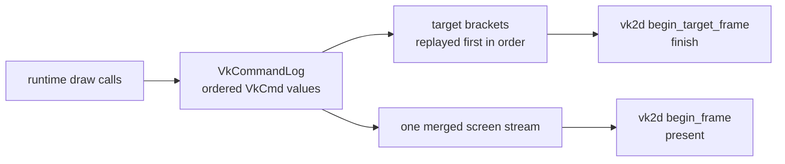
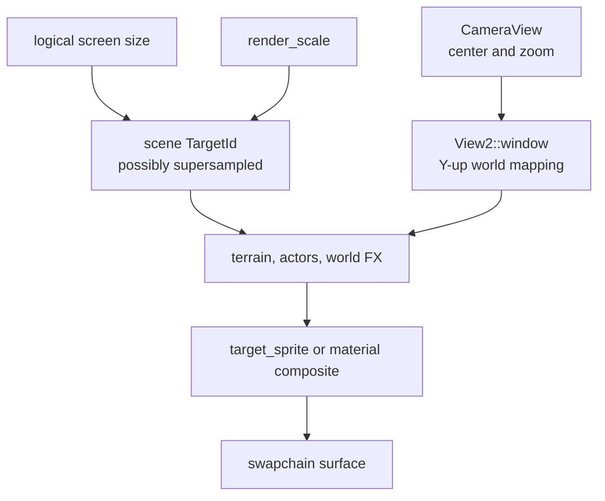
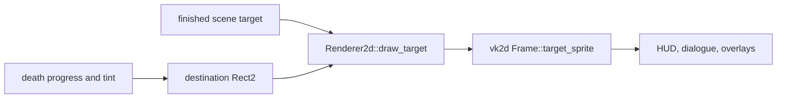
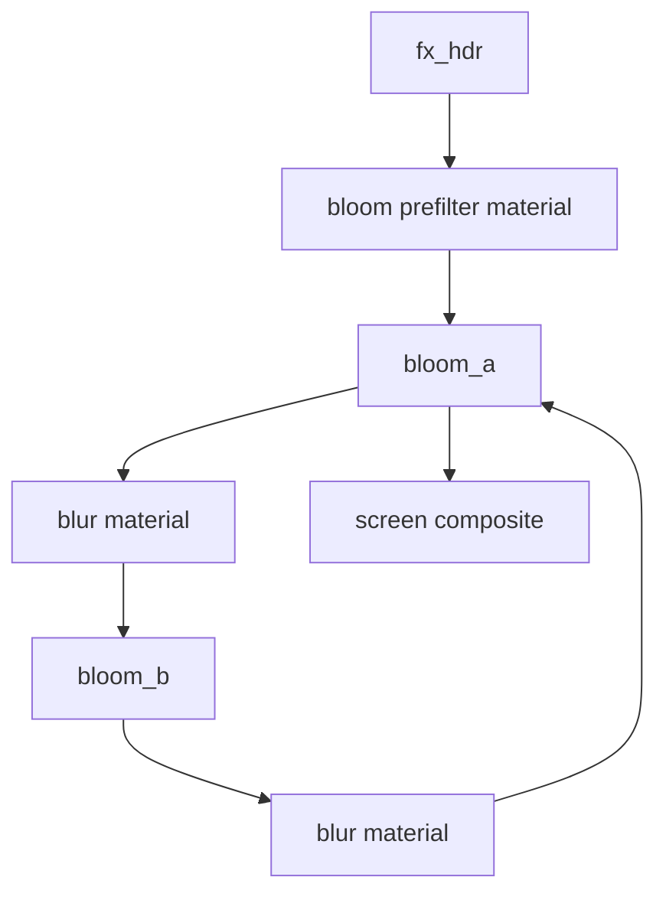
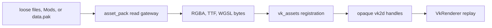

This page follows one game frame through the canonical `vk2d` runtime path.
The runtime does not rebuild gameplay for Vulkan. It emits the same neutral
rendering vocabulary, while `VkRenderer` records that vocabulary and replays it
into `vk2d` passes at present time.

## Live Shell Path



Run it with:

```powershell
cargo run --features vk-shell -- --vk --arena
```

The shell owns the winit event loop and resize events. `PrototypeRuntime` owns
game modes, data, simulation, and draw intent. `VkRenderer` owns the translation
from that intent to `vk2d` calls.

## The Same Runtime Sequence

The `--vk` shell deliberately mirrors the normal runtime order:

```rust
input.update(&runtime.settings.controls);
runtime.handle_input(delta, &input, &assets);
runtime.update(delta, &assets, &input);
runtime.poll_mode_changed_event(&assets);
runtime.draw(&assets, &input);
vk_renderer.present()?;
```

That is the key integration seam. A new gameplay system should not branch on
Vulkan. A new draw path should use `Renderer2d`, and the backend can then replay
it through `vk2d`.

## Why Commands Are Recorded

`vk2d::Frame` borrows its `Context` for the lifetime of a render pass. The
runtime's `Renderer2d` methods are called independently by many modules, so
holding one live `Frame` inside every method would create impossible Rust
borrows. `VkRenderer` records an ordered command log instead.



Target work finishes before a later screen or target pass samples it. The
recording layer also gives us pure tests for command order and replay
partitioning without requiring a GPU in every test.

## Scene Target And World View

The world scene is rendered into an offscreen target. The target may be larger
than the window when render scaling is enabled, but the logical camera window
remains the window's world extent.



The adapter keeps two sizes distinct:

- the logical screen size defines how much world space the camera sees;
- the target's texel size defines how many pixels the pass renders into.

Conflating them makes supersampled scenes drift away from screen-space labels
and damage numbers. `view2_from_world` in `renderer_vk.rs` carries this rule.

## Scene Pass In Code

The runtime-side code remains backend-neutral:

```rust
let screen = self.renderer.screen_size();
self.fx_targets.ensure(
    &mut self.renderer,
    screen.x,
    screen.y,
    self.settings.gfx.render_scale,
);

let scene = self.fx_targets.scene_id();
self.renderer.begin_target(scene);
self.renderer.set_world_view(self.world_view());
self.draw_world_scene(assets, render_time);
self.renderer.end_target();
```

On the canonical path, `VkRenderer` maps this bracket to
`Context::begin_target_frame`, `Frame::set_view(View2)`, the queued world
commands, and `Frame::finish()`.

## Screen Composite And Death Zoom

When the world target is complete, the runtime switches to screen coordinates.
Death transition, UI, and post-processing then operate in window space.



The runtime does not need to know whether a target is a Macroquad render
texture or a `vk2d::TargetId`; it only supplies the destination rectangle and
sprite parameters.

## Bloom And Material Passes

The emissive and bloom path is a sequence of finished target dependencies:



At the neutral layer the operation is still expressed with target ids,
materials, uniforms, and `present_target`. On `vk2d`, the replay layer binds a
finished source target with `bind_material_target` and uses
`material_fullscreen`, or uses `target_sprite` when the pass is a positioned
blit.

Never sample a target while the same target is being rendered. Finish the write
pass first, then bind the target in a later pass.

## Asset Registration

The canonical asset loader is separate from Macroquad's `RuntimeAssets`:



`vk2d` receives bytes, not EchoWarrior paths. `vk_assets.rs` registers fonts,
textures, materials, and target resources against stable game-facing keys so
the runtime can keep its `TextureId`, `FontId`, and `MaterialId` values.

## What Is Still Being Routed

The canonical path is real, but parity work is explicit and ongoing. Current
known gaps include terrain chunks, weather overlays, audio, egui panels, and
HiDPI input scaling. The shell logs a skip when a subsystem is intentionally
not available rather than calling raw Macroquad globals.

```mermaid
flowchart TD
    requested["runtime requests feature"]
    neutral{ "neutral route exists?" }
    vk["replay through vk2d"]
    fallback["visible/logged fallback"]
    bug["silent raw Macroquad call\nregression"]

    requested --> neutral
    neutral -- yes --> vk
    neutral -- no --> fallback
    fallback -. must never become .-> bug
```

Treat a new skip line as a routing task. Treat a panic, black region, or
unexplained missing effect as a regression.

## Adding A New Draw Feature

For a new renderer-backed feature:

1. Put gameplay meaning and configuration in `src/game`, `src/data`, or
   `Assets/` as appropriate.
2. Build a renderer-neutral description in the owning runtime/UI module.
3. Use an existing `Renderer2d` verb if it expresses the feature.
4. If a real GPU capability is missing, add it to `vk2d` first and keep the
   public inputs neutral.
5. Add the `VkRenderer` replay mapping and a pure command test.
6. Run the canonical shell, then the compatibility path if it was touched.

For submodule ownership and signed pointer updates, see [Renderer Submodule Workflow](../renderer-submodule-workflow/).

Everything above is EchoWarrior-specific — how *this game* drives `vk2d`. If you want to use `vk2d` in an unrelated project with no EchoWarrior code involved, start at [10D. vk2d Standalone Quickstart](vk2d-standalone-quickstart/) instead.
