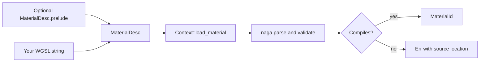
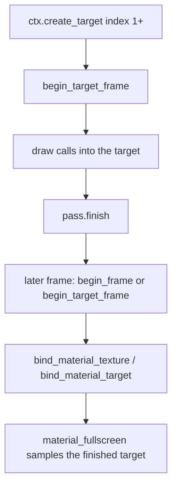

This continues [10D. vk2d Standalone Quickstart](vk2d-standalone-quickstart/) for consumers using `vk2d` outside EchoWarrior. It covers writing your own WGSL materials from a blank slate — no EchoWarrior shader library, no `Assets/Shaders/wgsl/` conventions, just the renderer's own contract.

For how materials are compiled and batched internally, see [10B. vk2d Renderer Internals](vk2d-renderer-internals/) — this page stays at the "I want to ship an effect" level.

## The Contract

A material is exactly two things:

1. A WGSL string defining `vs_main` and `fs_main`.
2. A `MaterialDesc` declaring its uniform fields and (optionally) sampled texture slots.

There is no third thing. `vk2d` does not generate WGSL, does not require a specific file layout, and does not care whether your shader text comes from a `.wgsl` file, an embedded `include_str!`, or a string built at runtime.



```rust,no_run
# use vk2d::{Context, MaterialDesc, UniformType, BlendMode};
# fn go(ctx: &mut Context, wgsl: &str) -> Result<(), vk2d::Vk2dError> {
let mat = ctx.load_material(MaterialDesc {
    wgsl,
    blend: BlendMode::Additive,
    uniforms: &[("time", UniformType::Vec4)],
    prelude: None,
    textures: &[],
})?;
# let _ = mat;
# Ok(())
# }
```

`load_material` returns `Result<MaterialId, Vk2dError>` — a malformed shader is a startup-time `Err` with a source location from `naga`'s WGSL parser, never a panic and never a silent black screen discovered later.

## A Fullscreen Time-Driven Material

The smallest useful pattern: a fullscreen effect driven by one uniform. This is deliberately the same shader shape used in the crate's own `examples/hello_sprite.rs`.

```wgsl
struct Uniforms { time: vec4<f32> };
@group(0) @binding(0) var<uniform> u: Uniforms;

struct VertexOutput {
    @builtin(position) position: vec4<f32>,
    @location(0) uv: vec2<f32>,
};

@vertex
fn vs_main(@builtin(vertex_index) i: u32) -> VertexOutput {
    var out: VertexOutput;
    // Fullscreen triangle trick: 3 vertices, no vertex buffer needed.
    let uv = vec2<f32>(f32((i << 1u) & 2u), f32(i & 2u));
    out.position = vec4<f32>(uv * 2.0 - vec2<f32>(1.0, 1.0), 0.0, 1.0);
    out.uv = uv;
    return out;
}

@fragment
fn fs_main(in: VertexOutput) -> @location(0) vec4<f32> {
    let t = u.time.x;
    let d = distance(in.uv, vec2<f32>(0.5, 0.5));
    let pulse = 0.5 + 0.5 * sin(t * 2.0 - d * 12.0);
    return vec4<f32>(0.2 * pulse, 0.6 * pulse, 0.9 * pulse, pulse);
}
```

Push the uniform value once per frame, then draw the material fullscreen:

```rust,no_run
# use vk2d::{Context, Color, MaterialId, UniformValue};
# fn go(ctx: &mut Context, mat: MaterialId, t: f32) -> Result<(), vk2d::Vk2dError> {
let mut frame = ctx.begin_frame(Color::BLACK)?;
frame.set_uniform(mat, "time", UniformValue::Vec4(t, 0.0, 0.0, 0.0));
frame.material_fullscreen(mat);
frame.present();
# Ok(())
# }
```

## Uniform Rules

- Every field in `MaterialDesc::uniforms` gets a **fixed 16-byte slot** — you always push a `Vec4`-shaped value by name, even for a single float, so you never compute byte offsets by hand.
- Unknown uniform names passed to `set_uniform` are a silent no-op, not an error — consistent with the crate's "per-frame draw calls never panic" rule.
- `MaterialDesc::prelude` lets you prepend shared WGSL (helper functions, common structs) before your material body compiles, if you're authoring more than one effect and want to factor out common code.

## Sampling A Texture From A Material

Declare texture slots by name in `MaterialDesc::textures`; `vk2d` assigns the WGSL bindings for you in order:

| Slot index | Texture binding | Sampler binding |
| --- | --- | --- |
| `textures[0]` | `@binding(1)` | `@binding(2)` |
| `textures[1]` | `@binding(3)` | `@binding(4)` |
| `textures[n]` | `@binding(1 + 2*n)` | `@binding(2 + 2*n)` |

```rust,no_run
# use vk2d::{Context, MaterialDesc, UniformType, BlendMode};
# fn go(ctx: &mut Context, wgsl: &str) -> Result<(), vk2d::Vk2dError> {
let mat = ctx.load_material(MaterialDesc {
    wgsl,
    blend: BlendMode::Additive,
    uniforms: &[("u_time", UniformType::Vec4)],
    prelude: None,
    textures: &["scene"],
})?;
# let _ = mat;
# Ok(())
# }
```

Bind an actual texture (or a render target, see below) to that slot before drawing the material:

```rust,no_run
# use vk2d::{Context, Color, MaterialId, TextureId};
# fn go(ctx: &mut Context, mat: MaterialId, tex: TextureId) -> Result<(), vk2d::Vk2dError> {
let mut frame = ctx.begin_frame(Color::BLACK)?;
frame.bind_material_texture(mat, "scene", tex);
frame.material_fullscreen(mat);
frame.present();
# Ok(())
# }
```

If nothing is bound to a declared slot, `vk2d` samples a shared 1x1 white texture instead — the material still compiles and draws, it just isn't visually interesting yet. This is intentional: you can wire the material into your draw loop before the texture pipeline that feeds it exists.

## Multi-Pass Effects (Render Targets)

For anything beyond a single fullscreen pass — bloom, blur, any effect that needs to sample "what was drawn so far" — render into an offscreen `TargetId` first, finish it, then sample it as a texture in a later pass.

```rust,no_run
# use vk2d::{Context, Color, Rect2};
# fn go(ctx: &mut Context) -> Result<(), vk2d::Vk2dError> {
let scene = ctx.create_target(1600, 900);

let mut pass = ctx.begin_target_frame(scene, Color::BLACK)?;
pass.fill_rect(Rect2::new(0.0, 0.0, 1600.0, 900.0), Color::WHITE);
pass.finish();

// Now sample `scene` from a later fullscreen pass or draw it as a sprite.
# Ok(())
# }
```



Two rules matter here:

- **Never bind a target to itself.** Render into a target, `finish()` it, *then* bind it as a texture in a subsequent pass. Sampling a target you're currently rendering into is undefined and `vk2d` guards against the self-sample case on `Frame::target_sprite`.
- `create_target` allocates indices starting at `1` — index `0` is reserved for the window's own scene target, so app-created targets can never collide with it.

## Debugging A Shader That Won't Compile

Because WGSL is parsed through `naga` at `load_material` time (not lazily on first draw), a syntax error or a bind-group mismatch surfaces immediately as `Err(Vk2dError::..)` with a source location — check that error message first; it names the exact WGSL line. This is the same mechanism the crate's own `examples/shader_gallery.rs` relies on to keep broken shaders selectable-but-inert instead of crashing the whole demo.
