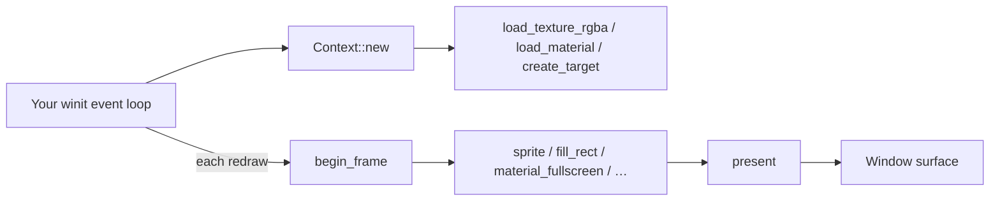
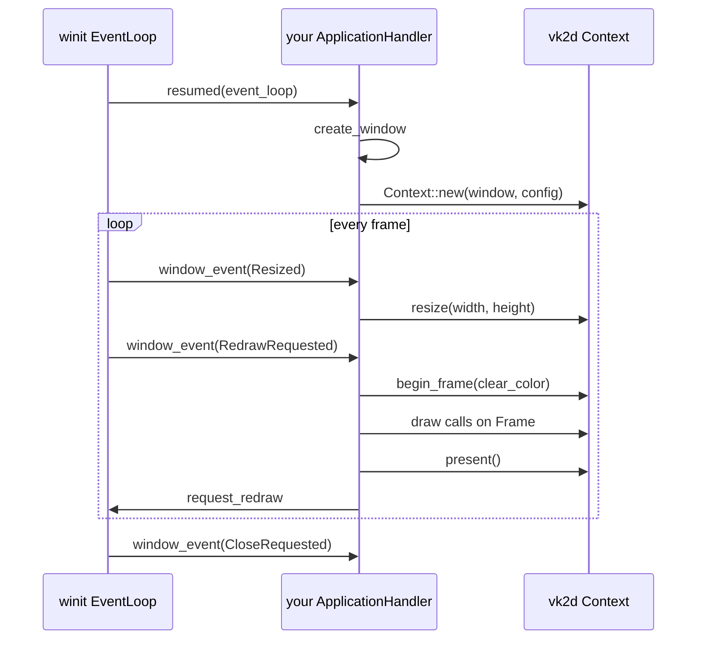

The previous three pages describe `vk2d` from inside EchoWarrior: how the game's `Renderer2d` contract maps onto it, and how to change the renderer library itself. This page and the two after it are for a different reader — someone who wants `vk2d` as a dependency in their **own** project, with no EchoWarrior code involved at all.

`vk2d` is deliberately **game-agnostic**. It knows nothing about EchoWarrior's assets, resolution, or file layout. You supply decoded pixel bytes, WGSL text, and a `winit` window; it draws sprites, shapes, text, and shader materials. Everything here works the same whether the consumer is EchoWarrior, a game jam prototype, or a tool with no gameplay at all.

## Getting The Crate

`vk2d` is pre-1.0 and currently lives inside the EchoWarrior repository at `crates/vk2d`, with a plan to extract it to its own top-level repository once the API settles (see the crate's `README.md` "Status" section). Until that extraction happens, the two supported ways to depend on it from an unrelated project are:

```toml
# Option A — pin a commit from the standalone mirror repo
[dependencies]
vk2d = { git = "https://github.com/soulwax/vk2d", rev = "<commit-sha>" }

# Option B — path dependency against a local clone/submodule checkout
[dependencies]
vk2d = { path = "../path/to/EchoWarrior/crates/vk2d" }
```

Either way, also add `winit` (`0.30`) — `vk2d::Context::new` takes an `Arc<winit::window::Window>`, so your application owns window creation and the event loop; `vk2d` never creates a window for you.

```toml
[dependencies]
winit = "0.30"
```

## The Mental Model



Three ideas carry the whole API:

1. **Immediate mode.** Nothing is retained across frames except GPU-side resources you explicitly created (textures, materials, targets, fonts). Every frame you `begin_frame`, issue draw calls against the returned `Frame`, and `present()`.
2. **Neutral value types, opaque handles.** You never see a `wgpu` type. You pass `Color`, `Point`, `Rect2`, and get back `TextureId` / `MaterialId` / `FontId` / `TargetId` — small `Copy` handles you hold in your own app state.
3. **Shaders are data.** There is no per-effect Rust code. An effect is a WGSL string plus a `MaterialDesc` describing its uniforms and texture slots, loaded at runtime through `Context::load_material`.

## Minimal Window + Frame Loop

This mirrors the crate's own `examples/hello_sprite.rs` (runnable today with `cargo run -p vk2d --example hello_sprite` from inside EchoWarrior, if you want to see it working before wiring your own project).

```rust,no_run
use std::sync::Arc;
use vk2d::{Backend, Color, Context, ContextConfig, Filter, Point, SpriteParams};
use winit::application::ApplicationHandler;
use winit::event::WindowEvent;
use winit::event_loop::{ActiveEventLoop, EventLoop};
use winit::window::{Window, WindowId};

struct App {
    window: Option<Arc<Window>>,
    ctx: Option<Context>,
}

impl ApplicationHandler for App {
    fn resumed(&mut self, event_loop: &ActiveEventLoop) {
        let window = Arc::new(
            event_loop
                .create_window(Window::default_attributes().with_title("my app"))
                .expect("window"),
        );
        self.window = Some(window.clone());

        let mut ctx = Context::new(
            window,
            ContextConfig {
                logical_size: (1280, 720),
                prefer_backend: Backend::Vulkan,
            },
        )
        .expect("gpu context");

        // A 1x1 white pixel is enough to prove sprite drawing works.
        let tex = ctx.load_texture_rgba(&[255, 255, 255, 255], 1, 1, Filter::Nearest);
        let _ = tex;
        self.ctx = Some(ctx);
    }

    fn window_event(&mut self, _el: &ActiveEventLoop, _id: WindowId, event: WindowEvent) {
        match event {
            WindowEvent::CloseRequested => std::process::exit(0),
            WindowEvent::Resized(size) => {
                if let Some(ctx) = self.ctx.as_mut() {
                    ctx.resize(size.width, size.height);
                }
            }
            WindowEvent::RedrawRequested => {
                if let Some(ctx) = self.ctx.as_mut() {
                    if let Ok(mut frame) = ctx.begin_frame(Color::rgb(0.05, 0.06, 0.10)) {
                        frame.fill_rect(
                            vk2d::Rect2::new(100.0, 100.0, 200.0, 120.0),
                            Color::rgb(0.8, 0.3, 0.4),
                        );
                        frame.present();
                    }
                }
                if let Some(w) = self.window.as_ref() {
                    w.request_redraw();
                }
            }
            _ => {}
        }
    }
}

fn main() {
    let event_loop = EventLoop::new().expect("event loop");
    let mut app = App { window: None, ctx: None };
    event_loop.run_app(&mut app).expect("run");
}
```

Every real project follows this shape: create a `Context` once in `resumed`, call `ctx.resize` on `WindowEvent::Resized`, and do all drawing inside `WindowEvent::RedrawRequested` between `begin_frame` and `present`.



## Loading Real Images

`vk2d` never reads files itself — it takes decoded RGBA bytes. Pair it with an image-decoding crate such as [`image`](https://crates.io/crates/image) in your own project:

```rust,no_run
# use vk2d::{Context, Filter};
# fn go(ctx: &mut Context, path: &str) {
let img = image::open(path).expect("decode").to_rgba8();
let (w, h) = img.dimensions();
let tex = ctx.load_texture_rgba(img.as_raw(), w, h, Filter::Nearest);
# let _ = tex;
# }
```

Use `Filter::Nearest` for pixel art (crisp upscaling, no blur) and `Filter::Linear` for photographic or high-resolution source art.

## Drawing A Sprite

```rust,no_run
# use vk2d::{Context, Color, Point, SpriteParams, TextureId};
# fn go(ctx: &mut Context, tex: TextureId) -> Result<(), vk2d::Vk2dError> {
let mut frame = ctx.begin_frame(Color::BLACK)?;
frame.sprite(
    tex,
    Point::new(100.0, 100.0),
    SpriteParams {
        dest_size: Some(Point::new(256.0, 256.0)),
        ..Default::default()
    },
);
frame.present();
# Ok(())
# }
```

`SpriteParams` also carries source-rect cropping (for spritesheets), rotation, tint color, and flip flags — see the crate's `sprite.rs` doc comments for the full field list.

## What Comes Next

- [10E. vk2d Materials And Shaders](vk2d-standalone-materials/) — writing your own WGSL effects as a standalone consumer, without EchoWarrior's shader library conventions.
- [10F. vk2d Optional Features](vk2d-standalone-features/) — the `egui` and `winit-input` feature flags, and the fixed-logical-size upscale behavior.

If you outgrow the standalone docs, [10B. vk2d Renderer Internals](vk2d-renderer-internals/) documents the crate's own module map and extension rules — useful once you are patching `vk2d` itself rather than just consuming it.
