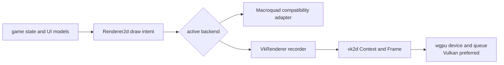
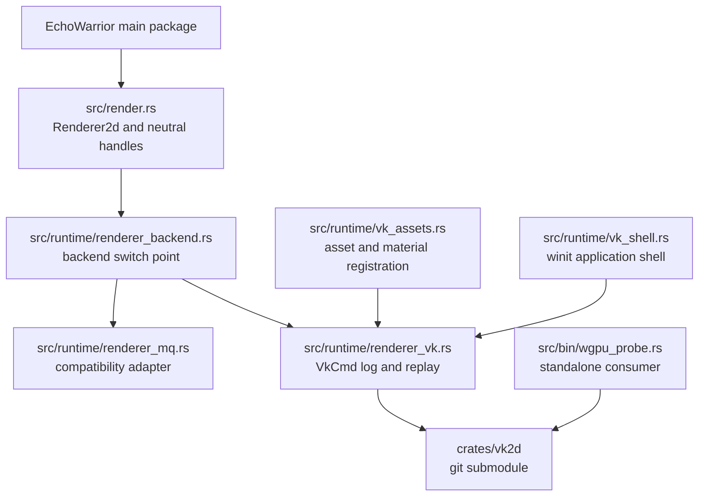
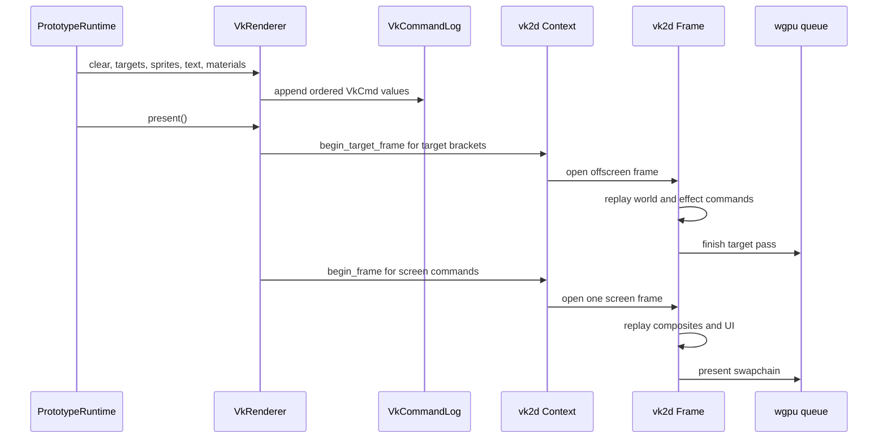
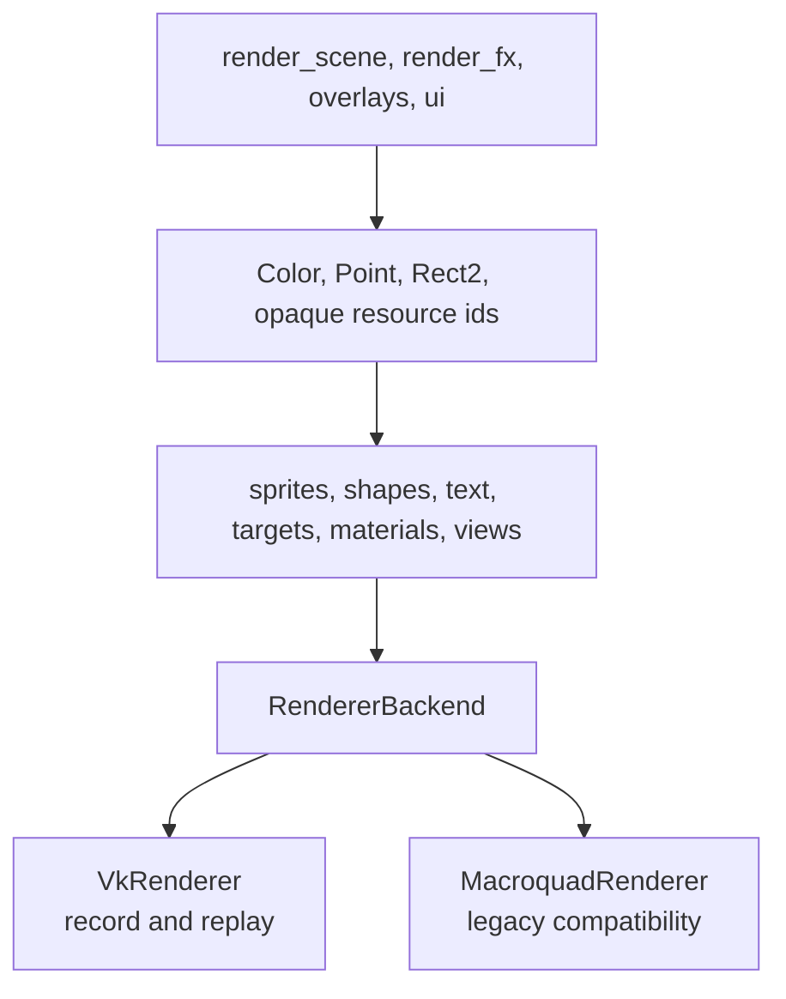
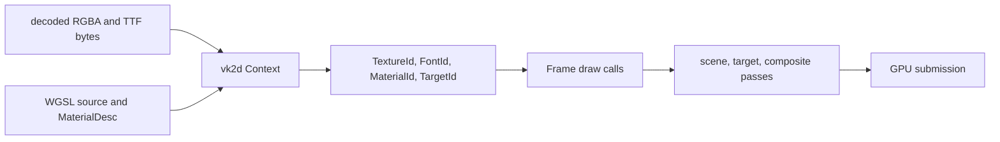
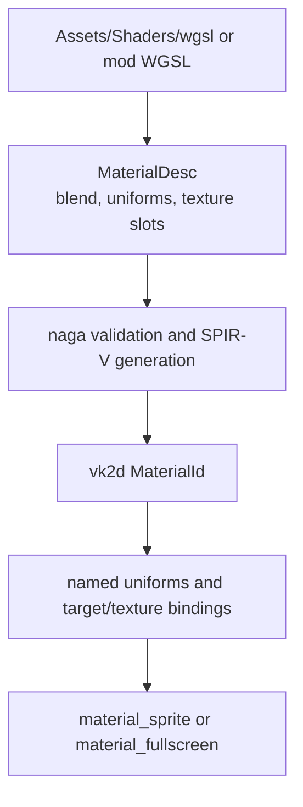

`vk2d` is now EchoWarrior's canonical renderer standard.

It is a renderer we own, evolve, and can extend at the GPU boundary. The crate
lives in its own repository, [soulwax/vk2d](https://github.com/soulwax/vk2d),
and EchoWarrior consumes it through the `crates/vk2d` git submodule. Macroquad
still exists as a compatibility backend while the remaining presentation paths
are moved deliberately, but new renderer architecture should target `vk2d`.

## The Big Picture

The game describes a frame through the neutral `Renderer2d` vocabulary. The
active backend then turns that vocabulary into GPU work.



The important ownership rule is simple:

- EchoWarrior owns game intent, asset lookup, camera policy, layout, and the
  adapter that maps game values into renderer values.
- `vk2d` owns GPU context creation, resource registries, draw batching, target
  passes, text, materials, and submission.
- Macroquad is a fallback and compatibility implementation of the same
  neutral contract. It is not the renderer design to extend for new GPU work.

## What “Canonical” Means

Canonical describes the direction and the contract, not a claim that every old
call site has already disappeared.

| Question | Current answer |
| --- | --- |
| Where should a new renderer capability be designed? | `soulwax/vk2d` first, then the EchoWarrior adapter. |
| Where should gameplay and UI describe drawing? | `src/render.rs` and `Renderer2d` values/verbs. |
| Which backend owns GPU features such as WGSL materials and target passes? | `vk2d`. |
| What is the compatibility path? | `MacroquadRenderer` in `src/runtime/renderer_mq.rs`. |
| How is the Vulkan shell selected today? | Build with `vk-shell`, then pass `--vk`. |
| Is Macroquad-only code allowed? | Only for an existing compatibility path or an explicitly isolated legacy subsystem. |

The current command is therefore honest about both facts:

```powershell
cargo run --features vk-shell -- --vk --arena
```

That launches `src/runtime/vk_shell.rs`, creates a `vk2d::Context`, installs a
`RendererBackend::Vk`, and runs the same runtime input/update/draw order as the
older shell. A future build-profile change may make that path implicit, but a
contributor should already treat it as the canonical path.

## Repository Map



The `src/wgpu_vulkan/` directory and `wgpu_probe` binary remain useful as an
example consumer and smoke surface. They are not a second renderer project.
The reusable implementation belongs in `vk2d`.

## One Frame, Two Phases

`Renderer2d` is called by many runtime modules, so it cannot hold a live
`vk2d::Frame<'_>` across every individual method call. `VkRenderer` solves that
borrow/lifetime mismatch by recording commands first and replaying once per
present.



This preserves draw order while respecting `vk2d`'s resource borrowing model.
Target brackets finish before a later pass samples their textures. The result
is still one game frame, even though it contains several GPU passes.

## The Runtime Boundary

The game-side contract intentionally contains no `wgpu`, `winit`, or
`macroquad::Texture2D` values:

```rust
pub trait Renderer2d {
    fn draw_sprite(&mut self, texture: TextureId, pos: Point, params: SpriteParams);
    fn draw_text(&mut self, text: &str, pos: Point, params: TextParams);
    fn begin_target(&mut self, target: TargetId);
    fn end_target(&mut self);
    fn set_world_view(&mut self, view: CameraView);
    fn set_screen_view(&mut self);
    fn draw_target(&mut self, target: TargetId, dest: Rect2, params: SpriteParams);
}
```

The actual trait contains the complete shape/material vocabulary. The snippet
shows the architectural idea: a runtime feature says what should happen, and
the backend decides how that becomes GPU work.



Do not leak renderer-native types upward. If a new helper needs a GPU device,
texture view, sampler, or winit event, it belongs in `vk2d`, `renderer_vk.rs`,
`vk_assets.rs`, or the shell boundary.

## What `vk2d` Owns

The standalone crate is deliberately small, but it owns the difficult part of
the problem:

| `vk2d` area | Responsibility |
| --- | --- |
| `Context` | instance, adapter selection, device, queue, surface, registries, resize |
| `Frame` | ordered immediate draw calls and pass completion |
| `sprite` | RGBA uploads, source rectangles, flips, texture batching |
| `shapes` | batched rectangles, lines, circles, outlines, triangles |
| `text` | TTF rasterization, per-size atlas buckets, metrics |
| `material` | WGSL validation/compilation, named uniforms, texture slots, pipelines |
| `target` | offscreen targets, filtering, scene composition |
| `view` | CPU-side world-to-output transform, including Y-up coordinates |
| optional integrations | egui overlay and winit input collection |



`vk2d` does not know EchoWarrior's asset paths or gameplay concepts. It
receives bytes and neutral values. The game-side loader resolves loose files,
mods, or packed assets before registration.

## Shader Direction

New GPU effects should be expressed as WGSL materials where the renderer can
own the pipeline contract and the game can own the content path.



The renderer should not grow one Rust module per effect. A Rust adapter is
appropriate when the *rendering capability* is missing; a new spell shape or
palette should normally be data and WGSL.

## Contributor Workflow

When you need a renderer change, use this order:

1. Express the game-side need as a neutral `Renderer2d` verb or a concrete
   renderer capability.
2. Decide whether the capability belongs in `vk2d` or only in the EchoWarrior
   adapter. Reusable GPU behavior belongs in `vk2d`.
3. Change and test `crates/vk2d` in its own repository first.
4. Push the renderer commit before updating EchoWarrior's submodule pointer.
5. Update `renderer_vk.rs`, asset registration, and runtime routing in the
   parent repository.
6. Verify the canonical shell and the compatibility path when both are
   affected.

The detailed submodule sequence lives in [Renderer Submodule Workflow](../renderer-submodule-workflow/).

## Verification Matrix

```powershell
# renderer library
cargo test -p vk2d
cargo run -p vk2d --example hello_sprite -- --frames 3
cargo run -p vk2d --example shader_gallery -- --frames 3

# EchoWarrior consumer and canonical shell
cargo run --bin wgpu_probe -- --frames 3
cargo run --features vk-shell -- --vk --arena

# compatibility path, when its adapter or legacy route changed
cargo run -- --arena
```

The three surfaces answer different questions. `vk2d` examples prove the
library. `wgpu_probe` proves EchoWarrior can consume it. `--vk` proves the
runtime shell, command recorder, asset registration, and live game route.
Macroquad is a compatibility regression check, not the architectural finish
line.

## Current Limits

The canonical direction does not mean parity is complete. Known migration work
includes terrain and weather paths, audio under the winit shell, egui under the
vk runtime, HiDPI input scaling, and any remaining raw Macroquad calls that
cannot safely execute without a Macroquad context.

Each gap must be explicit and logged. A missing capability should degrade to a
visible or logged fallback; it must not silently call a Macroquad global from
the `--vk` path.
