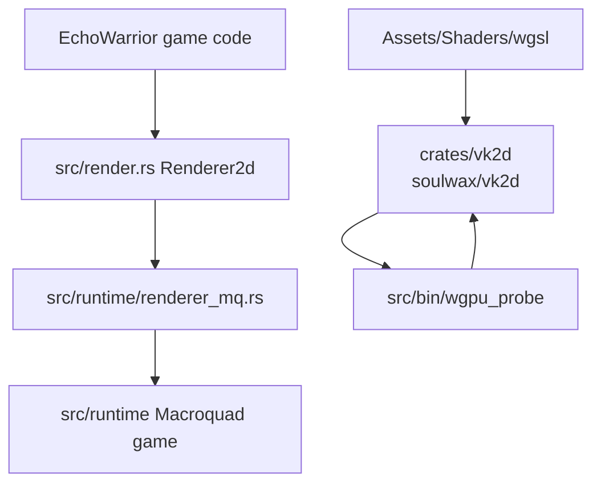
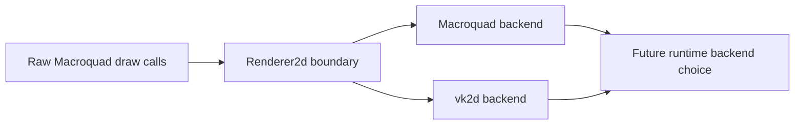
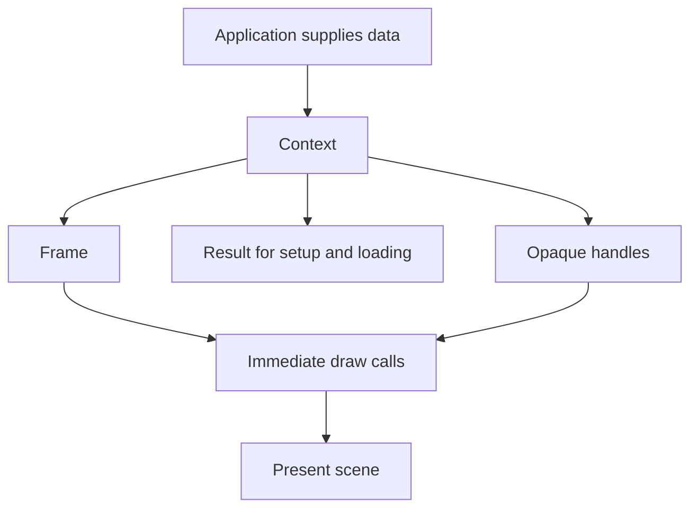
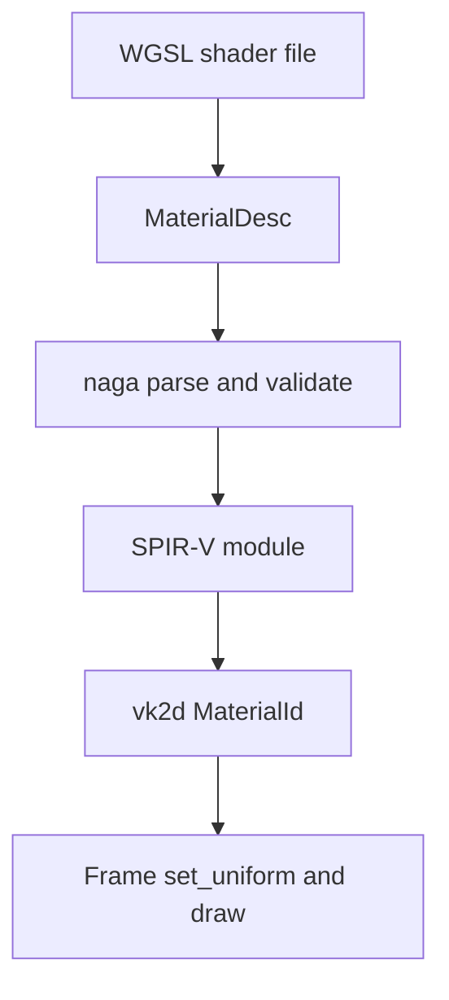
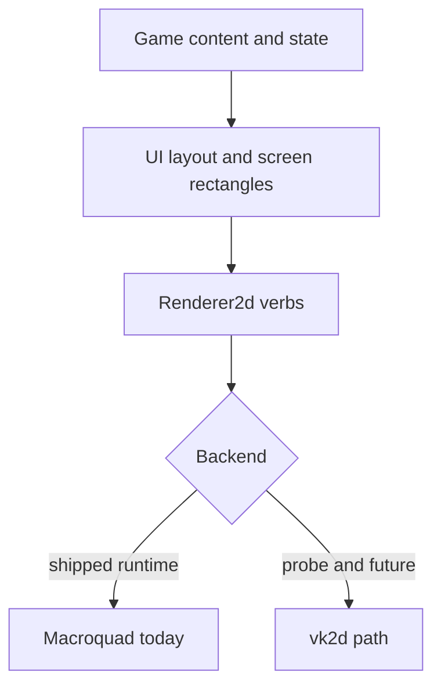

EchoWarrior is moving toward an owned Vulkan-capable 2D renderer without breaking the playable Macroquad runtime.

The renderer itself lives in [soulwax/vk2d](https://github.com/soulwax/vk2d). In this repository, `crates/vk2d` is a git submodule and workspace member used by EchoWarrior so the game can compile, test, and probe against the renderer while the renderer remains its own project.

The important beginner takeaway: this is not a big renderer swap yet. It is a staged migration with two parallel tracks:

- the shipping game still runs through Macroquad
- new renderer work is isolated behind `Renderer2d`, `MacroquadRenderer`, the `soulwax/vk2d` submodule, and `wgpu_probe`

## Current Shape



`src/render.rs` is the neutral contract. It defines plain value types and opaque handles: `Color`, `Point`, `Rect2`, `TextureId`, `MaterialId`, `FontId`, and `TargetId`.

`src/runtime/renderer_mq.rs` implements that contract on top of Macroquad. It lets existing draw sites move onto the neutral API while the shipped game still renders exactly where it already does.

`crates/vk2d` is the `soulwax/vk2d` renderer submodule. It is game-agnostic, uses wgpu with a Vulkan preference, and loads WGSL material shaders as data.

`src/bin/wgpu_probe.rs` is EchoWarrior's richer smoke example. It opens a winit window, uses `vk2d`, draws a sprite grid, WGSL effects, text, and an egui overlay, then can exit automatically with `--frames N`.

For renderer internals, see [vk2d Renderer Internals](vk2d-renderer-internals/). For submodule commit rules, see [Renderer Submodule Workflow](../renderer-submodule-workflow/).

## Why This Exists

The old renderer problem was not just API taste. EchoWarrior wants:

- owned sprite batching and render-target control
- data-authored WGSL effects instead of one Rust file per shader
- startup shader compilation errors with source locations
- a renderer that stays reusable outside the game repository
- a migration path that does not halt game development



The boundary is the important part. Each draw site moved to `Renderer2d` becomes easier to run through Macroquad today and a Vulkan backend later.

## The Four Pieces

| Piece | Role | Beginner rule |
| --- | --- | --- |
| `src/render.rs` | neutral drawing trait and value types | no `macroquad`, no `wgpu`, no game constants |
| `src/runtime/renderer_mq.rs` | Macroquad implementation of `Renderer2d` | maps neutral verbs to existing Macroquad calls |
| `crates/vk2d` | git submodule checkout of `soulwax/vk2d`, the wgpu/Vulkan immediate renderer | no EchoWarrior asset paths or gameplay assumptions |
| `src/wgpu_vulkan` + `wgpu_probe` | EchoWarrior demo consumer of `vk2d` | allowed to load game demo assets and shaders |

## What Changed Recently

The repository is now a Cargo workspace, and the renderer crate is a submodule:

```text
Cargo.toml
crates/vk2d/
src/
```

The root game package depends on the local `crates/vk2d` submodule with its optional `egui` and `winit-input` features for the probe. The shipping Macroquad runtime does not use `wgpu` directly.

The `wgpu_probe` no longer owns the renderer internals. It is now a consumer of `vk2d`. The renderer library owns context creation, textures, materials, text, shapes, render targets, egui overlay presentation, and the nearest-upscale scene blit.

From a fresh clone, initialize the renderer submodule before building:

```powershell
git submodule update --init crates/vk2d
```

## Current Library Contract



`vk2d` is not an engine layer. It is a small renderer library:

- the app supplies decoded RGBA texture bytes, TTF bytes, logical resolution, sprite source rectangles, and WGSL shader text
- setup and resource loading return `Result<_, Vk2dError>`
- per-frame draw calls are infallible and skip bad handles
- public draw inputs stay neutral: `Color`, `Point`, `Rect2`, and opaque handles
- `egui` and `winit-input` are optional feature integrations
- the scene renders at a fixed logical size and nearest-upscales to the window

## Shader Contract



For `vk2d`, shaders are content. A material is a `.wgsl` string plus a blend mode and a uniform declaration. The app pushes uniform values by name.

That is different from the old pattern where a new shader could imply a new Rust module. The direction is: fewer shader-specific Rust files, more shader data.

EchoWarrior-specific shader file paths belong in `src/wgpu_vulkan` or game asset manifests. The renderer crate should receive WGSL text, not know where EchoWarrior stores it.

## What Not To Do

Do not:

- import `wgpu` into `src/game`, `src/data`, or `src/ui`
- put game-specific paths such as `Assets/Graphics/...` inside `soulwax/vk2d`
- add backend-specific types to `src/render.rs`
- move a large render subsystem all at once
- treat `wgpu_probe` as the shipped game runtime
- commit an EchoWarrior submodule pointer before the `soulwax/vk2d` commit it points at is pushed

Do:

- move draw sites through `Renderer2d` in small slices
- keep gameplay and layout data backend-neutral
- use `cargo run --bin wgpu_probe -- --frames 3` for probe smoke checks
- use `cargo run -p vk2d --example hello_sprite -- --frames 3` when the renderer library itself changed
- keep `cargo run` as the Macroquad runtime smoke check

## Verification

Use the narrowest check for the slice:

```powershell
cargo check
cargo test -p vk2d
cargo run -p vk2d --example hello_sprite -- --frames 3
cargo run --bin wgpu_probe -- --frames 3
cargo run
```

`cargo run -p vk2d --example hello_sprite -- --frames 3` verifies the renderer crate by itself. `cargo run --bin wgpu_probe -- --frames 3` verifies EchoWarrior's isolated Vulkan consumer path. `cargo run` verifies the playable Macroquad path. A good renderer migration slice knows which one it affected.

## Mental Model



The game should increasingly describe what to draw in neutral terms. The backend decides how those requests become GPU work.
