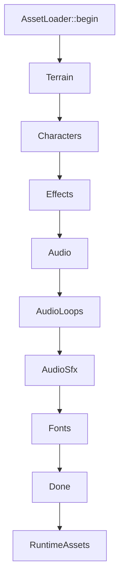
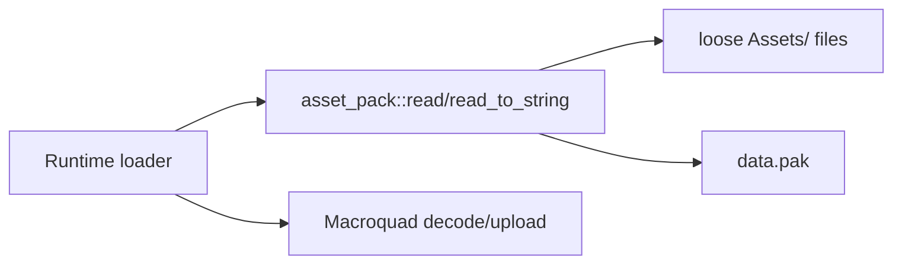
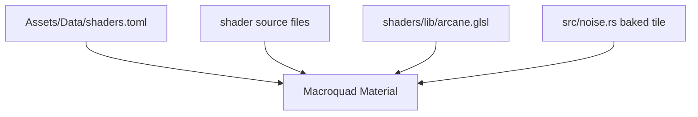

`src/runtime/assets.rs` turns loose or packed assets into live Macroquad handles. It is deliberately phase-stepped so the loading screen can draw between chunks of work.

## Loader Shape

`AssetLoader::begin()` receives music definitions and initial audio track ids, then starts at `LoadPhase::Terrain`.

Each `step()` handles one phase and returns the next phase. The caller draws a loading frame and waits for the next Macroquad frame between steps.

## What Each Phase Owns

| Phase | Main work |
| --- | --- |
| `Terrain` | Load tile textures and build world terrain chunks. |
| `Characters` | Load player/enemy textures and character sheets. |
| `Effects` | Load portraits, runtime symbols, weather sheets, particles, shaders, and the baked noise tile. |
| `Audio` | Build voice bank, SFX bank, and deferred looping track handles. |
| `AudioLoops` | Decode long weather/music loops one at a time. |
| `AudioSfx` | Preload core one-shot SFX on a small per-frame budget. |
| `Fonts` | Resolve UI, dialogue, and combat font roles. |

`finish()` consumes the loader into `RuntimeAssets` and fails if a required phase was skipped.

## Loose Files And Packs

Most asset reads go through `echo_warrior::asset_pack::read*` first, then fall back to Macroquad loose-file loaders. This makes the same runtime path work in development and release:

When a new direct runtime path is added, verify it is included in asset-pack discovery.

## Texture And Atlas Notes

Character sheets are packed into a shared runtime atlas when possible. Sheets that fail decode or overflow load standalone but use the same draw path through `source_offset`.

Runtime symbol icons use `Assets/Metadata/symbols_spritesheet.toml`. The loader logs how many runtime symbols were loaded; missing metadata degrades to `None` rather than crashing.

Weather sprites are optional per sheet. Missing rain or lightning metadata logs an error and leaves that layer absent.

## Shader Loading

Shaders are declared in `Assets/Data/shaders.toml`. The runtime loader:

- reads vertex and fragment sources through the asset gateway
- splices `shaders/lib/arcane.glsl` at `// #pragma arcane`
- resolves uniform descriptors
- chooses alpha or additive blending
- binds shared textures declared by `textures`

The current shared texture registry includes `u_noise_tex`, backed by the baked noise tile from `src/noise.rs`.

Compile failures are logged and skipped. A bad shader should not take down the runtime.

## Font Rules

The runtime prefers TrueType faces because Macroquad's text rasterizer is unreliable with some CFF/OTF punctuation. Current roles:

| Role | Primary use |
| --- | --- |
| Default UI | Loading and basic UI fallback. |
| Dialogue name | Speaker names and title-like labels. |
| Dialogue body | Readable prose and descriptions. |
| Combat | Damage numbers and combat text. |

Fonts are configurable through `Assets/Data/fonts.toml`, with platform fallbacks as a last resort.

## Contributor Checklist

- Add manifest-owned assets to the relevant TOML instead of hardcoding paths.
- Use `asset_pack::read*` for runtime file reads when practical.
- Keep optional visual layers optional: log and continue.
- Run `cargo run --bin asset_pack -- --dry-run --list` after adding runtime paths.
- Run `npm run build` in the wiki if changing this page.
