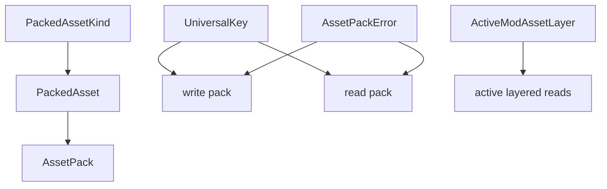
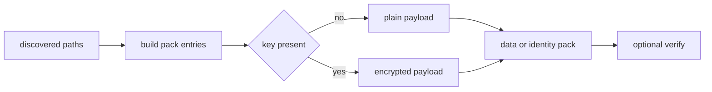
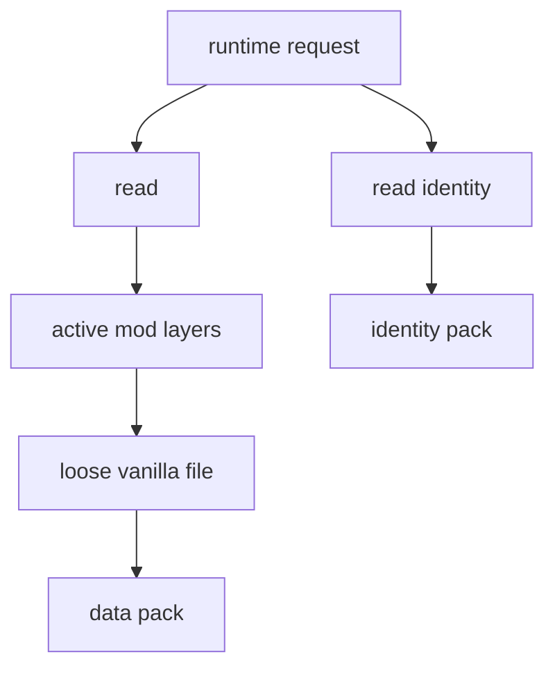
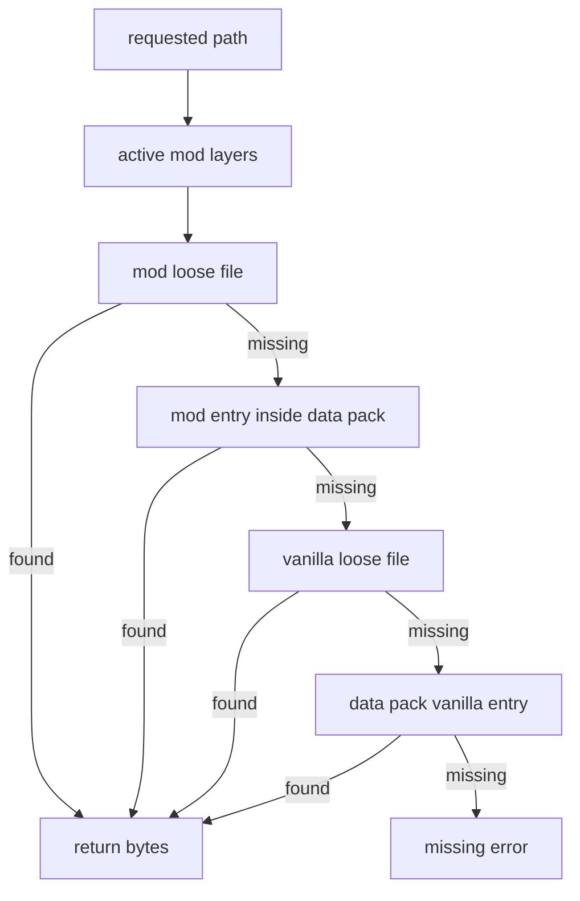
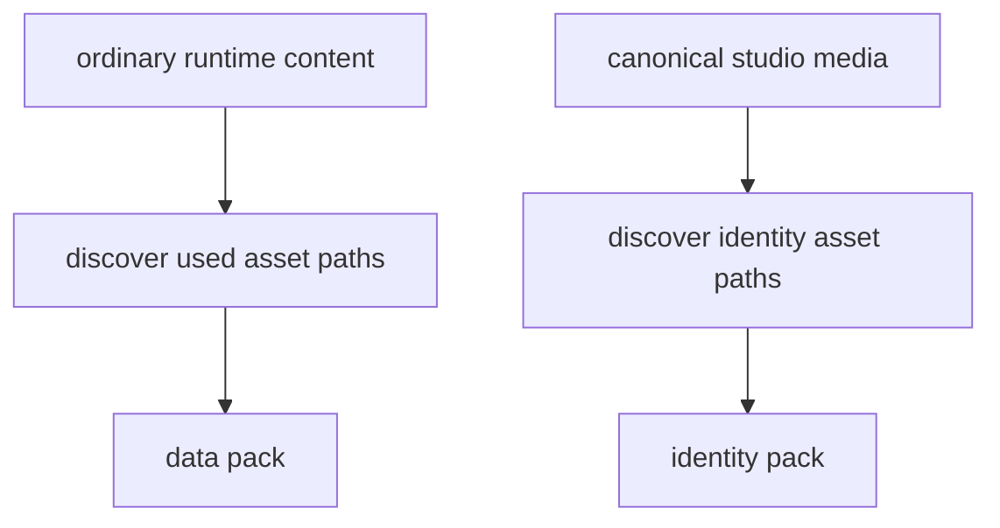
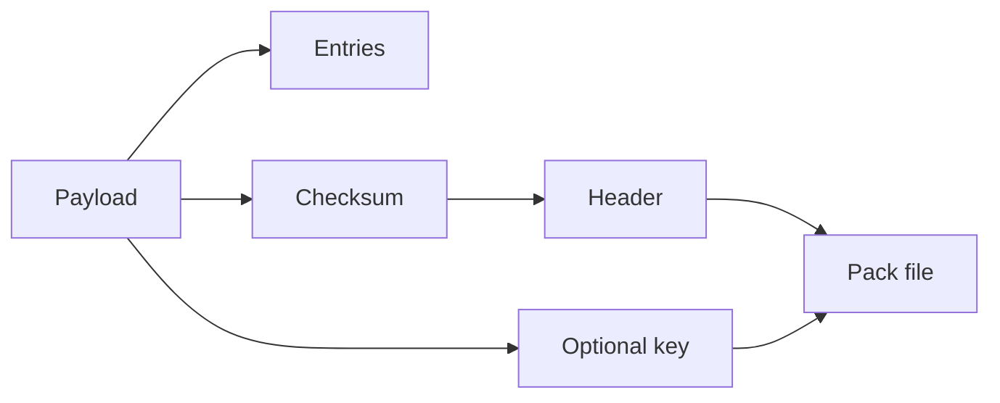
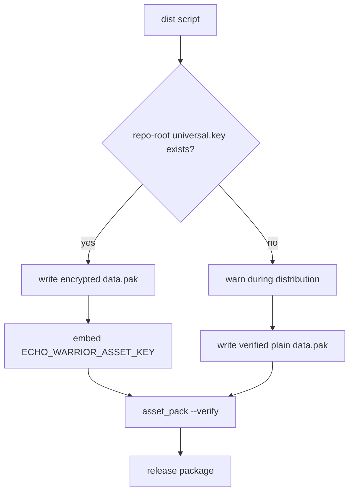

This page documents the public surface of `src/asset_pack.rs`.

## Core Types



| Type | Purpose |
| --- | --- |
| `PackedAssetKind` | Classification used for inventory and verification: data, metadata, dialogue, script, shader, texture, audio, font, other. |
| `PackedAsset` | One normalized path plus bytes and kind. |
| `AssetPack` | Immutable collection of packed assets with path lookup helpers. |
| `UniversalKey` | 32-byte key wrapper used for optional pack encryption. |
| `ActiveModAssetLayer` | Runtime-selected mod layer id and root path. |
| `AssetPackError` | Error type for pack parsing, encryption, UTF-8, and I/O failures. |

## Pack Writing



| Function | Purpose |
| --- | --- |
| `write_pack(pack, key, path)` | Writes encrypted or unencrypted pack depending on whether `key` is present. |
| `write_encrypted_pack(pack, key, path)` | Explicit encrypted write helper. |
| `build_pack_from_paths(root, paths)` | Reads source files and builds an `AssetPack` from discovered paths. |

`data.pak` is optionally encrypted:

- release scripts look for repo-root `universal.key`
- when `universal.key` exists, the scripts pass it to `asset_pack --key` and embed the same value into `ECHO_WARRIOR_ASSET_KEY`
- when `universal.key` is missing, the scripts warn and still write a verified unencrypted `data.pak`
- runtime key discovery still accepts legacy `hwdruntime` for older local packs, but new release work should use `universal.key`

`identity.pak` is different. It is always written with an explicit per-build key by release scripts.

## Pack Reading



| Function | Purpose |
| --- | --- |
| `read(path)` | Main runtime content read: active mod layers, loose files, then default pack fallback. |
| `read_identity(path)` | Reads canonical identity media from `identity.pak`, bypassing loose/mod override paths in release. |
| `read_to_string(path)` | `read(path)` plus UTF-8 conversion. |
| `read_from_default_pack(path)` | Reads directly from vanilla `data.pak` if present. |
| `list_default_pack_paths(prefix, extension)` | Lists active mod and default-pack paths for runtime discovery. |
| `list_default_pack_paths_for_vanilla(prefix, extension)` | Lists vanilla default-pack paths only. |

Use `read_to_string` for TOML/YAML/Lua data loaders when loose and packed content should both work.

## Active Mod Layers

The runtime sets selected mod layers with:

```rust
set_active_mod_layers(layers);
```

and clears them with:

```rust
clear_active_mod_layers();
```

`active_mod_layer_ids()` returns the current ids for diagnostics/UI.

Read order is intentionally layer-aware:



Later selected layers override earlier dependency layers.

## Discovery API



| Function | Purpose |
| --- | --- |
| `discover_used_asset_paths(root)` | Finds all runtime assets that should ship in `data.pak`. |
| `discover_identity_asset_paths(root)` | Finds canonical studio intro frame/audio assets for `identity.pak`. |
| `normalize_asset_path(path)` | Converts paths into pack-stable forward-slash form. |

Discovery is the release contract. If a runtime asset is not discovered, loose development runs may work while packaged builds fail.

## Explicit Discovery Lists

`asset_pack.rs` still contains explicit lists for assets without a manifest owner:

- `HARDCODED_RUNTIME_FILES`
- `CORE_SFX_IDS`
- `CORE_MUSIC_IDS`

Prefer manifest-owned or directory-scanned assets first. Update explicit lists only when a direct runtime load has no better data owner.

## Pack Format Notes

`data.pak` uses an EchoWarrior-specific binary format with:



- pack magic
- payload magic
- format version
- flags
- optional XOR-style payload encryption derived from `UniversalKey`
- checksum validation

The encryption protects against casual browsing, not against a determined user with the client binary.

## Release Key Decision



That warning is intentional. Missing `universal.key` should not block local or internal packaging, but the distributor should notice that the resulting `data.pak` is readable without a key.

## Change Checklist

When adding or moving runtime assets:

1. Prefer `Assets/Data`, `Assets/Metadata`, `Assets/Scripts`, `Assets/Dialogue`, or a manifest reference.
2. If needed, update the explicit discovery list.
3. Run:

```powershell
cargo run --bin asset_pack -- --dry-run --list
```

4. Confirm the new path appears.
5. For release-impacting changes, run:

```powershell
cargo run --bin asset_pack -- --out data.pak --inventory-out asset_inventory.md --verify
```
