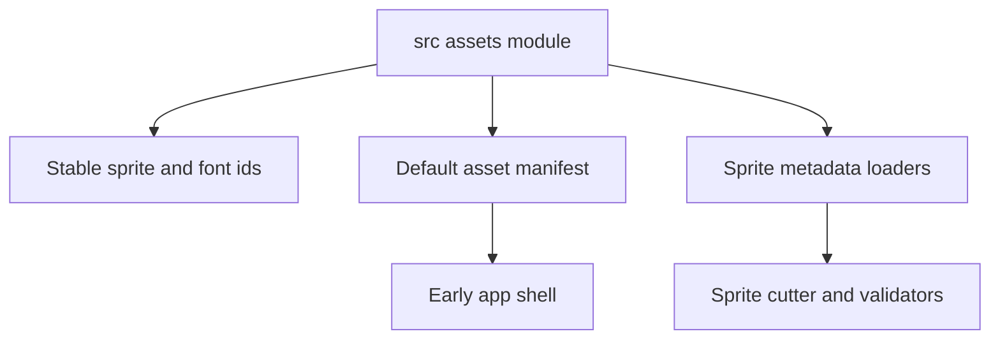
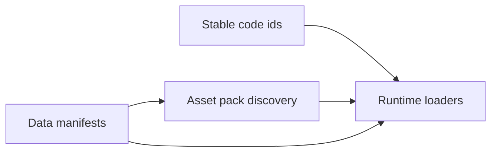
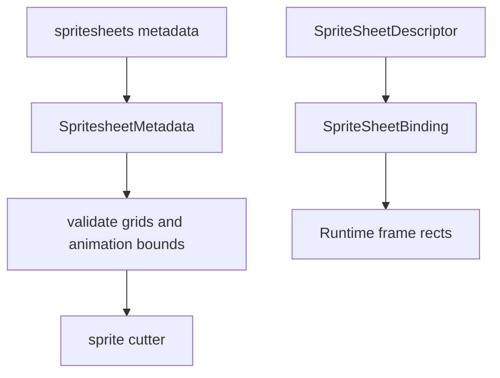
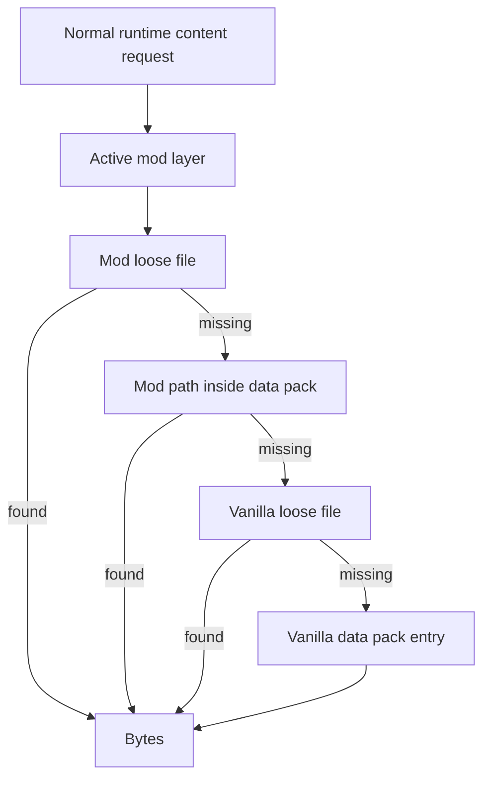
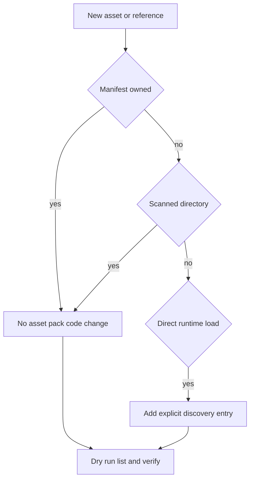

## `src/assets.rs`

`src/assets.rs` defines stable identifiers and metadata loaders for source assets.

The file has three main jobs:

1. Declare stable sprite and font ids.
2. Provide `AssetManifest::default_manifest()` for the core sprite/font set.
3. Parse and validate spritesheet metadata and descriptor files.



## Asset Manifest

The default manifest includes player/enemy/tileset/object/particle sprites and the redistributable UI fonts. This manifest is a lightweight code-side inventory; most runtime content is now driven by `Assets/Data/*.toml`.

Do not add new runtime assets here unless the code really needs a stable enum id. Prefer data manifests when a modder should be able to replace or extend content.

Runtime decoding and GPU upload are covered in [Asset Loading Pipeline](../asset-loading-pipeline/). This page is about pack/discovery contracts; the loader page is about how assets become live `Texture2D`, `Material`, `Font`, and audio handles.



## Sprite Metadata

`SpriteMetadata` loads `Assets/Metadata/spritesheets.toml` through `asset_pack::read_to_string`, which means the same call works for loose files and packed files.



Validation catches:

- zero-sized spritesheet grids
- zero-sized tileset grids
- animation rows or columns outside the declared sheet

`SpriteSheetDescriptor` handles per-sheet descriptor TOML files, resolves named sprites, and binds animations to frame rectangles.

## `src/asset_pack.rs`

`asset_pack.rs` is the central asset gateway for shipping and modding.

It owns:

- the `data.pak` and `identity.pak` binary formats
- optional payload encryption with `UniversalKey`
- loose-file reads for development
- packed-file fallback for release builds
- active mod layer reads
- asset path normalization
- release asset discovery
- identity cinematic asset discovery

## Read Order

For normal runtime content, reads prefer:



Identity media is deliberately separate. Production identity reads use `identity.pak` and bypass the ordinary mod override chain.

## Discovery Rules

`discover_used_asset_paths()` automatically includes common runtime content:

- `Assets/Data/**/*.toml`
- `Assets/Metadata/**/*.toml`
- `Assets/Scripts/**/*.lua`
- `Assets/Dialogue/*.yaml` and `.yml`
- manifest-referenced shader sources
- metadata descriptor images
- character sprites
- configured fonts
- core audio ids
- runtime-shaped files under `Mods/<mod_id>/`

Only directly loaded files without a manifest owner and newly preloaded core audio ids should require an `asset_pack.rs` update.



## Safety Rules

- Keep pack paths normalized with forward slashes.
- Never allow unpack paths to escape the requested output directory.
- Verify after changing runtime asset references:

```powershell
cargo run --bin asset_pack -- --dry-run --list
```

For release packs:

```powershell
cargo run --bin asset_pack -- --out data.pak --inventory-out asset_inventory.md --verify
```
