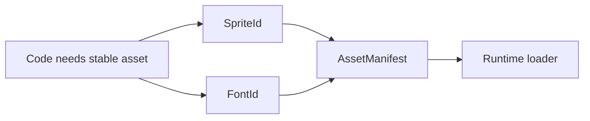
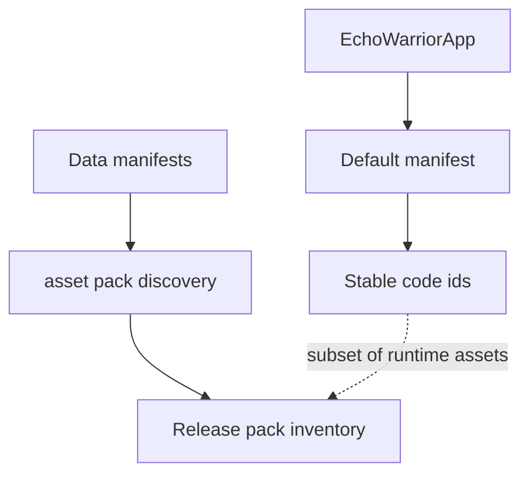
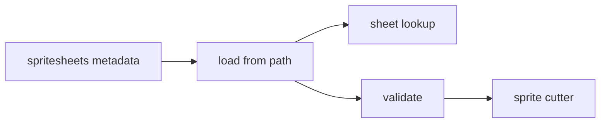
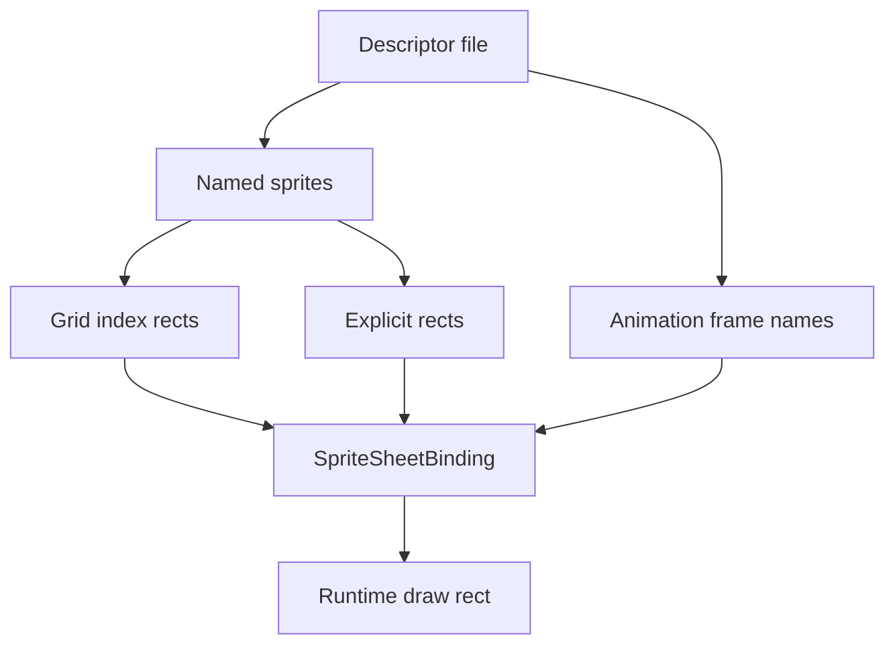

This page documents `src/assets.rs`, the top-level asset metadata layer. Runtime loading lives under `src/runtime/`, and data-driven content definitions live under `src/data/`.

## Stable Ids

`SpriteId` and `FontId` are small enums for assets that the code wants to name directly.



Current sprite ids:

| Id | Default path |
| --- | --- |
| `Player` | `Assets/Graphics/sprites/characters/player.png` |
| `Skeleton` | `Assets/Graphics/sprites/characters/skeleton.png` |
| `SkeletonSwordless` | `Assets/Graphics/sprites/characters/skeleton_swordless.png` |
| `Slime` | `Assets/Graphics/sprites/characters/slime.png` |
| `GrassTiles` | `Assets/Graphics/sprites/tilesets/grass.png` |
| `PlainsTiles` | `Assets/Graphics/sprites/tilesets/plains.png` |
| `WaterSheet` | `Assets/Graphics/sprites/tilesets/water-sheet.png` |
| `Objects` | `Assets/Graphics/sprites/objects/objects.png` |
| `DustParticles` | `Assets/Graphics/sprites/particles/dust_particles_01.png` |

Current font ids:

| Id | Default path |
| --- | --- |
| `HopeGold` | `Assets/Fonts/hope-gold-v1/HopeGold.otf` |
| `CompassGold` | `Assets/Fonts/compass-gold-v1/CompassGold.otf` |
| `RedeemGold` | `Assets/Fonts/redeem-gold-v1/RedeemGold.otf` |
| `RulerGold` | `Assets/Fonts/ruler-gold-v1/RulerGold.otf` |
| `SinsGold` | `Assets/Fonts/sins-gold-v1/SinsGold.otf` |

Use these ids for stable engine-owned assets. For moddable content, prefer a TOML manifest under `Assets/Data`.

## `AssetManifest`

`AssetManifest::default_manifest()` returns the built-in sprite and font vectors. It is used by `EchoWarriorApp::new()` as the early app shell inventory.

This manifest is not the full release-pack inventory. `src/asset_pack.rs` discovers release assets from directories and data manifests.



## `SpriteMetadata`

`SpriteMetadata` represents `Assets/Metadata/spritesheets.toml`.

```rust
pub struct SpriteMetadata {
    pub sheets: Vec<SpritesheetMetadata>,
    pub tilesets: Vec<TilesetMetadata>,
}
```

Important methods:

| Method | Purpose |
| --- | --- |
| `load_from_path(path)` | Reads through `asset_pack::read_to_string`, so loose and packed paths work. |
| `sheet(id)` | Finds one configured sheet by id. |
| `validate()` | Validates sheet grids, tileset grids, and animation bounds. |



## `SpritesheetMetadata`

Each sheet declares:

- id
- source image path
- kind
- frame dimensions
- columns and rows
- generated output directory
- optional animation rows

`expected_width()` and `expected_height()` are used by the sprite cutter to confirm the source PNG matches metadata before cutting.

## `SpriteSheetDescriptor`

`SpriteSheetDescriptor` represents per-sheet descriptor TOML files such as `Assets/Metadata/player_spritesheet.toml`.



It supports two sprite addressing modes:

- grid `index`
- explicit `x`, `y`, `w`, `h`

Calling `bind()` returns a `SpriteSheetBinding`, which resolves named sprites and animation frames into `SpriteSheetRect` values.

## Common Failure Modes

| Symptom | Likely cause |
| --- | --- |
| Sprite cutter rejects a sheet | Source image dimensions do not match `frame_width * columns` and `frame_height * rows`. |
| Animation does not resolve | `frames` references a sprite name that is not declared. |
| Descriptor validates but runtime draws the wrong frame | Grid index, origin, padding, or explicit rect values are wrong. |
| Asset works loose but not in release | The file is not discoverable by `asset_pack`. See [Assets And Packaging](../assets-and-packaging/). |
