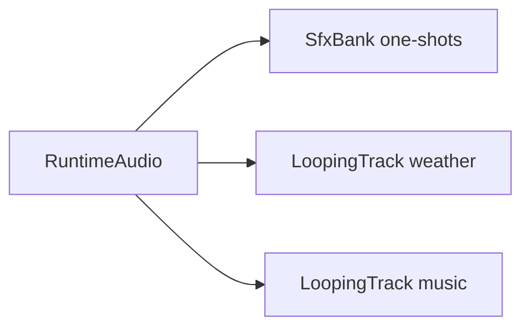
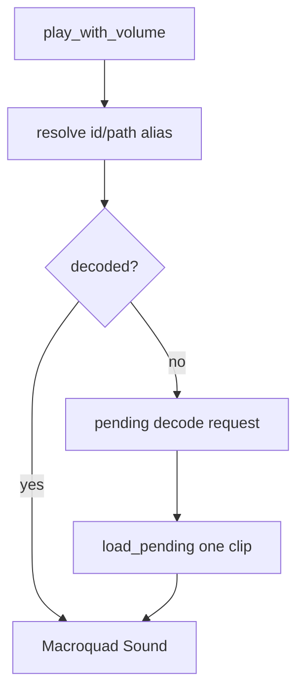
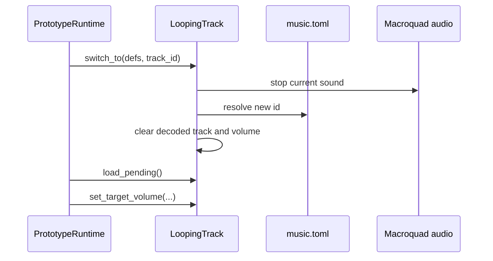
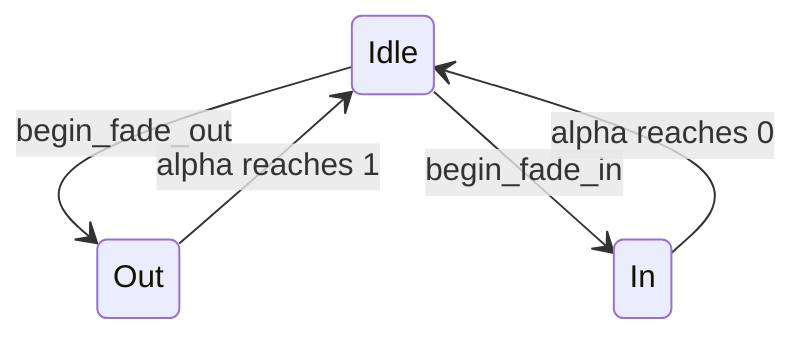
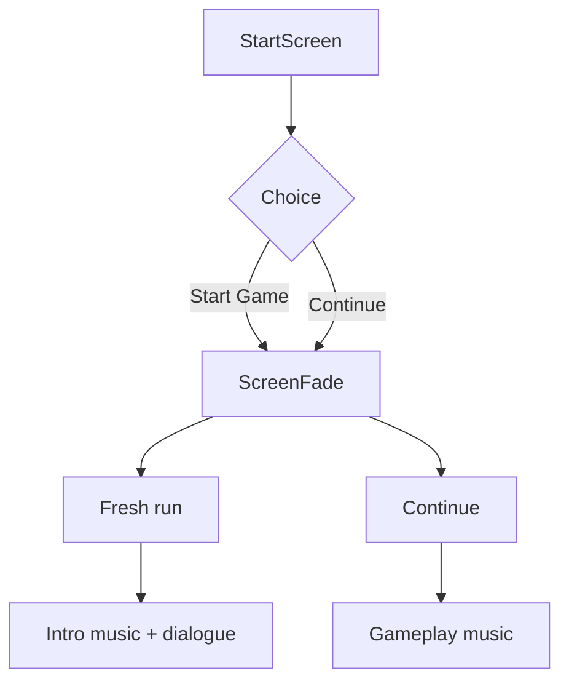

The current runtime treats audio and scene transitions as part of the same player-facing handoff: start screens, intro dialogue, gameplay, weather, and death all fade instead of snapping.

## Audio Data

Audio manifests are loaded from `src/data/mod_data.rs`:

| Data file | Rust type | Purpose |
| --- | --- | --- |
| `Assets/Data/sfx.toml` | `SfxDef` | One-shot sound effects. |
| `Assets/Data/music.toml` | `TrackDef` | Long music/weather loops. |
| `Assets/Data/settings.toml` | `AudioSettings` | Track ids, volumes, and fade times. |

All loaders print errors and fall back to defaults where possible.

## Runtime Audio Layers

`RuntimeAudio` currently owns:

The split matters because weather remains atmospheric while non-weather audio can fade down during death or scene transitions.

## SFX Bank

`SfxBank` builds a catalog from `sfx.toml` and resolves calls by id, asset path, or normalized `Assets/...` path.

Important safeguards:

- unknown ids warn once
- repeated pending requests coalesce to the loudest requested volume
- `load_pending()` decodes at most one clip per frame
- unsupported audio formats are rejected before Macroquad can panic

Macroquad currently accepts `.ogg` and `.wav` here. Do not add `.mp3` runtime audio without changing and testing the backend guard.

## Looping Tracks

`LoopingTrack::preload()` captures a manifest track id without decoding immediately. Decoding happens in the loader's `AudioLoops` phase.

`LoopingTrack::switch_to()` is the runtime handoff tool:

The current start flow uses intro music for a fresh game and gameplay music for Continue or post-intro gameplay.

## Weather And Music Gain

Weather audio follows visual storm intensity, not only the discrete weather enum. This lets cinematic weather and natural weather share a believable audio curve.

Non-weather audio gain fades down during death so music and SFX make room for the death presentation while weather can remain present.

## Screen Fade

`src/runtime/transition.rs` contains the pure state machine:

The runtime draws one fullscreen black rectangle using `ScreenFade::alpha`. A scene change fades out to black, swaps hidden state, then fades in.

## Start And Continue Handoffs

`DEFAULT_FADE_SECONDS` is currently `0.6`, clamped internally so invalid fade durations do not divide by zero.

## Contributor Checklist

- Add SFX through `Assets/Data/sfx.toml`, not by hardcoding file paths in runtime logic.
- Add music/weather loops through `Assets/Data/music.toml`.
- Keep runtime audio file formats to `.ogg` or `.wav`.
- Use `LoopingTrack::switch_to()` for music handoffs instead of starting a second music layer.
- Use `ScreenFade` for scene-to-scene fades.
- Run `cargo test --bin echo_warrior runtime::audio` or `cargo test --bin echo_warrior runtime::transition` after changing these internals.
