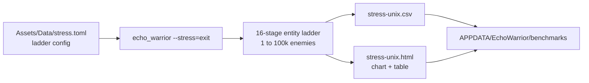
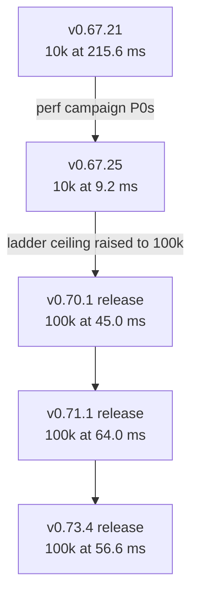

This page is the canonical record of EchoWarrior stress-benchmark
measurements: the current release-vs-debug snapshot, the run history across
versions, and the reconciliation notes that say which raw runs were excluded
and why. Numbers without conditions are noise — every row here carries its
build version, profile, resolution, and date.

## How the numbers are produced



The stress mode opens an empty run and walks a staged entity ladder
(deterministic golden-angle spawn spiral, immortal horde, invulnerable
player), sampling frame times for 4 s per stage after a 1.5 s warmup. The
ladder is the 1-2-5 series up to `enemy_count` in `Assets/Data/stress.toml`
— 16 stages to 100 000 since v0.68 (13 stages to 10 000 before that).

Reproduce with:

```powershell
cargo build --release
target\release\echo_warrior.exe --stress=exit   # exits 0 once the report is written
```

Run builds serially with the machine otherwise idle, and keep
`vsync = false` under `[gfx]` — every run below has `vsync_suspected=false`.

## Current snapshot: v0.73.4 release vs debug (2026-07-13)

Both builds, full ladder, 1584x861, render_scale 2.0, bloom on, MSAA 4,
vsync off. **Conditions caveat:** these runs were taken on a development
machine with background load present; the two release runs of the day agree
within 1 % (56.6 vs 56.0 ms at 100 k), so the shape is trustworthy, but
treat absolute values as indicative until re-measured on an idle machine.

| entities | release avg ms | debug avg ms | speedup | release p95 ms | debug p95 ms | release fps | debug fps |
|---:|---:|---:|---:|---:|---:|---:|---:|
| 1 | 3.70 | 3.72 | 1.01x | 4.22 | 4.46 | 270.5 | 268.9 |
| 2 | 3.82 | 3.83 | 1.00x | 4.38 | 4.38 | 262.0 | 261.4 |
| 5 | 3.69 | 3.72 | 1.01x | 4.18 | 4.36 | 271.3 | 268.8 |
| 10 | 3.60 | 3.62 | 1.00x | 4.01 | 4.06 | 277.6 | 276.2 |
| 20 | 3.70 | 3.69 | 1.00x | 4.54 | 4.41 | 270.1 | 271.1 |
| 50 | 3.58 | 3.57 | 1.00x | 4.11 | 3.98 | 279.6 | 279.8 |
| 100 | 4.18 | 4.21 | 1.01x | 5.92 | 6.14 | 239.5 | 237.6 |
| 200 | 4.60 | 4.66 | 1.01x | 7.02 | 7.41 | 217.2 | 214.7 |
| 500 | 4.26 | 4.31 | 1.01x | 5.16 | 5.31 | 234.9 | 231.8 |
| 1000 | 5.02 | 7.33 | 1.46x | 6.65 | 15.75 | 199.0 | 136.3 |
| 2000 | 6.13 | 6.49 | 1.06x | 9.81 | 9.98 | 163.2 | 154.1 |
| 5000 | 9.45 | 11.38 | 1.20x | 17.25 | 17.05 | 105.9 | 87.9 |
| 10000 | 14.78 | 20.96 | 1.42x | 27.43 | 29.34 | 67.6 | 47.7 |
| 20000 | 23.74 | 38.61 | 1.63x | 46.57 | 56.19 | 42.1 | 25.9 |
| 50000 | 45.41 | 72.95 | 1.61x | 115.08 | 114.71 | 22.0 | 13.7 |
| 100000 | 56.56 | 95.11 | 1.68x | 84.26 | 112.98 | 17.7 | 10.5 |

Reading the shape:

- **Up to 500 entities the builds are identical** (1.00–1.01x, ~270 fps).
  The frame is dominated by the fixed-cost GPU composite (SSAA render
  target + bloom), which optimization level cannot touch.
- **Divergence starts around 1 000 entities** and grows to a **~1.6–1.7x
  release advantage** at the top of the ladder, where per-entity CPU work
  (simulation, spatial grid, draw preparation) dominates.
- **Smooth ceilings:** both builds hold 60 fps to 2 000 entities; release
  holds 120 fps to 1 000, debug only to 500. The debug 1 000-entity row
  (1.46x, p95 15.75 ms) is a transient hitch — the 2 000 row is back to
  1.06x; trust the 5 000+ trend instead.

## Run history (complete runs only)



Pre-v0.68 rows ran the old 13-stage ladder capped at 10 000 entities and a
slightly different resolution — comparable to each other, not to the 100 k
rows. Cross-version rows show trends in this codebase on the same developer
machine, not hardware truth.

| date (UTC) | build | profile | smooth 60 | smooth 120 | heaviest stage | avg ms | avg fps |
|---|---|---|---:|---:|---:|---:|---:|
| 2026-07-04 | v0.67.21 | release | 200 | 50 | 10 000 | 215.6 | 4.6 |
| 2026-07-05 | v0.67.25 | release | 10 000 | 2 000 | 10 000 | 9.2 | 108.9 |
| 2026-07-05 | v0.67.26 | release | 10 000 | 2 000 | 10 000 | 9.9 | 100.7 |
| 2026-07-05 | v0.68.3 | debug | 2 000 | 1 000 | 100 000 | 93.5 | 10.7 |
| 2026-07-05 | v0.68.4 | debug | 2 000 | 1 000 | 100 000 | 122.1 | 8.2 |
| 2026-07-06 | v0.70.1 | release | 5 000 | 2 000 | 100 000 | 45.0 | 22.2 |
| 2026-07-08 | v0.71.1 | release | 5 000 | 1 000 | 100 000 | 64.0 | 15.6 |
| 2026-07-08 | v0.71.1 | debug | 5 000 | 1 000 | 100 000 | 107.3 | 9.3 |
| 2026-07-12 | v0.73.0 | debug | 2 000 | 1 000 | 100 000 | 87.6 | 11.4 |
| 2026-07-13 | v0.73.0 | debug | 2 000 | 1 000 | 100 000 | 92.9 | 10.8 |
| 2026-07-13 | v0.73.0 | debug | 5 000 | 1 000 | 100 000 | 94.7 | 10.6 |
| 2026-07-13 | v0.73.0 | debug | 2 000 | 1 000 | 100 000 | 95.3 | 10.5 |
| 2026-07-13 | v0.73.4 | release | 2 000 | 1 000 | 100 000 | 56.6 | 17.7 |
| 2026-07-13 | v0.73.4 | debug | 2 000 | 500 | 100 000 | 95.1 | 10.5 |
| 2026-07-13 | v0.73.4 | release | 2 000 | 1 000 | 100 000 | 56.0 | 17.9 |

The v0.67.21 → v0.67.25 jump (10 000 entities: 215.6 ms → 9.2 ms, a 23x
improvement) is the 2026-07 performance campaign landing — the moment the
game stopped being CPU-bound on entity count and became GPU-bound on the
post-processing composite.

## Reconciliation notes

Raw reports live in `%APPDATA%\EchoWarrior\benchmarks\` (CSV + HTML per
run). As of 2026-07-13 that folder holds 23 distinct runs; the tables above
use the 16 complete ones minus one exclusion:

- **Excluded: 2026-07-13 15:55 UTC, v0.73.4 debug, 113.3 ms at 100 k.**
  Two game instances were observed running concurrently during this run.
  Compared with the clean same-build run (95.1 ms), the contention inflated
  the heaviest stage by ~19 % — a concrete demonstration of why benchmark
  runs must be serial on an otherwise idle machine.
- **Partial runs** (aborted ladders of 1–10 stages, e.g. a stage-1-only
  v0.73.4 release run from 2026-07-13 14:36 UTC) are kept in the folder for
  forensics but never charted.

To rebuild the inventory after new runs, use the collector script from the
repo's `bench-publish` agent skill, which parses every CSV's meta line and
dedupes working copies by `started_unix`:

```powershell
python3 .claude/skills/bench-publish/scripts/collect_benchmarks.py `
    "$env:APPDATA\EchoWarrior\benchmarks"
```
