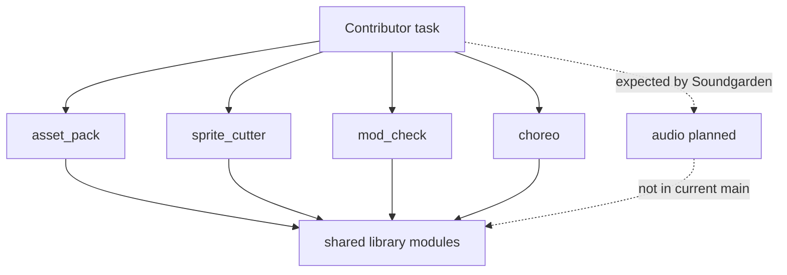
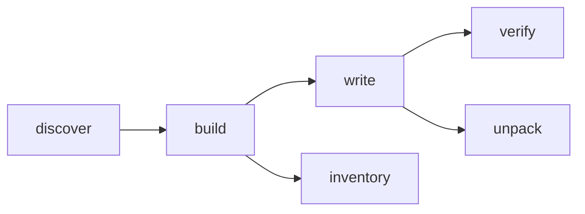
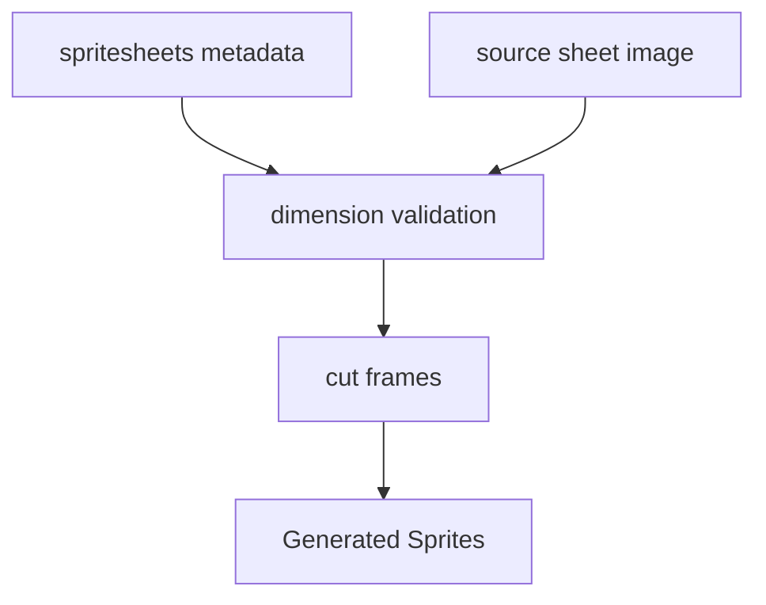
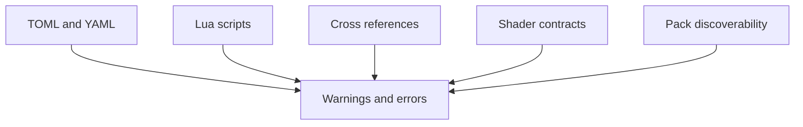
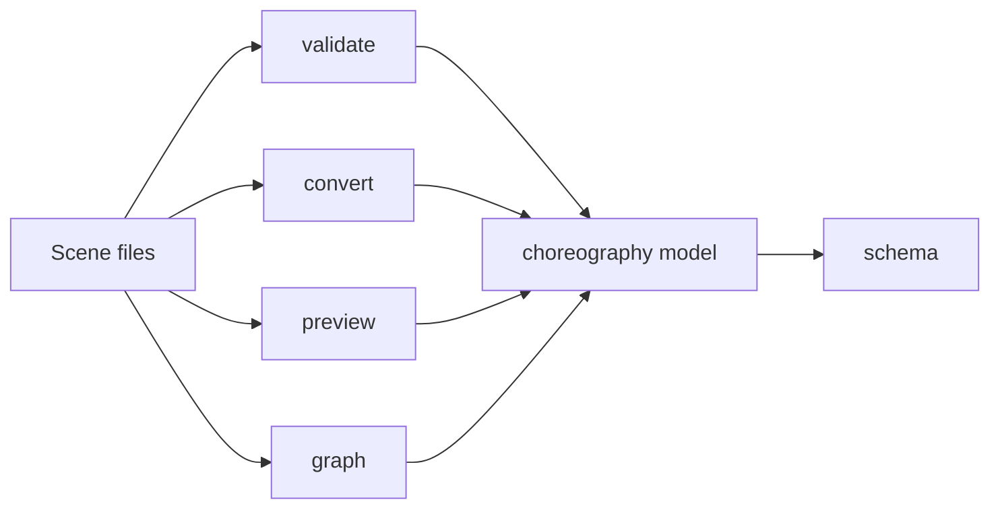
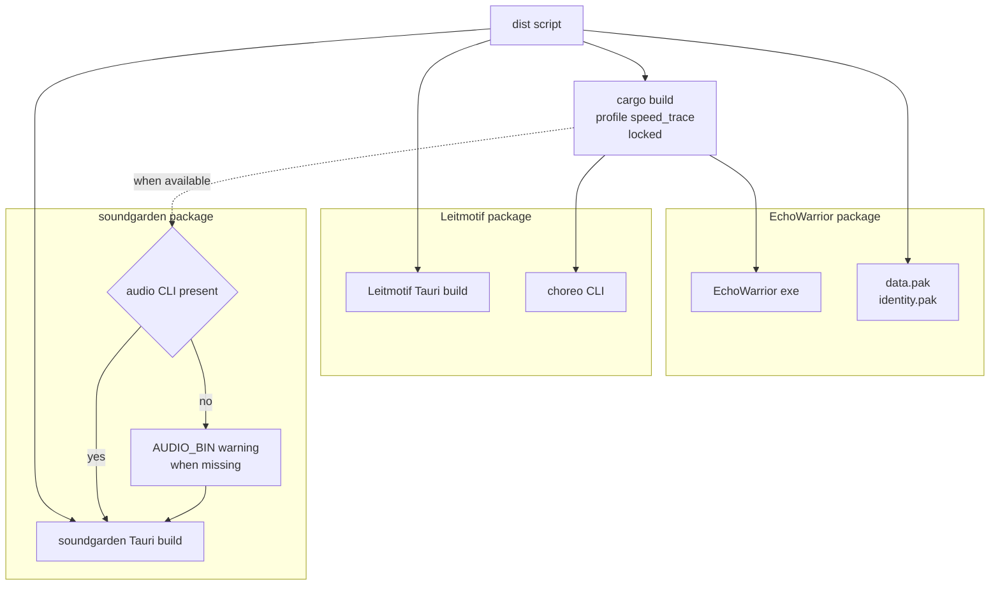

The `src/bin/` files are thin command-line shells over shared library code.



## `asset_pack`

Builds, verifies, inventories, lists, and unpacks asset packs.

Common commands:

```powershell
cargo run --bin asset_pack -- --dry-run --list
cargo run --bin asset_pack -- --out data.pak --inventory-out asset_inventory.md --verify
cargo run --bin asset_pack -- --identity --key identity.key --out identity.pak --inventory-out identity_inventory.md --verify
cargo run --bin asset_pack -- --pack data.pak --unpack unpacked_assets
```

Responsibilities:

- discover runtime or identity assets
- build an `AssetPack`
- optionally encrypt with `UniversalKey`
- verify packed bytes against source files
- reject unsafe unpack paths



## `sprite_cutter`

Cuts frames from sheets declared in `Assets/Metadata/spritesheets.toml`.

```powershell
cargo run --bin sprite_cutter -- --sheet player
cargo run --bin sprite_cutter -- --all --dry-run
cargo run --bin sprite_cutter -- --all
```

The cutter validates sheet dimensions against metadata before writing frames. Generated output goes under `Generated/Sprites/`, which is ignored by Git.



## `mod_check`

Validates moddable content without launching the game.

```powershell
cargo run --bin mod_check
cargo run --bin mod_check -- --root .
```

It checks TOML, YAML, Lua, schema versions, command buffers, shader uniforms, UI/theme values, asset-pack discoverability, save-sensitive ids, ability references, items, choreography, scene projects, and mod manifests.

Use it before shipping a mod or release package.



## `choreo`

The choreography contract CLI is the bridge between game data and authoring tools.

```powershell
cargo run --bin choreo -- validate Assets/Data/choreography.toml
cargo run --bin choreo -- validate Assets/Data/scenes
cargo run --bin choreo -- convert scene.toml scene.json
cargo run --bin choreo -- schema --out choreography.schema.json
cargo run --bin choreo -- preview Assets/Data/scenes/example_scene.toml intro
cargo run --bin choreo -- assets
cargo run --bin choreo -- graph Assets/Data/scenes --json
```

The CLI is intentionally thin: the data model and validation rules live in `echo_warrior::game::choreography`.



## Release Scripts

`scripts/dist.ps1` and `scripts/dist.sh` are the suite packaging front doors. They are not `src/bin` tools, but contributors should think of them as operational tools because they prove the shipped layout.



Current launch commands:

```powershell
pwsh -NoLogo -File scripts/dist.ps1
pwsh -NoLogo -File scripts/dist.ps1 -SkipTools
```

```sh
bash scripts/dist.sh
bash scripts/dist.sh --skip-tools
```

The default path stages EchoWarrior, Leitmotif, and soundgarden. The skip-tools path creates a game-only package.
