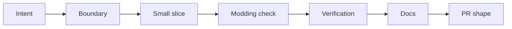
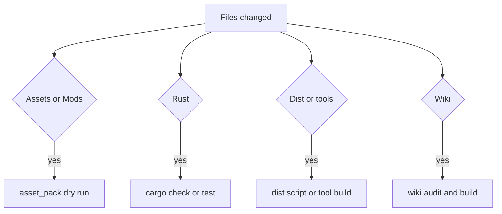
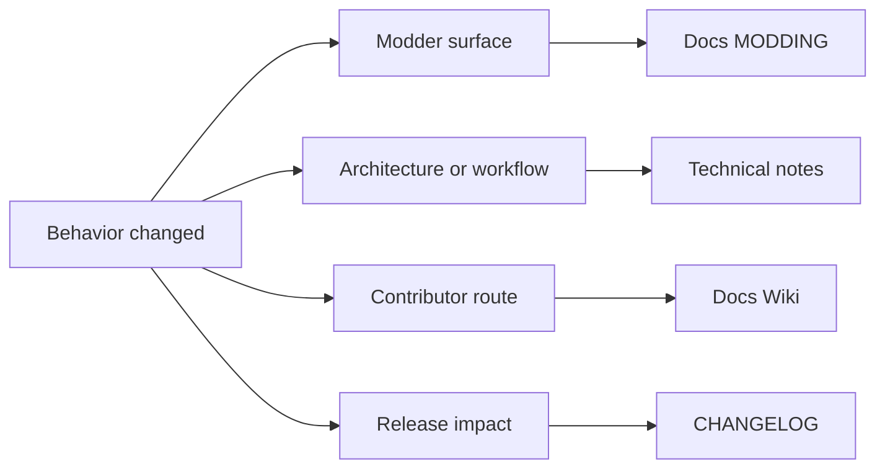

This is the practical path from idea to pull request.



## 1. Start With Intent

Before editing, write down the type of change:

- bug fix
- docs
- data/content
- modding surface
- runtime behavior
- pure gameplay/data logic
- release packaging
- tooling

Then read the relevant docs and files. Do not guess module names; EchoWarrior has several boundaries that look similar from far away.

## 2. Find The Right Boundary

Use this rule of thumb:

| If the change is about... | Start in... |
| --- | --- |
| content values, enemies, upgrades, items, abilities | `Assets/Data` and `src/data` |
| core gameplay rules that should be testable | `src/game` |
| drawing, input, audio, Macroquad state | `src/runtime` |
| renderer migration boundary | `src/render.rs`, `src/runtime/renderer_mq.rs`, then [Renderer Submodule Workflow](renderer-submodule-workflow/) |
| reusable Vulkan renderer internals | `crates/vk2d` / [soulwax/vk2d](https://github.com/soulwax/vk2d) |
| UI models/layout/theme | `src/ui` and `Assets/Data/ui.toml` |
| Lua spawn/event hooks | `src/scripting` and `Assets/Scripts` |
| dialogue | `Assets/Dialogue` and `src/game/dialogue_loader.rs` |
| release asset inclusion | `src/asset_pack.rs` and `src/bin/asset_pack.rs` |
| mod validation | `src/bin/mod_check.rs` |
| choreography data/tools | `Assets/Data/scenes`, `src/game/choreography.rs`, `src/bin/choreo.rs` |

## 3. Keep The Change Small

Prefer one cohesive contribution. A focused patch is easier to review and less likely to break active work in this repo.

Good shape:

- one bug and its test
- one data schema improvement plus modding docs
- one wiki page
- one tool diagnostic
- one asset-pack discovery fix

Risky shape:

- gameplay rewrite plus UI pass plus packaging change
- new dependency plus runtime architecture shift
- content change bundled with unrelated formatting

## 4. Preserve Modding

Ask these before coding:

- Can a modder change this without Rust?
- If not, should they be able to?
- Does this need a TOML/YAML/Lua field?
- Does `Docs/MODDING.md` need an update?
- Does `mod_check` need to validate the new surface?
- Does `asset_pack` discover the files needed in release builds?

## 5. Verify The Right Things

At minimum, run one relevant check. For most code changes, start with:

```powershell
cargo check
```

For formatting:

```powershell
cargo fmt --check
```

For release assets:

```powershell
cargo run --bin asset_pack -- --dry-run --list
```

For mod/content surfaces:

```powershell
cargo run --bin mod_check
```

For runtime behavior:

```powershell
cargo run
```

For the isolated Vulkan renderer path:

```powershell
cargo run --bin wgpu_probe -- --frames 3
```

For renderer-library work:

```powershell
cargo test -p vk2d
cargo run -p vk2d --example hello_sprite -- --frames 3
```

See [Verification Guide](../verification-guide/) for a fuller matrix.



## 6. Document The Change

Update docs in the same contribution when behavior changes.

Common destinations:

- `Docs/MODDING.md` for anything a modder can use
- `Docs/TECHNICAL_NOTES.md` for architecture changes
- `Docs/Wiki` submodule for contributor-facing main-code guidance
- `CHANGELOG.md` for completed changes and version bumps

If a change touches `crates/vk2d`, commit and push inside the `soulwax/vk2d` submodule first. Then bump the EchoWarrior parent pointer deliberately, not as part of an unrelated game change.



## 7. Pull Request Shape

A useful PR description says:

- what changed
- why it changed
- what files/areas are affected
- what verification was run
- any known limitations

If the change touches assets, mention whether `asset_pack --dry-run --list` was checked.
