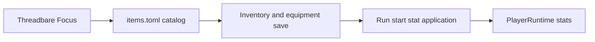
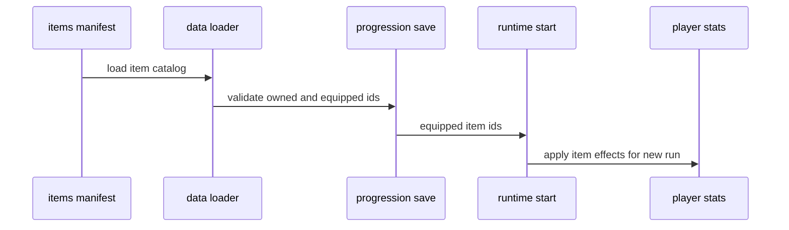
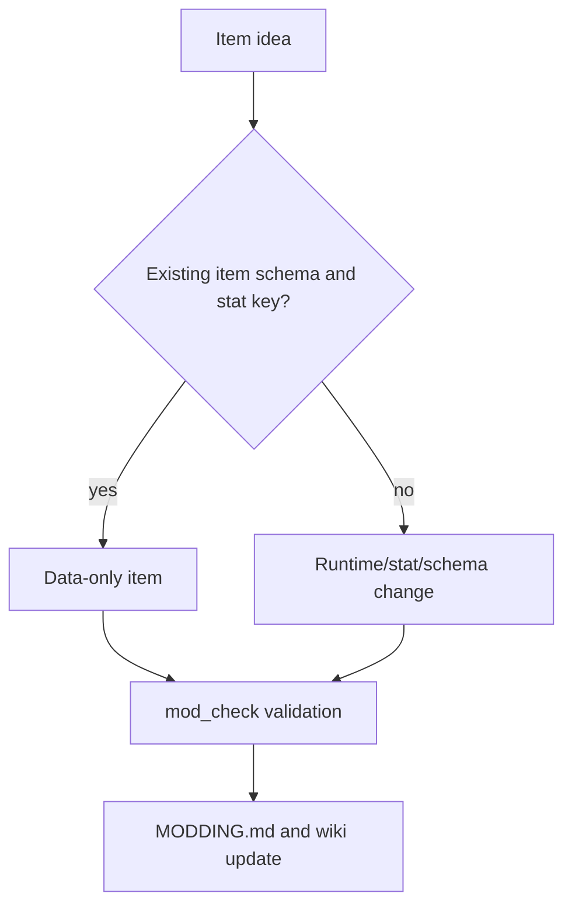

This example adds a tiny piece of persistent gear using the existing item and equipment system.

It is still data-only, but it teaches a deeper rule than a level-up card: item effects are part of account progression and apply when a run starts or restarts, not at the exact moment the TOML file is loaded.

## What We Are Building

A trinket named `Threadbare Focus`:

- lives in `Assets/Data/items.toml`
- uses an existing symbol id for its icon
- occupies the `trinket` equipment slot
- gives a small percentage boost to pickup radius
- needs no Rust change



## Step 1: Find The Catalog

Items live in:

```text
Assets/Data/items.toml
```

The file has two main parts:

- `[inventory]` controls grid size and starter items.
- `[[item]]` entries define gear, consumables, and materials.

The current equipment categories include fixed slots such as `weapon`, `head`, and `trinket`. Categories such as `consumable` are inventory-only for now.

## Step 2: Add The Item

Add this to `Assets/Data/items.toml` in a real contribution:

```toml
[[item]]
id = "threadbare_focus"
display_name = "Threadbare Focus"
description = "A small charm that helps Echo notice what the dark tries to hide."
icon = "heart_blessing"
category = "trinket"
rarity = "common"
stack_max = 1
effects = [ { stat = "pickup_radius", delta = 8.0, mode = "percent" } ]
```

This reuses the existing `heart_blessing` symbol id so the example does not need a new icon asset.

## Step 3: Understand The Effect Timing

Item effects are not the same as upgrade picks. Upgrade commands apply during the run when the player picks a card. Equipped item effects apply at run start and on restart.



That timing matters for docs and testing. If you equip a new item while already in a run, expect the effect to matter on the next run start rather than instantly rewriting combat state.

## Step 4: Decide Whether It Is Starter Gear

The `[inventory]` section can grant one-time starter items:

```toml
[inventory]
starter_items = ["iron_longsword", "leather_cap", "minor_vigor_charm"]
```

For a first contribution, do not add the new item to `starter_items` unless the goal is explicitly to change the default player account. A new item can exist in the catalog before the game has a reward source for it.

## Step 5: Verify

Run:

```powershell
cargo run --bin mod_check
```

This checks:

- item ids are non-empty and unique
- icon ids exist in the runtime symbol atlas
- `stack_max` is valid
- equippable gear is not accidentally stackable
- effect stat keys are valid
- starter item ids point to defined items

Then confirm release discovery:

```powershell
cargo run --bin asset_pack -- --dry-run --list
```

Because this example edits `Assets/Data/items.toml`, the data file should already be in the pack list.

## When This Needs Rust

This example stays data-only because `pickup_radius` already exists.

Rust becomes necessary when the item asks for a new live behavior:



Examples that need Rust:

- a new equipment slot
- a new item effect mode
- a new stat key
- consumable behavior that fires on use

Keep the first item boring on purpose. Boring data changes are how you learn the contract safely.
