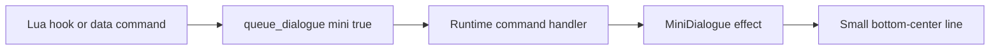
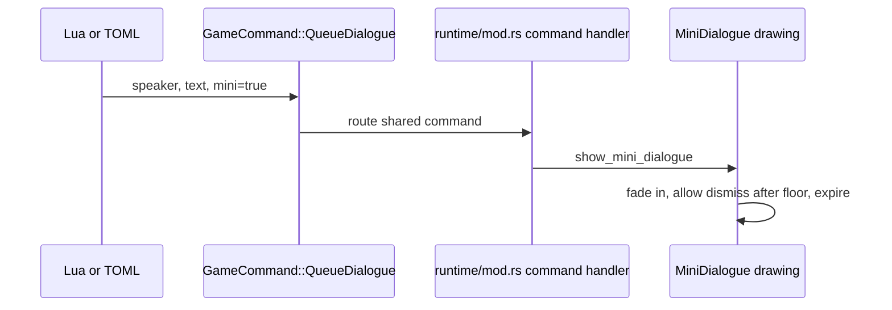

This example adds a tiny narrative cue using the existing `queue_dialogue` command with `mini = true`.

Mini-dialogue is for passing remarks: a companion hint, a reaction to an escalation, or a small reminder. It does not pause the game and it reuses the same command verb as full dialogue.

## What We Are Building

After a spawn layer adds pressure, Eve warns the player with a small non-blocking line.



## The Command Shape

The shared command is:

```toml
cmd = "queue_dialogue"
speaker = "Eve"
text = "Careful. The circle is tightening."
mini = true
```

The fields are intentionally small:

| Field | Meaning |
| --- | --- |
| `speaker` | Name shown before the line. |
| `text` | The spoken line. |
| `duration_seconds` | Optional for command data; defaults when omitted. |
| `mini` | `false` opens the full panel; `true` shows the small non-blocking line. |

## Option A: Use It From Lua

Lua has a helper for the mini form:

```lua
echo_warrior.mini_dialogue("Eve", "Careful. The circle is tightening.")
```

This is equivalent to returning a `queue_dialogue` command with `mini = true`.

In a real spawn hook, keep it gated so it does not spam every frame:

```lua
echo_warrior.on_spawn_wave("example.warning", function(ctx)
    if ctx.run_seconds < 60.0 then
        return {}
    end

    if ctx.enemies_killed % 25 ~= 0 then
        return {}
    end

    return {
        echo_warrior.mini_dialogue("Eve", "Careful. The circle is tightening.")
    }
end)
```

## Option B: Use It From Command Data

Any command list that supports `queue_dialogue` can use the same shape:

```toml
[[upgrade.commands]]
cmd = "queue_dialogue"
speaker = "Eve"
text = "The blue halo multiplies."
mini = true
```

Choreography `say` or `queue_dialogue` beats can also set `mini = true`.

## Understand The Runtime Boundary



The pure command model does not know how Macroquad draws the line. It only carries intent. The runtime chooses the presentation.

## Verify

Run:

```powershell
cargo run --bin mod_check
cargo run
```

Check that:

- Lua still compiles if you edited a script
- the game starts
- the mini line appears without opening the full dialogue panel
- repeated triggers do not make the UI noisy

## When This Needs Rust

This example stays data-only because it uses an existing command.

Rust becomes necessary if you want:

- a new presentation style beyond full dialogue and mini-dialogue
- new command fields
- special queuing rules
- a new Lua helper

When that happens, keep the command model small first, then adapt the runtime.
