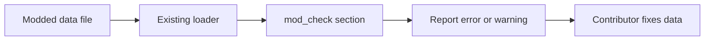
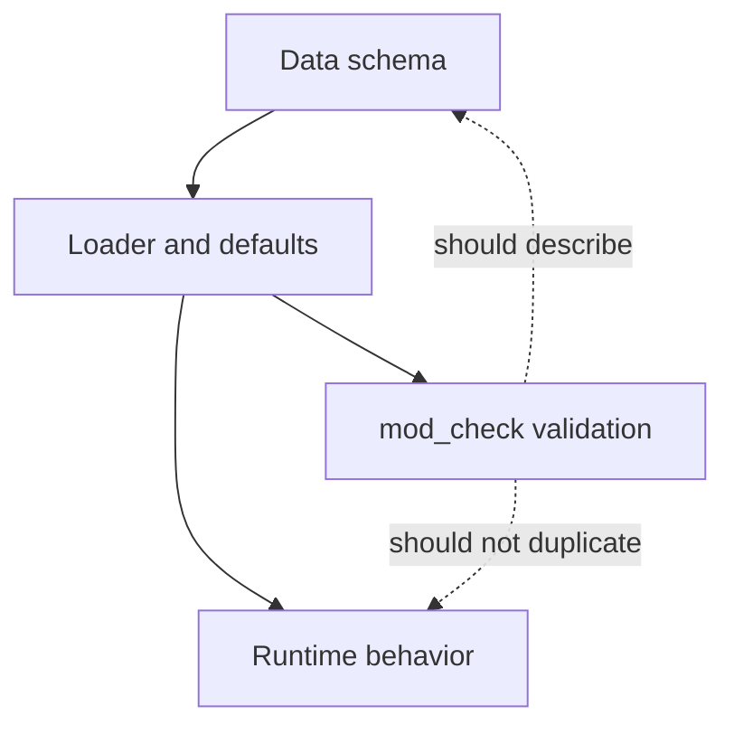
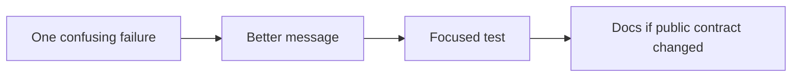

This example improves contributor tooling instead of gameplay. It is a good next step because it teaches validation boundaries without touching the runtime loop.

The goal is not to add a new validator from scratch. The goal is to make one existing error easier for a modder or contributor to fix.

## What We Are Building

Improve a diagnostic so it names:

- the file being checked
- the content id, when available
- the bad value
- a short hint about the expected shape



## Step 1: Find The Relevant Section

The CLI lives at:

```text
src/bin/mod_check.rs
```

Start by searching for the data domain you care about:

```powershell
rg -n "Items|upgrades|companions|queue_dialogue" src/bin/mod_check.rs
```

For item diagnostics, the current section is:

```text
18. Items
```

That section already validates ids, icons, stack sizes, item stat keys, and starter item references.

## Step 2: Understand The Report Pattern

`mod_check` accumulates messages through a small `Report` helper:

```rust
r.error("something is invalid");
r.warn("something is suspicious but allowed");
r.check();
```

Use errors for data that should fail validation. Use warnings for data that can run but probably means the author made a mistake.

## Step 3: Prefer Actionable Messages

Less helpful:

```text
unknown stat
```

More helpful:

```text
item "threadbare_focus": effect targets unknown stat "pickup_radus" (valid: damage, speed, max_hp, ...)
```

The better message tells the contributor where to look and what vocabulary is accepted.

## Step 4: Keep Validation Close To The Contract



`mod_check` should validate the public contract: ids, references, valid enum-like strings, and values that cannot sensibly run.

It should not become a second implementation of combat, pathfinding, rendering, or offer selection. If a check needs to simulate the whole game to be right, it probably belongs in a focused Rust test instead.

## Step 5: Add Or Tighten A Focused Test

For small diagnostics, prefer a small unit test near the validator when there is already a test pattern nearby.

A useful test usually:

- creates the smallest bad input
- runs the validator helper or command parsing path
- asserts that the error mentions the bad id or bad value

Avoid snapshotting the whole CLI output. Full-output snapshots make tiny wording improvements painful.

## Step 6: Verify

Run:

```powershell
cargo test
cargo run --bin mod_check
```

If your diagnostic only touches docs or message wording, `cargo check` is also a good quick sanity pass:

```powershell
cargo check
```

## Contributor Rule Of Thumb

Improve one diagnostic at a time.



If the public data contract did not change, the wiki may be enough. If the contract did change, update `Docs/MODDING.md` too.
