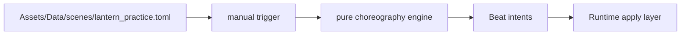

This example adds a tiny manual choreography scene. It uses existing choreography verbs and can be started from Lua or dialogue later.

## What We Are Building

A short scene where Echo raises the lantern, says one line, and gently nudges the camera.



## Step 1: Create The Scene File

Create:

```text
Assets/Data/scenes/lantern_practice.toml
```

## Step 2: Add A Manual Sequence

```toml
scene = "lantern_practice"
schema = 1

[[sequence]]
id = "warm_light"
note = "Tiny manual scene: Echo raises the lantern and speaks."
trigger = { kind = "manual" }

  [[sequence.step]]
  duration = 0.8
    [[sequence.step.beat]]
    actor = "echo"
    do = "raise_lantern"
    [[sequence.step.beat]]
    actor = "world"
    do = "camera"
    zoom = 1.04
    duration = 0.8

  [[sequence.step]]
  wait_for = { kind = "dialogue" }
    [[sequence.step.beat]]
    actor = "echo"
    do = "say"
    text = "Small light. Still enough."

  [[sequence.step]]
  duration = 0.6
    [[sequence.step.beat]]
    actor = "echo"
    do = "lower_lantern"
    [[sequence.step.beat]]
    actor = "world"
    do = "camera"
    zoom = 1.0
    duration = 0.6
```

Because the trigger is manual, this scene does nothing until something starts it.

## Step 3: Start It From Lua

You can trigger it from a Lua hook:

```lua
echo_warrior.on("level_up_offer", "example.lantern_practice", function(ctx)
    if ctx.player_level == 2 then
        return {
            echo_warrior.play_sequence("lantern_practice:warm_light")
        }
    end
    return {}
end)
```

Use the qualified id `scene:sequence` to avoid ambiguity.

## Verify

```powershell
cargo run --bin choreo -- validate Assets/Data/scenes
cargo run --bin mod_check
cargo run --bin asset_pack -- --dry-run --list
```

Then run the game if you wired the scene to a live trigger:

```powershell
cargo run
```

## When This Needs Rust

This example uses existing beat verbs: `raise_lantern`, `camera`, `say`, and `lower_lantern`.

Rust becomes necessary if you want a new beat verb, such as:

```toml
do = "draw_symbol_over_actor"
```

That requires:

- choreography serde model/schema support
- pure engine intent or command output
- runtime apply-layer behavior
- `choreo validate` / `mod_check` coverage
- modding documentation
