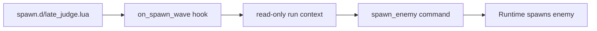
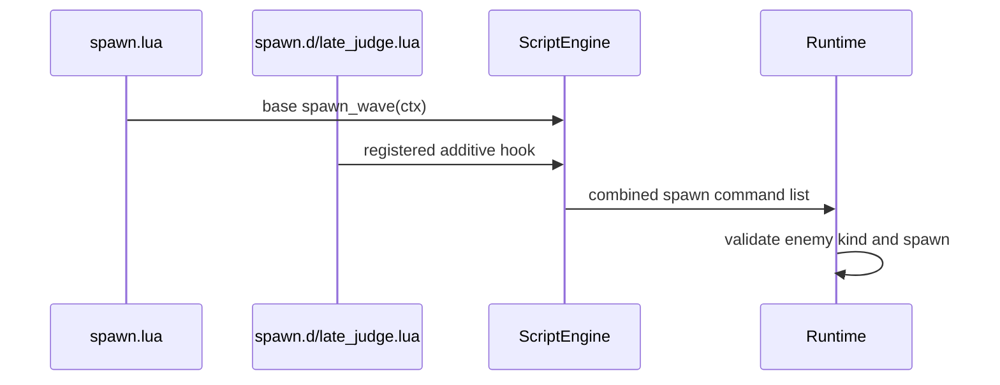

This example adds a tiny additive Lua spawn layer. It does not replace the base `spawn.lua`; it appends behavior through the hook API.

## What We Are Building

After 45 seconds, occasionally add one extra `JudgePenitent` behind the player.



## Step 1: Create A Layer File

Create:

```text
Assets/Scripts/spawn.d/late_judge.lua
```

If `spawn.d` does not exist yet, create the folder. Files in this folder load after `Assets/Scripts/spawn.lua` and are sorted by path.

## Step 2: Register A Hook

```lua
local function edge_point(ctx, angle)
    local reach = math.max(ctx.view_w, ctx.view_h) * 0.5 + ctx.cfg_edge_spawn_offset
    local x = echo_warrior.clamp(ctx.player_x + math.cos(angle) * reach, 0.0, ctx.world_w)
    local y = echo_warrior.clamp(ctx.player_y + math.sin(angle) * reach, 0.0, ctx.world_h)
    return x, y
end

echo_warrior.on_spawn_wave("example.late_judge", function(ctx)
    if ctx.run_seconds < 45.0 then
        return {}
    end

    if ctx.enemies_killed % 7 ~= 0 then
        return {}
    end

    local x, y = edge_point(ctx, math.pi)
    return {
        echo_warrior.spawn_enemy("JudgePenitent", x, y)
    }
end)
```

The hook returns a command table list. Rust applies the commands after the script returns.

## Why This Is Moddable



The base file can keep its wave schedule. Your layer adds behavior without copying the whole schedule.

## Verify

```powershell
cargo run --bin mod_check
cargo run --bin asset_pack -- --dry-run --list
cargo run
```

Check that:

- Lua compiles
- the new `Assets/Scripts/spawn.d/late_judge.lua` path appears in the asset-pack list
- the game starts
- the extra spawn appears after the timing/kills condition

## When This Needs Rust

This example uses an existing command: `spawn_enemy`.

Rust becomes necessary if the layer needs a new command verb or a new context field. For example:

```lua
-- hypothetical; not currently supported
ctx.nearest_boss_hp_ratio
echo_warrior.freeze_enemy(id, seconds)
```

That would require shared model/API work, runtime application, validation, and modding docs.
